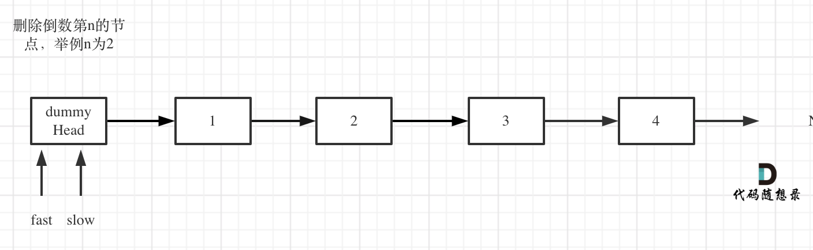

## 思路 

双指针的经典应用，如果要删除倒数第n个节点，让fast移动n步，然后让fast和slow同时移动，直到fast指向链表末尾。删掉slow所指向的节点就可以了。

思路是这样的，但要注意一些细节。

分为如下几步：

* 首先这里我推荐大家使用虚拟头结点，这样方面处理删除实际头结点的逻辑，如果虚拟头结点不清楚，可以看这篇： [链表：听说用虚拟头节点会方便很多？](https://mp.weixin.qq.com/s/slM1CH5Ew9XzK93YOQYSjA)


* 定义fast指针和slow指针，初始值为虚拟头结点，如图：

 </img></div>

* fast首先走n + 1步 ，为什么是n+1呢，因为只有这样同时移动的时候slow才能指向删除节点的上一个节点（方便做删除操作），如图：
 </img></div>

* fast和slow同时移动，之道fast指向末尾，如题： 
 </img></div>

* 删除slow指向的下一个节点，如图：
 </img></div>

此时不难写出如下C++代码：

```
class Solution {
public:
    ListNode* removeNthFromEnd(ListNode* head, int n) {
        ListNode* dummyHead = new ListNode(0);
        dummyHead->next = head;
        ListNode* slow = dummyHead;
        ListNode* fast = dummyHead;
        while(n-- && fast != NULL) {
            fast = fast->next;
        }
        fast = fast->next; // fast再提前走一步，因为需要让slow指向删除节点的上一个节点
        while (fast != NULL) {
            fast = fast->next;
            slow = slow->next;
        }
        slow->next = slow->next->next;
        return dummyHead->next;
    }
};
```
