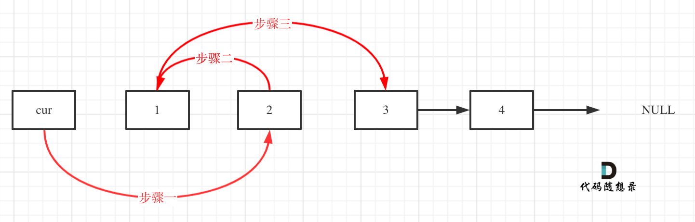

## 题目地址 

## 思路 

这道题目正常模拟就可以了。

建议使用虚拟头结点，这样会方便很多，要不然每次针对头结点（没有前一个指针指向头结点），还要单独处理。

对虚拟头结点的操作，还不熟悉的话，可以看这篇[链表：听说用虚拟头节点会方便很多？](https://mp.weixin.qq.com/s/slM1CH5Ew9XzK93YOQYSjA)。

接下来就是交换相邻两个元素了，**此时一定要画图，不画图，操作多个指针很容易乱，而且要操作的先后顺序**

初始时，cur指向虚拟头结点，然后进行如下三步： 

 </img></div>

操作之后，链表如下：


 </img></div>

看这个可能就更直观一些了：


 </img></div>

对应的C++代码实现如下：

```
class Solution {
public:
    ListNode* swapPairs(ListNode* head) {
        ListNode* dummyHead = new ListNode(0); // 设置一个虚拟头结点
        dummyHead->next = head; // 将虚拟头结点指向head，这样方面后面做删除操作
        ListNode* cur = dummyHead;
        while(cur->next != nullptr && cur->next->next != nullptr) {
            ListNode* tmp = cur->next; // 记录临时节点
            ListNode* tmp1 = cur->next->next->next; // 记录临时节点

            cur->next = cur->next->next;    // 步骤一
            cur->next->next = tmp;          // 步骤二
            cur->next->next->next = tmp1;   // 步骤三

            cur = cur->next->next; // cur移动两位，准备下一轮交换
        }
        return dummyHead->next;
    }
};
```
时间复杂度：O(n)
空间复杂度：O(1)

## 拓展 

**这里还是说一下，大家不必太在意leetcode上执行用时，打败多少多少用户，这个就是一个玩具，非常不准确。**

做题的时候自己能分析出来时间复杂度就可以了，至于leetcode上执行用时，大概看一下就行。

上面的代码我第一次提交执行用时8ms，打败6.5%的用户，差点吓到我了。

心想应该没有更好的方法了吧，也就O(n)的时间复杂度，重复提交几次，这样了：

 </img></div>

所以，不必过于在意leetcode上这个统计。


