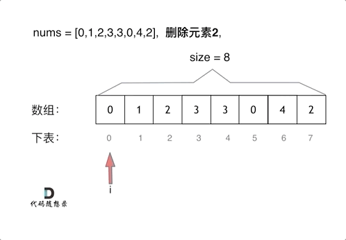

> 笔者在BAT从事技术研发多年，利用工作之余重刷leetcode，更多原创文章请关注公众号「代码随想录」。

# 题目地址 

https://leetcode-cn.com/problems/remove-element/

> 移除元素想要高效的话，不是很简单！

# 编号：27. 移除元素

给你一个数组 nums 和一个值 val，你需要 原地 移除所有数值等于 val 的元素，并返回移除后数组的新长度。

不要使用额外的数组空间，你必须仅使用 O(1) 额外空间并**原地**修改输入数组。

元素的顺序可以改变。你不需要考虑数组中超出新长度后面的元素。

示例 1:   
给定 nums = [3,2,2,3], val = 3,  
函数应该返回新的长度 2, 并且 nums 中的前两个元素均为 2。  
你不需要考虑数组中超出新长度后面的元素。  

示例 2:   
给定 nums = [0,1,2,2,3,0,4,2], val = 2,    
函数应该返回新的长度 5, 并且 nums 中的前五个元素为 0, 1, 3, 0, 4。  

**你不需要考虑数组中超出新长度后面的元素。**

# 思路 

有的同学可能说了，多余的元素，删掉不就得了。

**要知道数组的元素在内存地址中是连续的，不能单独删除数组中的某个元素，只能覆盖。** 

数组的基础知识可以看这里[程序员算法面试中，必须掌握的数组理论知识](https://mp.weixin.qq.com/s/X7R55wSENyY62le0Fiawsg)。

# 暴力解法

这个题目暴力的解法就是两层for循环，一个for循环遍历数组元素 ，第二个for循环更新数组。 

删除过程如下：

 </img></div>

很明显暴力解法的时间复杂度是O(n^2)，这道题目暴力解法在leetcode上是可以过的。

# 暴力解法C++代码

```
// 时间复杂度：O(n^2)
// 空间复杂度：O(1)
class Solution {
public:
    int removeElement(vector<int>& nums, int val) {
        int size = nums.size();
        for (int i = 0; i < size; i++) {
            if (nums[i] == val) { // 发现需要移除的元素，就将数组集体向前移动一位
                for (int j = i + 1; j < size; j++) {
                    nums[j - 1] = nums[j];
                }
                i--; // 因为下表i以后的数值都向前移动了一位，所以i也向前移动一位
                size--; // 此时数组的大小-1
            }
        }
        return size;

    }
};
```

# 双指针法

双指针法（快慢指针法）： **通过一个快指针和慢指针在一个for循环下完成两个for循环的工作。**

删除过程如下：

 </img></div>

**双指针法（快慢指针法）在数组和链表的操作中是非常常见的，很多考察数组和链表操作的面试题，都使用双指针法。**

我们来回顾一下，之前已经讲过有四道题目使用了双指针法。

双指针法将时间复杂度O(n^2)的解法优化为 O(n)的解法。也就是降一个数量级，题目如下：

* [15.三数之和](https://mp.weixin.qq.com/s/r5cgZFu0tv4grBAexdcd8A)
* [18.四数之和](https://mp.weixin.qq.com/s/nQrcco8AZJV1pAOVjeIU_g)

双指针来记录前后指针实现链表反转：

* [206.反转链表](https://mp.weixin.qq.com/s/pnvVP-0ZM7epB8y3w_Njwg)

使用双指针来确定有环：

* [142题.环形链表II](https://mp.weixin.qq.com/s/_QVP3IkRZWx9zIpQRgajzA)

双指针法在数组和链表中还有很多应用，后面还会介绍到。

# 双指针法C++代码：
```
// 时间复杂度：O(n)
// 空间复杂度：O(1)
class Solution {
public:
    int removeElement(vector<int>& nums, int val) {
        int slowIndex = 0; 
        for (int fastIndex = 0; fastIndex < nums.size(); fastIndex++) {  
            if (val != nums[fastIndex]) { 
                nums[slowIndex++] = nums[fastIndex]; 
            }
        }
        return slowIndex;
    }
};
```

拓展： 也可以一个指向前面，一个指向后面，遇到需要删除的就交换，最后返回指针的位置加1，只不过这么做更改了数组元素的位置了，不算是移除元素。

> 更多算法干货文章持续更新，可以微信搜索「代码随想录」第一时间围观，关注后，回复「Java」「C++」 「python」「简历模板」「数据结构与算法」等等，就可以获得我多年整理的学习资料。

