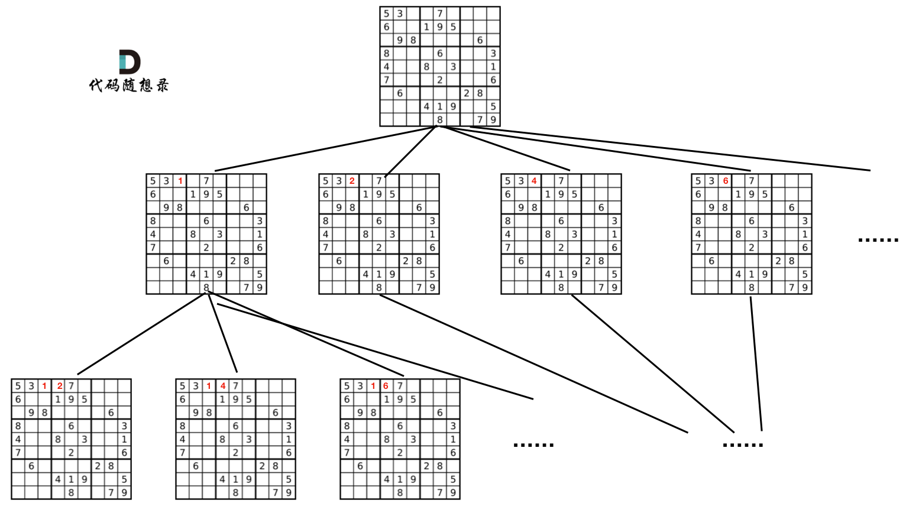

# 题目地址 

https://leetcode-cn.com/problems/sudoku-solver/

# 思路 

棋盘搜索问题依然是要使用回溯法，暴力搜索，只不过这次我们要做的是双层递归。 

怎么做双层递归呢？如果大家之前做过回溯类型的题目，例如：，77.组合（组合问题），131.分割回文串（分割问题），78.子集（子集问题），46.全排列（排列问题），以及51.N皇后（N皇后问题）等等，都会发现，这些都是单层递归。

**如果大家以上这几道题目没有做过的话，不建议上来就做这道题哈！**

n皇后因为每一行每一列只放一个皇后，只需要一层for循环遍历行数，递归来处理每一行的一个皇后放在哪里就可以。

本题就不一样了，本题中棋盘每一个位置都要放一个数字，这个问题的树形结构要比N皇后更宽更深。

如图所示：

 </img></div>

可以看出我们需要的是一个二维的递归（也就是两个for循环，递归遍历每一个棋盘的位置）

这道题目和之前递归的方式都不一样，这里相当于两层递归，之前的都是一层递归。

# C++代码 

```
class Solution {
private:
bool backtracking(vector<vector<char>>& board) {
    for (int i = 0; i < board.size(); i++) { // 遍历行
        for (int j = 0; j < board[0].size(); j++) { // 遍历列
            if (board[i][j] != '.') continue;
            for (char k = '1'; k <= '9'; k++) { // (i, j) 这个位置放k是否合适
                if (isValid(i, j, k, board)) { 
                    board[i][j] = k;
                    if (backtracking(board)) return true; // 如果找到合适一组立刻返回
                    board[i][j] = '.';
                }
            }
            return false;
        }
    }
    return true; // 遍历完没有返回false，说明找到了合适棋盘位置了

}
bool isValid(int row, int col, char val, vector<vector<char>>& board) {

    for (int i = 0; i < 9; i++) { // 判断行里是否重复
        if (board[row][i] == val) {
            return false;
        }
    }
    for (int j = 0; j < 9; j++) { // 判断列里是否重复
        if (board[j][col] == val) {
            return false;
        }
    }
    int startRow = (row / 3) * 3;
    int startCol = (col / 3) * 3;
    for (int i = startRow; i < startRow + 3; i++) { // 判断9方格里是否重复
        for (int j = startCol; j < startCol + 3; j++) {
            if (board[i][j] == val ) {
                return false;
            }
        }
    }
    return true;
}
public:
    void solveSudoku(vector<vector<char>>& board) {
        backtracking(board);
    }
};
```
