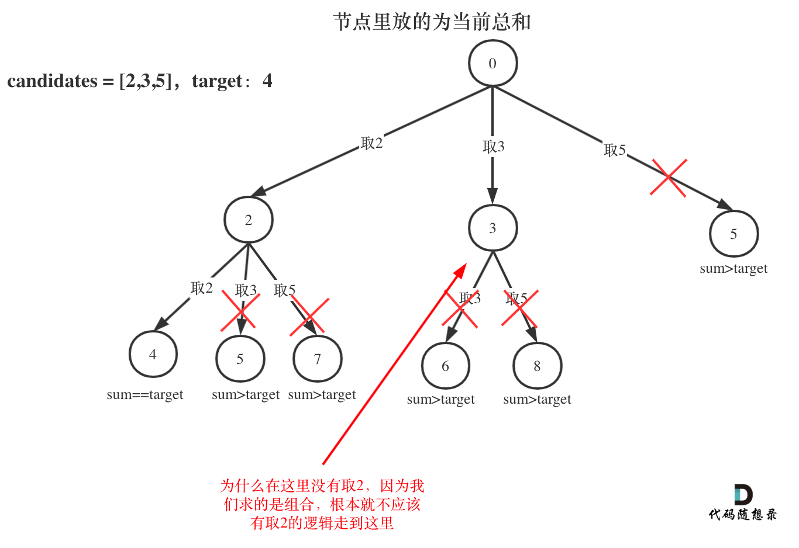

# 第39题. 组合总和

给定一个无重复元素的数组 candidates 和一个目标数 target ，找出 candidates 中所有可以使数字和为 target 的组合。

candidates 中的数字可以无限制重复被选取。

**说明：**

所有数字（包括 target）都是正整数。   
解集不能包含重复的组合。 

示例 1：

输入：candidates = [2,3,6,7], target = 7,
所求解集为：
[
  [7],
  [2,2,3]
]

示例 2：

输入：candidates = [2,3,5], target = 8,
所求解集为：
[
  [2,2,2,2],
  [2,3,3],
  [3,5]
]

# 思路

题目中的**无限制重复被选取，吓得我赶紧想想 出现0 可咋办**，然后看到下面提示：1 <= candidates[i] <= 200，我就放心了。


这道题上来可以这么想，看看一个数能不能构成target，一个for循环遍历一遍，再看看两个数能不能构成target，两个for循环遍历，在看看三个数能不能构成target，三个for循环遍历，直到candidates.size()个for循环遍历一遍。

遇到这种问题，就要想到递归的层级嵌套关系就可以解决这种多层for循环的问题，而回溯则帮我们选择每一个合适的集合！

那么使用回溯的时候，要知道求的是排列，还是组合，排列和组合是不一样的。

一些同学可能海分不清，我大概说一下：

**组合是不强调元素顺序的，排列是强调元素顺序的。**

例如 集合 1，2 和 集合 2，1 在组合上，就是一个集合，因为不强调顺序，而要是排列的话，1，2 和 2，1 就是两个集合了。

**求组合，和求排列的回溯写法是不一样的，代码上有小小细节上的改变。**

本题选组过程如下：

 </img></div>


分析完过程，回溯算法的模板框架如下：
```
backtracking() {
    if (终止条件) {
        存放结果;
    }

    for (选择：选择列表（可以想成树中节点孩子的数量）) {
        递归，处理节点;
        backtracking();
        回溯，撤销处理结果
    }
}
```

按照模板不难写出如下代码，但很一些细节，我在注释中标记出来了。

# C++代码

```
class Solution {
private:
    vector<vector<int>> result;
    vector<int> path;
    void backtracking(vector<int>& candidates, int target, int sum, int startIndex) {
        if (sum > target) {
            return;
        }
        if (sum == target) {
            result.push_back(path);
            return;
        }

        // 这里i 依然从 startIndex开始，因为求的是组合，如果求的是排列，那么i每次都从0开始
        for (int i = startIndex; i < candidates.size(); i++) {
            sum += candidates[i];
            path.push_back(candidates[i]);
            backtracking(candidates, target, sum, i); // 关键点在这里，不用i+1了，表示可以重复读取当前的数
            sum -= candidates[i];
            path.pop_back();

        }
    }
public:
    vector<vector<int>> combinationSum(vector<int>& candidates, int target) {
        backtracking(candidates, target, 0, 0);
        return result;
    }
};
```
