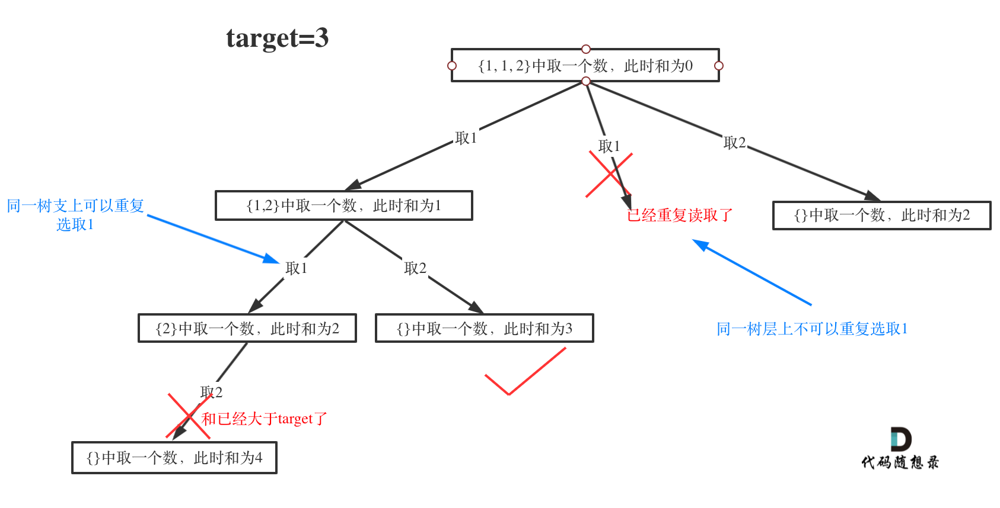

# 第40题. 组合总和
给定一个数组 candidates 和一个目标数 target ，找出 candidates 中所有可以使数字和为 target 的组合。

candidates 中的每个数字在每个组合中只能使用一次。

说明：

所有数字（包括目标数）都是正整数。
解集不能包含重复的组合。 

示例 1:

输入: candidates = [10,1,2,7,6,1,5], target = 8,
所求解集为:
[
  [1, 7],
  [1, 2, 5],
  [2, 6],
  [1, 1, 6]
]

示例 2:

输入: candidates = [2,5,2,1,2], target = 5,
所求解集为:
[
  [1,2,2],
  [5]
]

# 思想 

这道题目和[0039.组合总和](https://github.com/youngyangyang04/leetcode/blob/master/problems/0039.组合总和.md) 区别就是要去重。

很多同学在去重上想不明白，其实很多题解也没有讲清楚，反正代码是能过的，感觉是那么回事，稀里糊涂的先把题目过了。

这个去重为什么很难理解呢，**所谓去重，其实就是使用过的元素不能重复选取。** 这么一说好像很简单！


都知道组合问题可以抽象为树形结构，那么“使用过”在这个树形结构上是有两个维度的，一个维度是同一树枝上使用过，一个维度是同一树层上使用过。**没有理解这两个层面上的“使用过” 是造成大家没有彻底理解去重的根本原因。**

所以要明确我们要去重的是同一树层上的“使用过”。

为了理解去重我们来举一个例子，candidates = [1, 1, 2], target = 3，（方便起见candidates已经排序了）

选择过程如图所示：

 </img></div>


理解了“同一树枝使用过”和“同一树层使用过” 之后，我们在拉看如下代码实现，关键地方已经注释，大家应该就理解了

# C++代码 

```
class Solution {
private:
    vector<vector<int>> result;
    vector<int> path;
    void backtracking(vector<int>& candidates, int target, int sum, int startIndex, vector<bool>& used) {
        if (sum > target) {
            return;
        }
        if (sum == target) {
            result.push_back(path);
            return;
        }

        // 每个组合中只能使用一次 所以用 startindex
        // 给定一个数组 candidates 默认有重复项，解集不能包含重复的组合。  所以使用if这一套
        for (int i = startIndex; i < candidates.size(); i++) {
            // 这里理解used[i - 1]非常重要 
            // used[i - 1] == true，说明同一树支candidates[i - 1]使用过 
            // used[i - 1] == false，说明同一树层candidates[i - 1]使用过
            // 而我们要对同一树层使用过的元素进行跳过
            if (i > 0 && candidates[i] == candidates[i - 1] && used[i - 1] == false) { 
                continue;
            }
            sum += candidates[i];
            path.push_back(candidates[i]);
            used[i] = true;
            backtracking(candidates, target, sum, i + 1, used); // 关键点在这里，不用i+1了
            used[i] = false;
            sum -= candidates[i];
            path.pop_back();
        }
    }

public:
    vector<vector<int>> combinationSum2(vector<int>& candidates, int target) {
        vector<bool> used(candidates.size(), false);
        // 首先把给candidates排序，让其相同的元素都挨在一起。 
        sort(candidates.begin(), candidates.end());
        backtracking(candidates, target, 0, 0, used);
        return result;

    }
};
```
