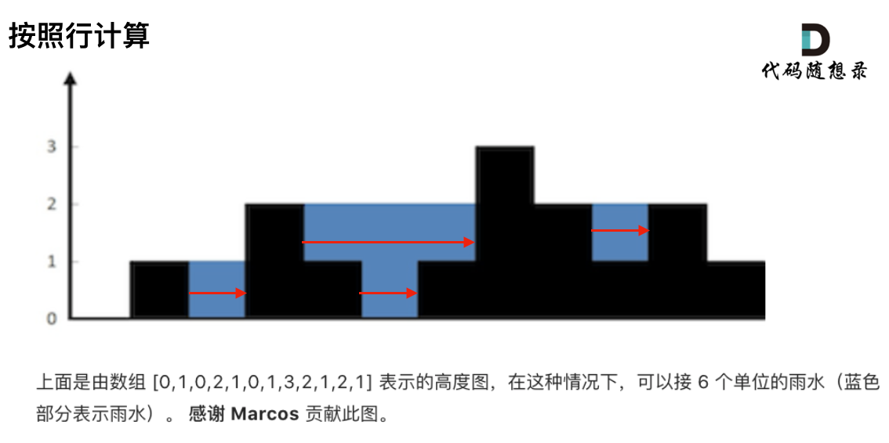
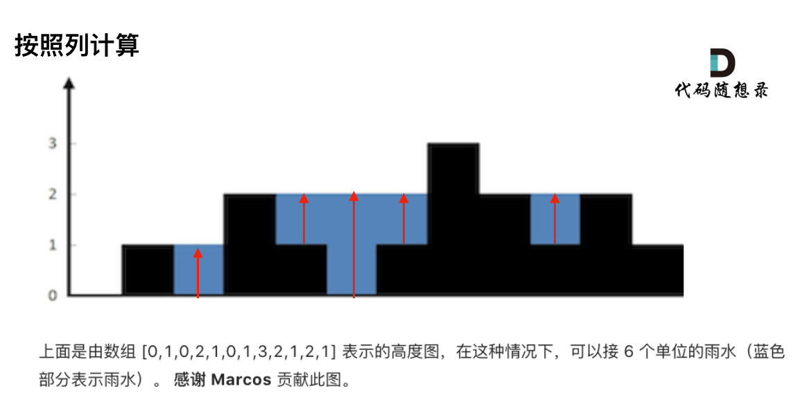
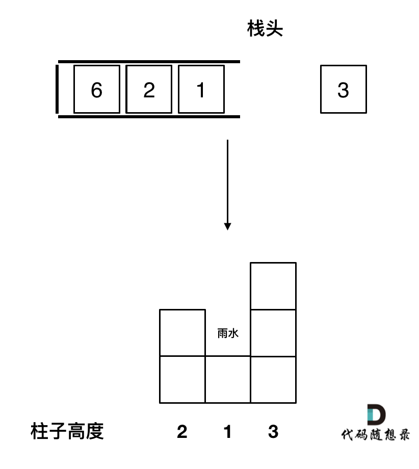
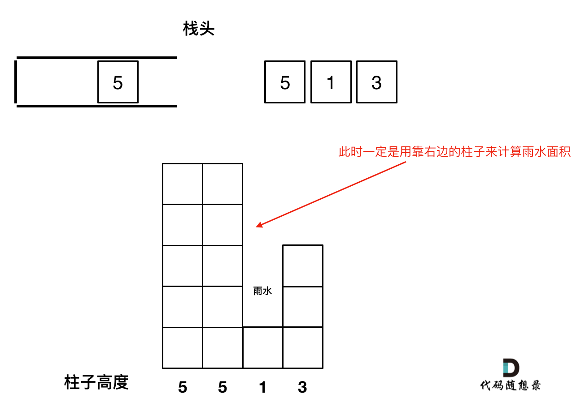

# 题目链接 

# 思路 

接雨水问题在面试中还是常见题目的，有必要好好讲一讲。

本文深度讲解如下三种方法：
* 双指针法
* 动态规划
* 单调栈

## 双指针解法 

这道题目暴力解法并不简单，我们来看一下思路。

首先要明确，要按照行来计算，还是按照列来计算。如图所示：

 </img></div>

 </img></div>

一些同学在实现暴力解法的时候，很容易一会按照行来计算一会按照列来计算，这样就会越写越乱。

我个人倾向于按照列来计算，比较容易理解，接下来看一下按照列如何计算。

首先，**如果按照列来计算的话，宽度一定是1了，我们再把每一列的雨水的高度求出来就可以了。**

可以看出每一列雨水的高度，取决于，该列 左侧最高的柱子和右侧最高的柱子中最矮的那个柱子的高度。

这句话可以有点绕，来举一个理解，例如求列4的雨水高度，如图：

 </img></div>

列4 左侧最高的柱子是列3，高度为2（以下用lHeight表示）。

列4 右侧最高的柱子是列7，高度为3（以下用rHeight表示）。

列4 柱子的高度为1（以下用height表示）

那么列4的雨水高度为 列3和列7的高度最小值减列4高度，即： min(lHeight, rHeight) - height。

列4的雨水高度求出来了，宽度为1，相乘就是列4的雨水体积了。

此时求出了列4的雨水体积。

一样的方法，只要从头遍历一遍所有的列，然后求出每一列雨水的体积，相加之后就是总雨水的体积了。 

首先从头遍历所有的列，并且**要注意第一个柱子和最后一个柱子不接雨水**，代码如下：
```
for (int i = 0; i < height.size(); i++) {
    // 第一个柱子和最后一个柱子不接雨水
    if (i == 0 || i == height.size() - 1) continue;
}
```

在for循环中求左右两边最高柱子，代码如下：

```
int rHeight = height[i]; // 记录右边柱子的最高高度
int lHeight = height[i]; // 记录左边柱子的最高高度
for (int r = i + 1; r < height.size(); r++) {
    if (height[r] > rHeight) rHeight = height[r];
}
for (int l = i - 1; l >= 0; l--) {
    if (height[l] > lHeight) lHeight = height[l];
}
```

最后，计算该列的雨水高度，代码如下：

```
int h = min(lHeight, rHeight) - height[i];
if (h > 0) sum += h; // 注意只有h大于零的时候，在统计到总和中
```

整体代码如下：

```
class Solution {
public:
    int trap(vector<int>& height) {
        int sum = 0;
        for (int i = 0; i < height.size(); i++) {
            // 第一个柱子和最后一个柱子不接雨水
            if (i == 0 || i == height.size() - 1) continue;

            int rHeight = height[i]; // 记录右边柱子的最高高度
            int lHeight = height[i]; // 记录左边柱子的最高高度
            for (int r = i + 1; r < height.size(); r++) {
                if (height[r] > rHeight) rHeight = height[r];
            }
            for (int l = i - 1; l >= 0; l--) {
                if (height[l] > lHeight) lHeight = height[l];
            }
            int h = min(lHeight, rHeight) - height[i];
            if (h > 0) sum += h;
        }
        return sum;
    }
};
```

因为每次遍历列的时候，还要向两边寻找最高的列，所以时间复杂度为O(n^2)。
空间复杂度为O(1)。

## 动态规划解法 

在上面的双指针解法，我们可以看到，只要知道左边柱子的最高高度 和 记录右边柱子的最高高度，就可以计算当前位置的雨水面积，这也是也列来计算的。

即，当前列雨水面积：min(左边柱子的最高高度，记录右边柱子的最高高度) - 当前柱子高度

为了的到两边的最高高度，使用了双指针来遍历，每到一个柱子都向两边遍历一波。

这其实是有重复计算的。

我们把每一个位置的左边最高高度记录在一个数组上（maxLeft），右边最高高度记录在一个数组上（maxRight）。

避免的重复计算，者就用到了动态规划。

当前位置，左边的最高高度，是前一个位置的最高高度和本高度的最大值。

即从左向右遍历：maxLeft[i] = max(height[i], maxLeft[i - 1]);

从右向左遍历：maxRight[i] = max(height[i], maxRight[i + 1]);

这样就找到递推公式。

是不是地推公式还挺简单的，其实动态规划就是这样，只要想到了递推公式，其实就比较简单了。

代码如下：

```
class Solution {
public:
    int trap(vector<int>& height) {
        if (height.size() <= 2) return 0;
        vector<int> maxLeft(height.size(), 0);
        vector<int> maxRight(height.size(), 0);
        int size = maxRight.size();

        // 记录每个柱子左边柱子最大高度
        maxLeft[0] = height[0];
        for (int i = 1; i < size; i++) {
            maxLeft[i] = max(height[i], maxLeft[i - 1]);
        }
        // 记录每个柱子右边柱子最大高度
        maxRight[size - 1] = height[size - 1];
        for (int i = size - 2; i >= 0; i--) {
            maxRight[i] = max(height[i], maxRight[i + 1]);
        }
        // 求和
        int sum = 0;
        for (int i = 0; i < size; i++) {
            int count = min(maxLeft[i], maxRight[i]) - height[i];
            if (count > 0) sum += count;
        }
        return sum;
    }
};
```

## 单调栈解法 

这个解法可以说是最不好理解的了，所以下面我花了大量的篇幅来介绍这种方法。

单调栈就是保持栈内元素有序。和[栈与队列：单调队列](https://mp.weixin.qq.com/s/8c6l2bO74xyMjph09gQtpA)一样，需要我们自己维持顺序，没有现成的容器可以用。


### 准备工作

那么本题使用单调栈有如下几个问题：

1. 首先单调栈是按照行方向来计算雨水，如图：

 </img></div>

知道这一点，后面的就可以理解了。

2. 使用单调栈内元素的顺序

从大到小还是从小打到呢？

要从栈底到栈头（元素从栈头弹出）是从大到小的顺序。

因为一旦发现添加的柱子高度大于栈头元素了，此时就出现凹槽了，栈头元素就是凹槽底部的柱子，栈头第二个元素就是凹槽左边的柱子，而添加的元素就是凹槽右边的柱子。

如图：

 </img></div>


3. 遇到相同高度的柱子怎么办。 

遇到相同的元素，更新栈内下表，就是将栈里元素（旧下标）弹出，将新元素（新下标）加入栈中。

例如 5 5 1 3 这种情况。如果添加第二个5的时候就应该将第一个5的下标弹出，把第二个5添加到栈中。

因为我们要求宽度的时候 如果遇到相同高度的柱子，需要使用最右边的柱子来计算宽度。

如图所示：


 </img></div>


4. 栈里要保存什么数值

是用单调栈，其实是通过 长 * 宽 来计算雨水面积的。

长就是通过柱子的高度来计算，宽是通过柱子之间的下表来计算，

那么栈里有没有必要存一个pair<int, int>类型的元素，保存柱子的高度和下表呢。 

其实不用，栈里就存放int类型的元素就行了，表示下表，想要知道对应的高度，通过height[stack.top()] 就知道弹出的下表对应的高度了。

所以栈的定义如下：

```
stack<int> st; // 存着下标，计算的时候用下标对应的柱子高度
```

明确了如上几点，我们再来看处理逻辑。

### 单调栈处理逻辑

先将下表0的柱子加入到栈中，`st.push(0);`。

然后开始从下表1开始遍历所有的柱子，`for (int i = 1; i < height.size(); i++)`。

如果当前遍历的元素（柱子）高度小于栈顶元素的高度，就把这个元素加入栈中，因为栈里本来就要保持从大到小的顺序（从栈底到栈头）。

代码如下：

```
if (height[i] < height[st.top()])  st.push(i);
```

如果当前遍历的元素（柱子）高度等于栈顶元素的高度，要跟更新栈顶元素，因为遇到相相同高度的柱子，需要使用最右边的柱子来计算宽度。

代码如下：

```
if (height[i] == height[st.top()]) { // 例如 5 5 1 7 这种情况
  st.pop();
  st.push(i);
}
```

如果当前遍历的元素（柱子）高度大于栈顶元素的高度，此时就出现凹槽了，如图所示： 

 </img></div>

取栈顶元素，将栈顶元素弹出，这个就是凹槽的底部，也就是中间位置，下表记为mid，对应的高度为height[mid]（就是图中的高度1）。

栈顶元素st.top()，就是凹槽的左边位置，下表为st.top()，对应的高度为height[st.top()]（就是图中的高度2）。

当前遍历的元素i，就是凹槽右边的位置，下表为i，对应的高度为height[i]（就是图中的高度3）。

那么雨水高度是 min(凹槽左边高度, 凹槽右边高度) - 凹槽底部高度，代码为：`int h = min(height[st.top()], height[i]) - height[mid];` 

雨水的宽度是 凹槽右边的下表 - 凹槽左边的下表 - 1（因为只求中间宽度），代码为：`int w = i - st.top() - 1 ;`

当前凹槽雨水的体积就是：`h * w`。

求当前凹槽雨水的体积代码如下：

```
while (!st.empty() && height[i] > height[st.top()]) { // 注意这里是while，持续跟新栈顶元素
    int mid = st.top();
    st.pop();
    if (!st.empty()) {
        int h = min(height[st.top()], height[i]) - height[mid];
        int w = i - st.top() - 1; // 注意减一，只求中间宽度
        sum += h * w;
    }
}
```

关键部分讲完了，整体代码如下：

```
class Solution {
public:
    int trap(vector<int>& height) {
        if (height.size() <= 2) return 0; // 可以不加
        stack<int> st; // 存着下标，计算的时候用下标对应的柱子高度
        st.push(0);
        int sum = 0;
        for (int i = 1; i < height.size(); i++) {
            if (height[i] < height[st.top()]) {     // 情况一
                st.push(i);
            } if (height[i] == height[st.top()]) {  // 情况二
                st.pop(); // 其实这一句可以不加，效果是一样的，但处理相同的情况的思路却变了。
                st.push(i);
            } else {                                // 情况三
                while (!st.empty() && height[i] > height[st.top()]) { // 注意这里是while
                    int mid = st.top();
                    st.pop();
                    if (!st.empty()) {
                        int h = min(height[st.top()], height[i]) - height[mid];
                        int w = i - st.top() - 1; // 注意减一，只求中间宽度
                        sum += h * w;
                    }
                }
                st.push(i);
            }
        }
        return sum;
    }
};
```

以上代码冗余了一些，但是思路是清晰的，下面我将代码精简一下，如下：

```
class Solution {
public:
    int trap(vector<int>& height) {
        stack<int> st;
        st.push(0);
        int sum = 0;
        for (int i = 1; i < height.size(); i++) {
            while (!st.empty() && height[i] > height[st.top()]) {
                int mid = st.top();
                st.pop();
                if (!st.empty()) {
                    int h = min(height[st.top()], height[i]) - height[mid];
                    int w = i - st.top() - 1;
                    sum += h * w;
                }
            }
            st.push(i);
        }
        return sum;
    }
};
```

精简之后的代码，大家就看不出去三种情况的处理了，貌似好像只处理的情况三，其实是把情况一和情况二融合了。 这样的代码不太利于理解。

