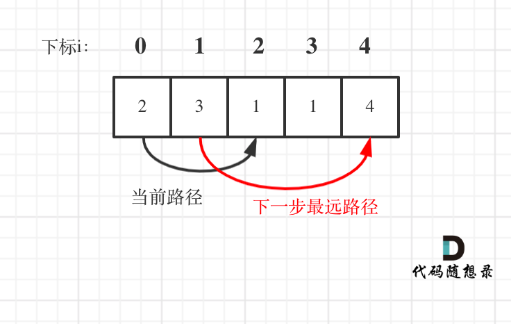

## 题目链接
https://leetcode-cn.com/problems/jump-game-ii/

## 思路 

本题相对于[0055.跳跃游戏](https://github.com/youngyangyang04/leetcode/blob/master/problems/0053.最大子序和.md)还是难了不少。

本题要计算最大步数，那么就要想清楚什么时候步数加一？ 

**这里需要统计两个距离，当前可移动距离和下一步最远距离**。

如果移动范围超过当前可移动距离，那么就必须再走一步来达到增加可移动距离的目的。

如图：

 </img></div>

### 方法一

这里还是有个特殊情况需要考虑，如果当前可移动距离的终点就是是集合终点，那么就不用增加步数了，因为不能再往后走了。

详情可看代码（详细注释）

```
// 版本一
class Solution {
public:
    int jump(vector<int>& nums) {
        if (nums.size() == 1) return 0;
        int curDistance = 0;    // 当前可移动距离
        int ans = 0;            // 记录走的最大步数
        int nextDistance = 0;   // 下一步最远距离
        for (int i = 0; i < nums.size(); i++) {
            nextDistance = max(nums[i] + i, nextDistance);
            if (i == curDistance) { // 遇到当前可移动距离的终点
                if (curDistance != nums.size() - 1) {   // 如果当前可移动距离的终点不是集合终点
                    ans++;                      // 需要走下一步
                    curDistance = nextDistance; // 更新下一步最远距离的范围
                    if (nextDistance >= nums.size() - 1) break; // 下一步最远距离已经可以达到终点，结束循环
                } else break;                           // 当前可移动距离的终点是集合终点
            }
        }
        return ans;
    }
};
```

### 方法二

依然是贪心，思路和方法一差不多，代码可以简洁一些。

在方法一种，处理 当前可移动距离的终点 是不是集合终点 来判断ans是否要做相应的加一操作。

其实可以用 for循环遍历的时候i < nums.size() - 1，这样就是默认最后一步，一定是可以到终点的。

代码如下：

```

class Solution {
public:
    int jump(vector<int>& nums) {
        int curDistance = 0;
        int ans = 0;            // 记录走的最大步数，初始为0
        int nextDistance = 0;   // 每走一步获得的跳跃范围
        for (int i = 0; i < nums.size() - 1; i++) { // 注意这里是小于nums.size() - 1
            nextDistance = max(nums[i] + i, nextDistance);
            if (i == curDistance) { // 遇到本次跳跃范围的终点
                curDistance = nextDistance;
                ans++;
            }
        }
        return ans;
    }
};
```
