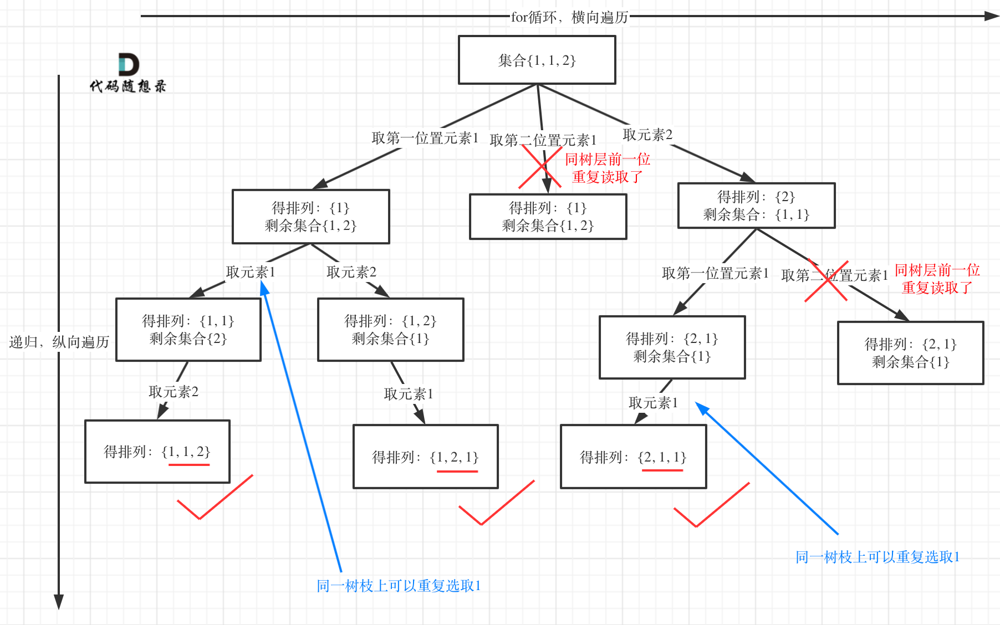
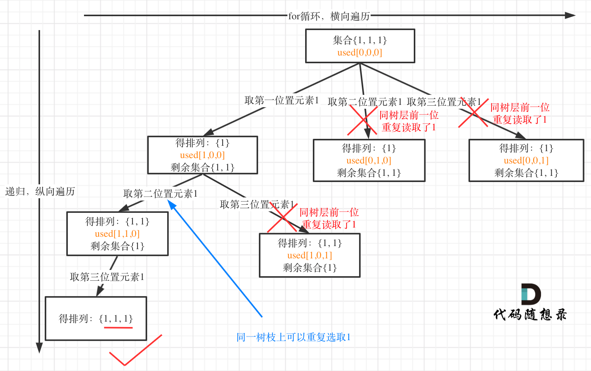
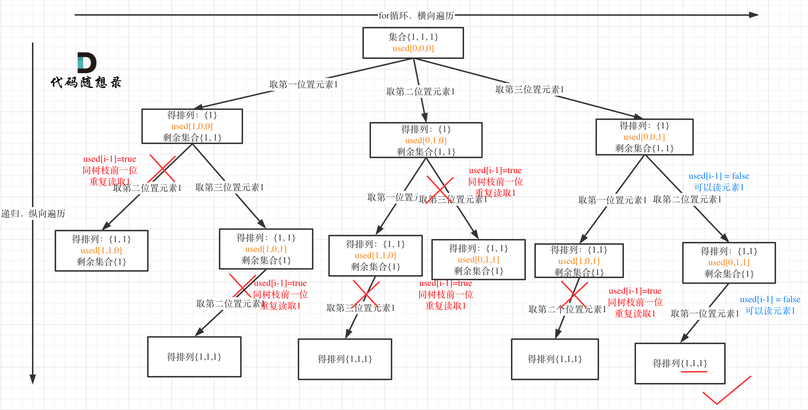

## 题目地址 
https://leetcode-cn.com/problems/permutations-ii/

## 思路 

这道题目和46.全排列的区别在与**给定一个可包含重复数字的序列**，要返回**所有不重复的全排列**。

这里就涉及到去重了。 

要注意**全排列是要取树的子节点的，如果是子集问题，就取树上的所有节点。**

很多同学在去重上想不明白，其实很多题解也没有讲清楚，反正代码是能过的，感觉是那么回事，稀里糊涂的先把题目过了。

这个去重为什么很难理解呢，**所谓去重，其实就是使用过的元素不能重复选取。** 这么一说好像很简单！

但是什么又是“使用过”，我们把排列问题抽象为树形结构之后，**“使用过”在这个树形结构上是有两个维度的**，一个维度是同一树枝上使用过，一个维度是同一树层上使用过。

**没有理解这两个层面上的“使用过” 是造成大家没有彻底理解去重的根本原因。**

那么排列问题，既可以在 同一树层上的“使用过”来去重，也可以在同一树枝上的“使用过”来去重！

理解这一本质，很多疑点就迎刃而解了。

首先把示例中的 [1,1,2]，抽象为一棵树，然后在同一树层上对nums[i-1]使用过的话，进行去重如图：

 </img></div>

图中我们对同一树层，前一位（也就是nums[i-1]）如果使用过，那么就进行去重。

代码如下：

## C++代码

```
class Solution {
private:
    vector<vector<int>> result;
    void backtracking (vector<int>& nums, vector<int>& vec, vector<bool>& used) {
        // 此时说明找到了一组
        if (vec.size() == nums.size()) {
            result.push_back(vec);
            return;
        }

        for (int i = 0; i < nums.size(); i++) {
            // 这里理解used[i - 1]非常重要 
            // used[i - 1] == true，说明同一树支nums[i - 1]使用过 
            // used[i - 1] == false，说明同一树层nums[i - 1]使用过
            // 如果同一树层nums[i - 1]使用过则直接跳过
            if (i > 0 && nums[i] == nums[i - 1] && used[i - 1] == false) { 
                continue;
            }
            if (used[i] == false) {
                used[i] = true;
                vec.push_back(nums[i]);
                backtracking(nums, vec, used);
                vec.pop_back();
                used[i] = false;
            }
        }
    }

public:
    vector<vector<int>> permuteUnique(vector<int>& nums) {
        sort(nums.begin(), nums.end());
        vector<bool> used(nums.size(), false);
        vector<int> vec;
        backtracking(nums, vec, used);
        return result;

    }
};
```

## 拓展

大家发现，去重最为关键的代码为：

```
if (i > 0 && nums[i] == nums[i - 1] && used[i - 1] == false) { 
    continue;
}
```

可是如果把 `used[i - 1] == true` 也是正确的，去重代码如下：
```
if (i > 0 && nums[i] == nums[i - 1] && used[i - 1] == true) { 
    continue;
}
```

这是为什么呢，就是上面我刚说的，如果要对树层中前一位去重，就用`used[i - 1] == false`，如果要对树枝前一位去重用用`used[i - 1] == true`。

**对于排列问题，树层上去重和树枝上去重，都是可以的，但是树层上去重效率更高！**

这么说是不是有点抽象？

来来来，我就用输入: [1,1,1] 来举一个例子。

树层上去重(used[i - 1] == false)，的树形结构如下：

 </img></div>

树枝上去重（used[i - 1] == true）的树型结构如下：

 </img></div>

大家应该很清晰的看到，树层上去重非常彻底，效率很高，树枝上去重虽然最后可能得到答案，但是多做了很多无用搜索。

