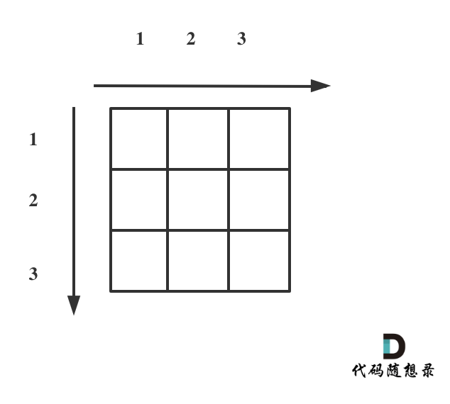
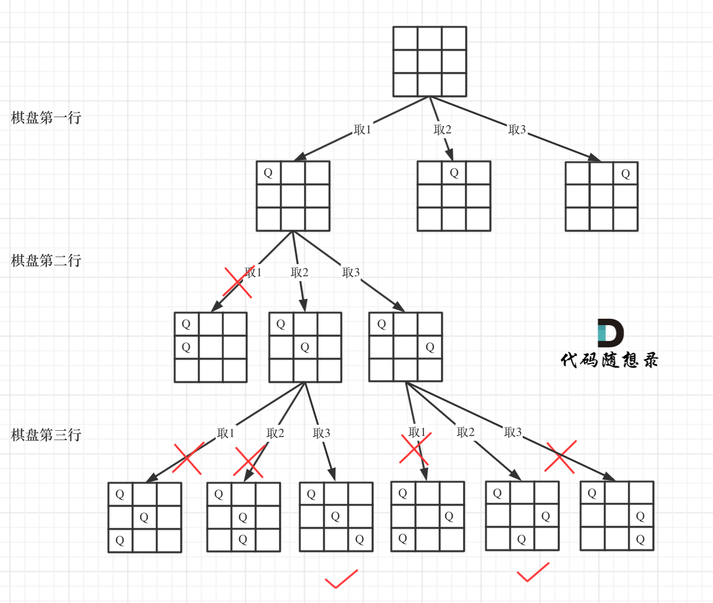

# 题目链接 

https://leetcode-cn.com/problems/n-queens/ 

# 第51题. N皇后
n 皇后问题研究的是如何将 n 个皇后放置在 n×n 的棋盘上，并且使皇后彼此之间不能相互攻击。 

上图为 8 皇后问题的一种解法。


给定一个整数 n，返回所有不同的 n 皇后问题的解决方案。

每一种解法包含一个明确的 n 皇后问题的棋子放置方案，该方案中 'Q' 和 '.' 分别代表了皇后和空位。

示例:

输入: 4
输出: [
 [".Q..",  // 解法 1
  "...Q",
  "Q...",
  "..Q."],

 ["..Q.",  // 解法 2
  "Q...",
  "...Q",
  ".Q.."]
]
解释: 4 皇后问题存在两个不同的解法。

提示：

> 皇后，是国际象棋中的棋子，意味着国王的妻子。皇后只做一件事，那就是“吃子”。当她遇见可以吃的棋子时，就迅速冲上去吃掉棋子。当然，她横、竖、斜都可走一到七步，可进可退。（引用自 百度百科 - 皇后 ）


# 思路

都知道n皇后问题是回溯算法解决的经典问题，但是用回溯解决多了 排列，组合，子集问题之后，遇到这种二位矩阵还会有点不知所措。

首先来看一下皇后们的约束条件：

1. 不能同行
2. 不能同列 
3. 不能同斜线


确定完约束条件，来看看究竟要怎么去搜索皇后们的位置，其实搜索皇后的位置，可以抽象为一棵树。

下面我用一个3 * 3 的棋牌，如图：

 </img></div>

将搜索过程抽象为一颗树，如图：


 </img></div>

从图中，可以看出，二维矩阵，其实矩阵的行，就是 这颗树的高度，矩阵的宽就是二叉树没一个节点孩子的宽度。


那么我们用皇后们的约束条件，来回溯搜索这颗二叉树，**只要搜索到了树的叶子节点，说明就找到了皇后们的合理位置了。** 

我总结的回溯模板如下：

```
backtracking() {
    if (终止条件) {
        存放结果;
    }

    for (枚举同一个位置的所有可能性，可以想成节点孩子的数量) {
        递归，处理节点;
        backtracking();
        回溯，撤销处理结果
    }
}
```

那么按照这个模板不能写出如下代码：

# C++代码

```
class Solution {
private:
void backtracking(int n, int row, vector<string>& chessboard, vector<vector<string>>& result) {
    if (row == n) {
        result.push_back(chessboard);
        return;
    }
    for (int col = 0; col < n; col++) {
        if (isValid(row, col, chessboard, n)) {
            chessboard[row][col] = 'Q';
            backtracking(n, row + 1, chessboard, result);
            chessboard[row][col] = '.';
        }
    }
}
bool isValid(int row, int col, vector<string>& chessboard, int n) {
    int count = 0;
    // 检查列
    for (int i = 0; i < row; i++) { // 这是一个剪枝
        if (chessboard[i][col] == 'Q') {
            return false;
        }
    }
    // 检查 45度角是否有皇后
    for (int i = row - 1, j = col - 1; i >=0 && j >= 0; i--, j--) {
        if (chessboard[i][j] == 'Q') {
            return false;
        }
    }
    // 检查 135度角是否有皇后
    for(int i = row - 1, j = col + 1; i >= 0 && j < n; i--, j++) {
        if (chessboard[i][j] == 'Q') {
            return false;
        }
    }
    return true;
}
public:
    vector<vector<string>> solveNQueens(int n) {
        std::vector<std::string> chessboard(n, std::string(n, '.'));
        vector<vector<string>> result;

        backtracking(n, 0, chessboard, result);
        return result;
    }
};
```
