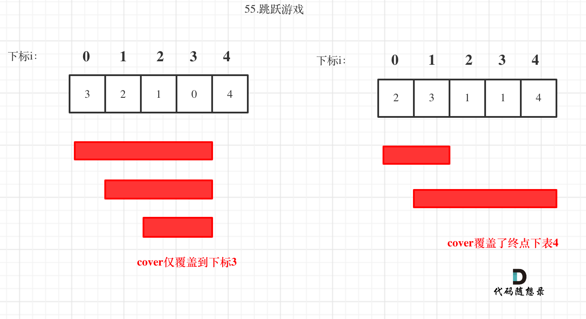

## 链接
https://leetcode-cn.com/problems/jump-game/

## 思路 

其实贪心和动态规划很容易混在一起，在面试中，我们应该本着能用贪心就用贪心，贪心解决不了再考虑用动态规划。 毕竟贪心更容易理解，并快速写出代码。

刚看到本题一开始可能想：当前位置元素如果是3，我究竟是跳一步呢，还是两步呢，还是三步呢，究竟跳几步才是最优呢？ 

其实如果本题是要求只能跳元素数值大小的个数，不能多也不能少，问是否达到终点，那么一定要用动态规划了。

但本题其实我们就看跳到的范围能否覆盖终点，就可以了。

那么我们每次取最大的覆盖范围，看最后能否覆盖终点。

如图：

 </img></div>

那么i每次移动只能在cover的范围内移动，每移动一个元素，cover得到该元素数值的补充，让i继续移动下去。

而cover每次只取 得到该元素数值补充后的范围 和 cover本身范围 的最大值。

如果cover大于等于了终点下表，直接return true就可以了。

C++代码如下：

```
class Solution {
public:
    bool canJump(vector<int>& nums) {
        int cover = 0;
        if (nums.size() == 1) return true; // 只有一个元素，就是能达到
        for (int i = 0; i <= cover; i++) { // 注意这里是小于等于cover
            cover = max(i + nums[i], cover);
            if (cover >= nums.size() - 1) return true; // 说明可以覆盖到终点了
        }
        return false;
    }
};
```
