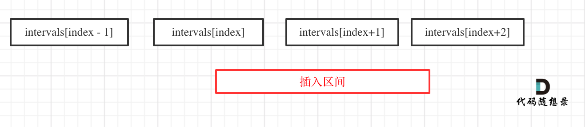
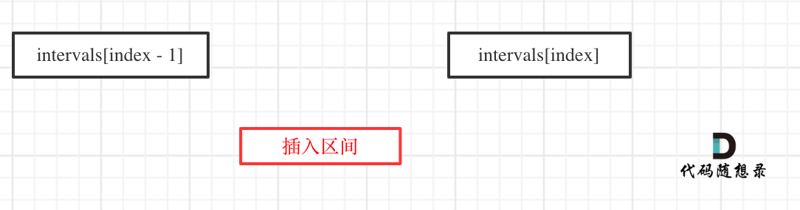

这道题目合并的情况有很多种，想想都让人头疼。 

我把这道题目化为三步：

## 步骤一：找到需要合并的区间 

找到插入区间需要插入或者合并的位置。 

代码如下：

```
int index = 0; // intervals的索引
while (index < intervals.size() && intervals[index][1] < newInterval[0]) {
    result.push_back(intervals[index++]);
}
```

此时intervals[index]就需要合并的区间了 

## 步骤二：合并区间

合并区间还有两种情况

1. intervals[index]需要合并，如图：

 </img></div>

对于这种情况，只要是intervals[index]起始位置 <= newInterval终止位置，就要一直合并下去。

代码如下：

```
while (index < intervals.size() && intervals[index][0] <= newInterval[1]) { // 注意防止越界
    newInterval[0] = min(intervals[index][0], newInterval[0]);
    newInterval[1] = max(intervals[index][1], newInterval[1]);
    index++;
}
```
合并之后，将newInterval放入result就可以了

2. intervals[index]不用合并，插入区间直接插入就行，如图：

 </img></div>

对于这种情况，就直接把newInterval放入result就可以了

## 步骤三：处理合并区间之后的区间 

合并之后，就应该把合并之后的区间，以此加入result中。

代码如下：

```
while (index < intervals.size()) {
    result.push_back(intervals[index++]);
}
```

# 整体C++代码

```
class Solution {
public:
    vector<vector<int>> insert(vector<vector<int>>& intervals, vector<int>& newInterval) {
        vector<vector<int>> result;
        int index = 0; // intervals的索引
        // 步骤一：找到需要合并的区间
        while (index < intervals.size() && intervals[index][1] < newInterval[0]) {
            result.push_back(intervals[index++]);
        }
        // 步骤二：合并区间
        while (index < intervals.size() && intervals[index][0] <= newInterval[1]) {
            newInterval[0] = min(intervals[index][0], newInterval[0]);
            newInterval[1] = max(intervals[index][1], newInterval[1]);
            index++;
        }
        result.push_back(newInterval);
        // 步骤三：处理合并区间之后的区间
        while (index < intervals.size()) {
            result.push_back(intervals[index++]);
        }
        return result;
    }
};
```
