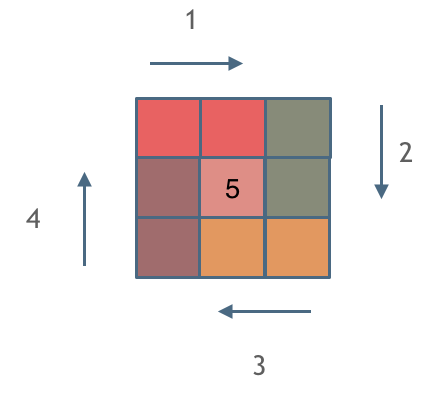

> 笔者在BAT从事技术研发多年，利用工作之余重刷leetcode，更多原创文章请关注公众号「代码随想录」。

## 题目地址 
https://leetcode-cn.com/problems/spiral-matrix-ii/ 

## 思路 

模拟顺时针画矩阵的过程 

填充上行从左到右 
填充右列从上到下
填充下行从右到左
填充左列从下到上

在模拟的过程中最重要的思想是**保持画每一条边的原则一致，即每次都是左闭右开的原则**，如果所示

 </img></div>

很多同学，做这道题目之所以一直写不好，代码越写越乱，就是因为 在画每一条边的时候，没有保证统一原则

例如：模拟矩阵上边的时候 左闭右开，然后模拟矩阵右列的时候又开始了左闭又闭，那岂能不乱

## 解法 

```C++
class Solution {
public:
    vector<vector<int>> generateMatrix(int n) {
        vector<vector<int>> res(n, vector<int>(n, 0)); // 使用vector定义一个二维数组
        int startx = 0, starty = 0; // 定义每循环一个圈的起始位置
        int loop = n / 2; // 每个圈循环几次，例如n为奇数3，那么loop = 1 只是循环一圈，矩阵中间的值需要单独处理
        int mid = n / 2; // 矩阵中间的位置，例如：n为3， 中间的位置就是(1，1)，n为5，中间位置为(2, 2)
        int count = 1; // 用来给矩阵中每一个空格赋值
        int offset = 1; // 每一圈循环，需要控制每一条边遍历的长度
        int i,j;
        while (loop --) {
            i = startx;
            j = starty;

            // 下面开始的四个for就是模拟转了一圈
            // 模拟填充上行从左到右(左闭右开)
            for (j = starty; j < starty + n - offset; j++) {
                res[startx][j] = count++;
            }
            // 模拟填充右列从上到下(左闭右开)
            for (i = startx; i < startx + n - offset; i++) {
                res[i][j] = count++;
            }
            // 模拟填充下行从右到左(左闭右开)
            for (; j > starty; j--) {
                res[i][j] = count++;
            }
            // 模拟填充左列从下到上(左闭右开)
            for (; i > startx; i--) {
                res[i][j] = count++;
            }

            // 第二圈开始的时候，起始位置要各自加1， 例如：第一圈起始位置是(0, 0)，第二圈起始位置是(1, 1)
            startx++;
            starty++;

            // offset 控制每一圈里每一条边遍历的长度
            offset += 2;
        }

        // 如果n为奇数的话，需要单独给矩阵最中间的位置赋值
        if (n % 2) {
            res[mid][mid] = count;
        }
        return res;
    }
};
```
> 笔者在先后在腾讯和百度从事技术研发多年，利用工作之余重刷leetcode，本文  [GitHub](https://github.com/youngyangyang04/leetcode-master )：https://github.com/youngyangyang04/leetcode-master 已经收录，欢迎star，fork，共同学习，一起进步。
