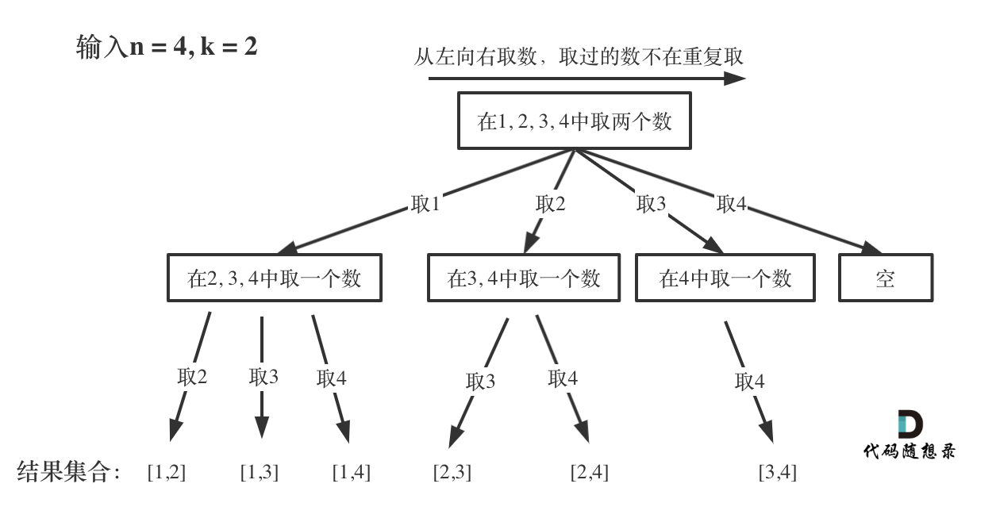
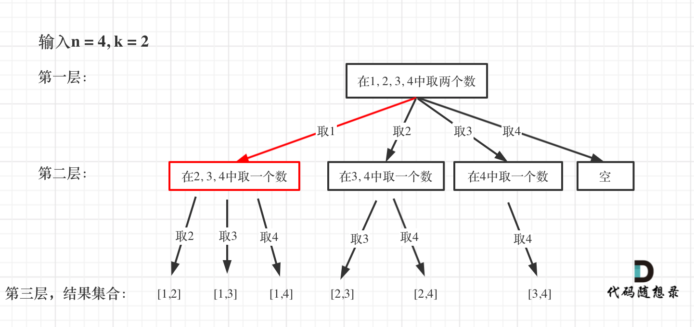
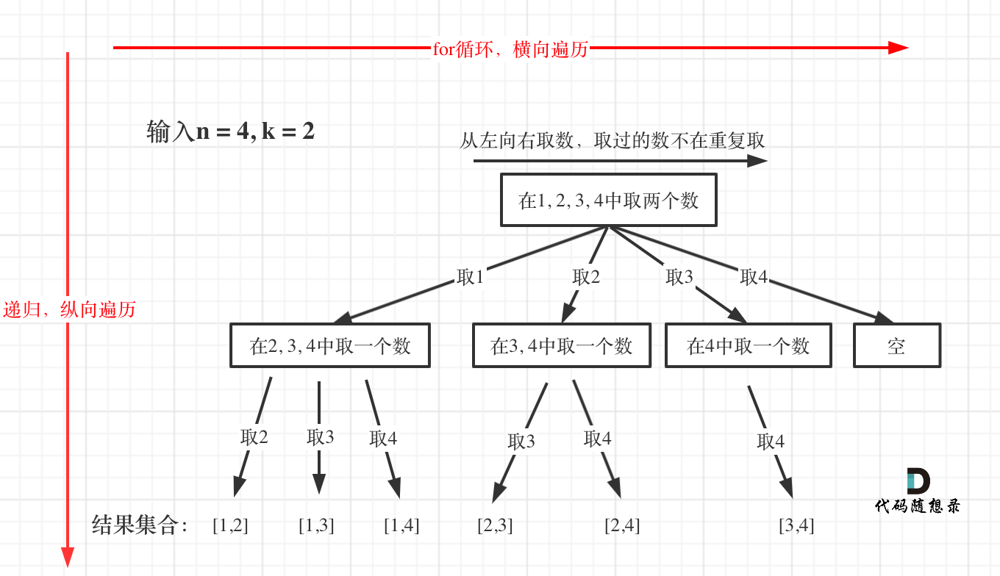

# 第77题. 组合

题目链接：https://leetcode-cn.com/problems/combinations/ 

给定两个整数 n 和 k，返回 1 ... n 中所有可能的 k 个数的组合。
示例:

输入: n = 4, k = 2
输出:
[
  [2,4],
  [3,4],
  [2,3],
  [1,2],
  [1,3],
  [1,4],
]


# 思路 

这是回溯法的经典题目。

直觉上当然是使用for循环，例如示例中k为2，很容易想到 用两个for循环，这样就可以输出 和示例中一样的结果。

代码如下：
```
    int n  = 4;
    for (int i = 1; i <= n; i++) {
        for (int j = i + 1; j <= n; j++) {
            cout << i << " " << j << endl;
        }
    }
```

输入：n = 100, k = 3
那么就三层for循环，代码如下：

```
for (int i = 1; i <= n; i++) {
    for (int j = i + 1; j <= n; j++) {
        for (int u = j + 1; u <=n; n++) {

        }
    }
}
```

**如果n为100，k为50呢，那就50层for循环，是不是开始窒息**。

那么回溯法就能解决这个问题了。

回溯是用来做选择，递归用来做节点层叠嵌套（可以理解是随便开K的for循环），**每一次的递归相当于嵌套一个for循环，可以用于解决多层嵌套循环的问题了**。

**回溯问题都可以抽象为一棵树形结构！用树形结构来理解回溯就容易多了**。

那么我们把组合问题抽象为如下树形结构：

 </img></div>

可以看出这个棵树，一开始集合是 1，2，3，4， 从左向右取数，取过的数，不在重复取。

第一次取1，集合变为2，3，4 ，因为k为2，我们只需要再取一个数就可以了，分别取，2，3，4， 得到集合[1,2] [1,3] [1,4]，以此类推。

**回溯的问题都可以抽象为一个树形结构，在求解组合问题的过程中，n相当于树的宽度，k相当于树的深度**。

**每次从集合中选组元素，可选择的范围随着选择的进行而限缩，调整可选择的范围**

如何在这个树上遍历，然后收集到我们要的结果集呢？

用的就是回溯搜索法，**可以发现，每次搜索到了叶子节点，我们就找到了一个结果**。


**这份模板，大家可以要记住了，后面做回溯搜索的题目，都离不开这个模板**。 

## 求组合

掌握了模板之后，我们再来看一下这道求组合的题目。

* 回溯函数返回值以及参数 

在这里要定义两个全局变量，一个用来存放符合条件单一结果，一个用来存放符合条件结果的集合。

代码如下：

```
vector<vector<int>> result; // 存放符合条件结果的集合
vector<int> path; // 用来存放符合条件结果
```

其实不定义这两个全局遍历也是可以的，把这两个变量放进回溯函数的参数里，但为了函数里参数太多影响可读性，所以我定义全局变量。

首先两个参数，集合n里面取k的数，是两个int型的变量。

然后还需要一个参数，也为int型变量startIndex，这个参数用来记录本层递归的中，集合从哪里开始遍历（集合就是[1,...,n] ）。

为什么要有这个startIndex呢？ 

从下图中红线部分可以看出，在集合[1,2,3,4]取1之后，下一层递归，就要在[2,3,4]中取数了，那么下一层递归如何知道从[2,3,4]中取数呢，靠的就是startIndex。

 </img></div>

所以需要startIndex来记录下一层递归，搜索的起始位置。 

那么整体代码如下：

```
vector<vector<int>> result; // 存放符合条件结果的集合
vector<int> path; // 用来存放符合条件单一结果
void backtracking(int n, int k, int startIndex) 
```

* 回溯函数终止条件 

什么时候到达所谓的叶子节点了呢？

就是path这个数组的大小如果达到k，说明我们找到了一个集合大小为k的组合了，在图中path存的就是根节点到叶子节点的路径。

如图红色部分：

 </img></div>

此时用result二维数组，把path保存起来，并终止本层递归。

所以终止条件代码如下：

```
if (path.size() == k) {
    result.push_back(path);
    return;
}
```


* 回溯搜索的遍历过程 

在如下如中，我们知道for循环用来横向遍历，递归的过程是纵向遍历。
 </img></div>

如此我们才遍历完图中的这棵树。

那么for循环每次就是从startIndex开始遍历，然后用path保存每次遍历到的节点。 

代码如下：

```
for (int i = startIndex; i <= n; i++) {
    path.push_back(i); // 处理节点 
    backtracking(n, k, i + 1); // 注意下一层搜索要从i+1开始
    path.pop_back(); // 回溯，撤销处理的节点
}
```

关键地方都讲完了，组合问题C++完整代码如下：


```
class Solution {
private:
    vector<vector<int>> result; // 存放符合条件结果的集合
    vector<int> path; // 用来存放符合条件结果
    void backtracking(int n, int k, int startIndex) {
        if (path.size() == k) {
            result.push_back(path);
            return;
        }
        for (int i = startIndex; i <= n; i++) {
            path.push_back(i); // 处理节点 
            backtracking(n, k, i + 1);
            path.pop_back(); // 回溯，撤销处理的节点
        }
    }
public:
    vector<vector<int>> combine(int n, int k) {
        result.clear();  // 可以不写
        path.clear(); // 可以不写
        backtracking(n, k, 1);
        return result;
    }
};
```

## 剪枝优化 

在遍历的过程中如下代码 ： 

```
for (int i = startIndex; i <= n; i++) 
```

这个遍历的范围是可以剪枝优化的，怎么优化呢？

来举一个例子，n = 4， k = 4的话，那么从2开始的遍历都没有意义了。

已经选择的元素个数：path.size();

要选择的元素个数 : k - path.size();

在集合n中开始选择的起始位置 : n - (k - path.size());

因为起始位置是从1开始的，而且代码里是n <= 起始位置，所以 集合n中开始选择的起始位置 : n - (k - path.size()) + 1;

所以优化之后是：

```
for (int i = startIndex; i <= n - (k - path.size()) + 1; i++)
```

优化后整体代码如下：

```
class Solution {
private:
    vector<vector<int>> result; // 存放符合条件结果的集合
    vector<int> path; // 用来存放符合条件结果
    void backtracking(int n, int k, int startIndex) {
        if (path.size() == k) {
            result.push_back(path);
            return;
        }
        for (int i = startIndex; i <= n - (k - path.size()) + 1; i++) {
            path.push_back(i); // 处理节点 
            backtracking(n, k, i + 1);
            path.pop_back(); // 回溯，撤销处理的节点
        }
    }
public:

    vector<vector<int>> combine(int n, int k) {
        backtracking(n, k, 1);
        return result;
    }
};
```


