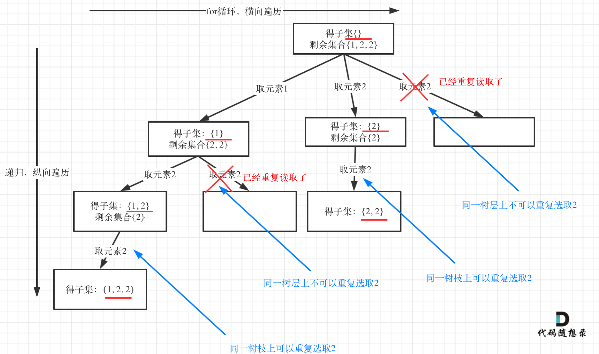

# 题目地址 
https://leetcode-cn.com/problems/subsets-ii/

# 第90题. 子集II

给定一个可能包含重复元素的整数数组 nums，返回该数组所有可能的子集（幂集）。

说明：解集不能包含重复的子集。

示例:   
输入: [1,2,2]  
输出:  
[  
  [2],  
  [1],  
  [1,2,2],  
  [2,2],  
  [1,2],  
  []  
]  


# 思路 

这道题目和[0078.子集](https://github.com/youngyangyang04/leetcode/blob/master/problems/0078.子集.md)区别就是集合里有重复元素了，而且求取的子集要去重。

很多同学在去重上想不明白，其实很多题解也没有讲清楚，反正代码是能过的，感觉是那么回事，稀里糊涂的先把题目过了。

这个去重为什么很难理解呢，**所谓去重，其实就是使用过的元素不能重复选取。** 这么一说好像很简单！

都知道组合问题可以抽象为树形结构，那么“使用过”在这个树形结构上是有两个维度的，一个维度是同一树枝上使用过，一个维度是同一树层上使用过。**没有理解这两个层面上的“使用过” 是造成大家没有彻底理解去重的根本原因。**

所以要明确我们要去重的是同一树层上的“使用过”。

用示例中的[1, 2, 2] 来举例，如图所示：

 </img></div>

从图中可以看出，同一树层上对重复取2 就要过滤掉，同一树枝上就可以重复取2，因为同一树枝上元素的集合才是唯一子集！

代码如下：（已经详细注释）

# C++代码

```
class Solution {
private:
    void backtracking(vector<int>& nums, vector<vector<int>>& result, vector<int>& vec, int startIndex,  vector<bool>& used) {
        result.push_back(vec);
        for (int i = startIndex; i < nums.size(); i++) {
            // used[i - 1] == true，说明同一树支candidates[i - 1]使用过 
            // used[i - 1] == false，说明同一树层candidates[i - 1]使用过
            // 而我们要对同一树层使用过的元素进行跳过
            if (i > 0 && nums[i] == nums[i - 1] && used[i - 1] == false) { 
                continue;
            }
            vec.push_back(nums[i]);
            used[i] = true;
            backtracking(nums, result, vec, i + 1, used);
            used[i] = false;
            vec.pop_back();
        }
    }

public:
    vector<vector<int>> subsetsWithDup(vector<int>& nums) {
        vector<bool> used(nums.size(), false);
        vector<vector<int>> result;
        vector<int> vec;
        sort(nums.begin(), nums.end());
        backtracking(nums, result, vec, 0, used);
        return result;
    }
};
```
