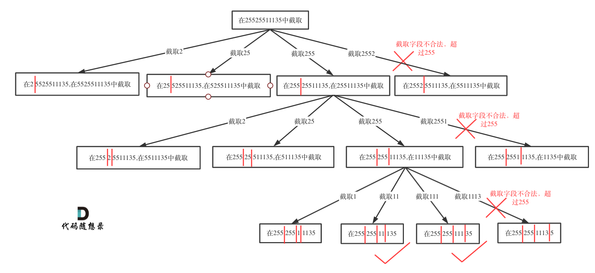

## 题目地址 
https://leetcode-cn.com/problems/restore-ip-addresses/

# 93. 复原IP地址

给定一个只包含数字的字符串，复原它并返回所有可能的 IP 地址格式。

有效的 IP 地址 正好由四个整数（每个整数位于 0 到 255 之间组成，且不能含有前导 0），整数之间用 '.' 分隔。

例如："0.1.2.201" 和 "192.168.1.1" 是 有效的 IP 地址，但是 "0.011.255.245"、"192.168.1.312" 和 "192.168@1.1" 是 无效的 IP 地址。

 

示例 1：  
输入：s = "25525511135"  
输出：["255.255.11.135","255.255.111.35"]   

示例 2：  
输入：s = "0000"   
输出：["0.0.0.0"]  

示例 3：
输入：s = "1111"   
输出：["1.1.1.1"]  

示例 4： 
输入：s = "010010"  
输出：["0.10.0.10","0.100.1.0"]  

示例 5： 
输入：s = "101023"  
输出：["1.0.10.23","1.0.102.3","10.1.0.23","10.10.2.3","101.0.2.3"]   

提示：  
0 <= s.length <= 3000  
s 仅由数字组成  


## 思路 

这道题目相信大家刚看时看到的时候，应该会一脸茫然。

那么只要意识到这是切割问题，那么切割问题就可以使用回溯搜索法把所有可能性搜出来，和[0131.分割回文串](https://github.com/youngyangyang04/leetcode/blob/master/problems/0131.分割回文串.md) 类似。

那么切割问题可以抽象为树型结构，如图：

 </img></div>

终止条件： 和[0131.分割回文串](https://github.com/youngyangyang04/leetcode/blob/master/problems/0131.分割回文串.md) 不同，本题明确要求只会分成4段，所以不能用切割线切到最后作为终止条件，而是分割的段数作为终止条件。

代码如下：

```
if (pointNum == 3) { // 逗点数量为3时，分隔结束
    // 判断第四段子字符串是否合法，如果合法就放进result中
    if (isValid(s, startIndex, s.size() - 1)) {
        result.push_back(s);
    }
    return;
}
```

那么再来看循环遍历的过程如何截取子串。

在`for (int i = startIndex; i < s.size(); i++)`循环中 [startIndex, i]这个区间就是截取的子串，需要判断这个子串是否合法，如果合法就在字符串后面加上符号`.`表示已经分割。

然后就是递归和回溯的过程：

递归调用时，下一层递归的startIndex要从i+2开始（因为刚刚在字符串中加入了分隔符`.`），同时记录分割符的数量pointNum 要 +1。

回溯的时候，就将刚刚加入的分隔符`.` 删掉就可以了，**pointNum其实也要减一，但是 pointNum+1 的逻辑放在递归函数的参数里了，这里相当于隐藏了回溯pointNum的过程**。

递归和回溯代码如下：

```
// 插入逗点之后下一个子串的起始位置为i+2
backtracking(s, i + 2, pointNum + 1);
s.erase(s.begin() + i + 1); // 回溯时删掉逗点
```

最后就是在写一个判断段位是否是有效段位了。

主要考虑到如下三点：

* 段位以0为开头的数字不合法
* 段位里有非正整数字符不合法 
* 段位如果大于255了不合法

代码如下：

```
// 判断字符串s在左闭又闭区间[start, end]所组成的数字是否合法
bool isValid(const string& s, int start, int end) {
    if (start > end) {
        return false;
    }
    if (s[start] == '0' && start != end) { // 0开头的数字不合法
            return false;
    }
    int num = 0;
    for (int i = start; i <= end; i++) {
        if (s[i] > '9' || s[i] < '0') { // 遇到非数字字符不合法
            return false;
        }
        num = num * 10 + (s[i] - '0');
        if (num > 255) { // 如果大于255了不合法
            return false;
        }
    }
    return true;
}
```

关键代码已经讲完，整体代码如下：

## C++代码

```
class Solution {
private:
    vector<string> result;// 记录结果
    // startIndex: 搜索的起始位置，pointNum:添加逗点的数量
    void backtracking(string& s, int startIndex, int pointNum) {
        if (pointNum == 3) { // 逗点数量为3时，分隔结束
            // 判断第四段子字符串是否合法，如果合法就放进result中
            if (isValid(s, startIndex, s.size() - 1)) {
                result.push_back(s);
            }
            return;
        }
        // 从起始位置开始构造字段字符串串
        for (int i = startIndex; i < s.size(); i++) {
            // 判断 [startIndex,i] 这个区间的子串是否合法
            if (isValid(s, startIndex, i)) {
                // 合法，在i的后面插入一个逗点
                s.insert(s.begin() + i + 1 , '.');
                // 插入逗点之后下一个子串的起始位置为i+2
                backtracking(s, i + 2, pointNum + 1);
                s.erase(s.begin() + i + 1); // 回溯时删掉逗点
            } else break;
        }
    }
    // 判断字符串s在左闭又闭区间[start, end]所组成的数字是否合法
    bool isValid(const string& s, int start, int end) {
        if (start > end) {
            return false;
        }
        if (s[start] == '0' && start != end) { // 0开头的数字不合法
                return false;
        }
        int num = 0;
        for (int i = start; i <= end; i++) {
            if (s[i] > '9' || s[i] < '0') { // 遇到非数字字符不合法
                return false;
            }
            num = num * 10 + (s[i] - '0');
            if (num > 255) { // 如果大于255了不合法
                return false;
            }
        }
        return true;
    }
public:
    vector<string> restoreIpAddresses(string s) {
        result.clear();
        backtracking(s, 0, 0);
        return result;
    }
};
```

> 更多算法干货文章持续更新，可以微信搜索「代码随想录」第一时间围观，关注后，回复「Java」「C++」 「python」「简历模板」「数据结构与算法」等等，就可以获得我多年整理的学习资料。
