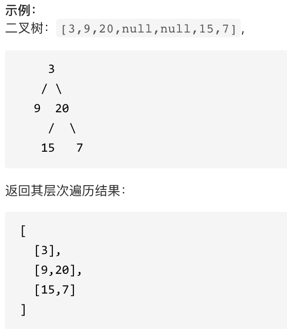
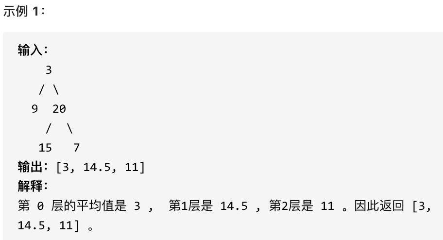

## 题目地址 
https://leetcode-cn.com/problems/binary-tree-level-order-traversal/

> 我要打十个！

看完这篇文章虽然不能打十个，但是可以迅速打六个！而且够快！


# 102.二叉树的层序遍历 

给你一个二叉树，请你返回其按 层序遍历 得到的节点值。 （即逐层地，从左到右访问所有节点）。

 </img></div>

## 思路 

我们之前讲过了三篇关于二叉树的深度优先遍历的文章：

* [二叉树：前中后序递归法](https://mp.weixin.qq.com/s/PwVIfxDlT3kRgMASWAMGhA)
* [二叉树：前中后序迭代法](https://mp.weixin.qq.com/s/c_zCrGHIVlBjUH_hJtghCg)
* [二叉树：前中后序迭代方式统一写法](https://mp.weixin.qq.com/s/WKg0Ty1_3SZkztpHubZPRg)

接下来我们再来介绍二叉树的另一种遍历方式：层序遍历。

层序遍历一个二叉树。就是从左到右一层一层的去遍历二叉树。这种遍历的方式和我们之前讲过的都不太一样。

需要借用一个辅助数据结构即队列来实现，**队列先进先出，符合一层一层遍历的逻辑，而是用栈先进后出适合模拟深度优先遍历也就是递归的逻辑。**

**而这种层序遍历方式就是图论中的广度优先遍历，只不过我们应用在二叉树上。**

使用队列实现二叉树广度优先遍历，动画如下：


<video src='../video/102二叉树的层序遍历.mp4' controls='controls' width='640' height='320' autoplay='autoplay'> Your browser does not support the video tag.</video></div>

这样就实现了层序从左到右遍历二叉树。

代码如下：**这份代码也可以作为二叉树层序遍历的模板，以后再打五个就靠它了**。

## C++代码

```
class Solution {
public:
    vector<vector<int>> levelOrder(TreeNode* root) {
        queue<TreeNode*> que;
        if (root != NULL) que.push(root);
        vector<vector<int>> result;
        while (!que.empty()) {
            int size = que.size();
            vector<int> vec;
            // 这里一定要使用固定大小size，不要使用que.size()，因为que.size是不断变化的
            for (int i = 0; i < size; i++) {
                TreeNode* node = que.front();
                que.pop();
                vec.push_back(node->val);
                if (node->left) que.push(node->left);
                if (node->right) que.push(node->right);
            }
            result.push_back(vec);
        }
        return result;
    }
};
```

**此时我们就掌握了二叉树的层序遍历了，那么如下五道leetcode上的题目，只需要修改模板的一两行代码（不能再多了），便可打倒！**

# 107.二叉树的层次遍历 II 

给定一个二叉树，返回其节点值自底向上的层次遍历。 （即按从叶子节点所在层到根节点所在的层，逐层从左向右遍历） 

 </img></div>

## 思路 

相对于102.二叉树的层序遍历，就是最后把result数组反转一下就可以了。 

## C++代码

```
class Solution {
public:
    vector<vector<int>> levelOrderBottom(TreeNode* root) {
        queue<TreeNode*> que;
        if (root != NULL) que.push(root);
        vector<vector<int>> result;
        while (!que.empty()) {
            int size = que.size();
            vector<int> vec;
            for (int i = 0; i < size; i++) { 
                TreeNode* node = que.front();
                que.pop();
                vec.push_back(node->val);
                if (node->left) que.push(node->left);
                if (node->right) que.push(node->right);
            }
            result.push_back(vec);
        }
        reverse(result.begin(), result.end()); // 在这里反转一下数组即可
        return result;

    }
};
```


# 199.二叉树的右视图 

给定一棵二叉树，想象自己站在它的右侧，按照从顶部到底部的顺序，返回从右侧所能看到的节点值。

 </img></div>

## 思路

层序遍历的时候，判断是否遍历到单层的最后面的元素，如果是，就放进result数组中，随后返回result就可以了。

## C++代码

```
class Solution {
public:
    vector<int> rightSideView(TreeNode* root) {
        queue<TreeNode*> que;
        if (root != NULL) que.push(root);
        vector<int> result;
        while (!que.empty()) {
            int size = que.size();
            for (int i = 0; i < size; i++) {
                TreeNode* node = que.front();
                que.pop();
                if (i == (size - 1)) result.push_back(node->val); // 将每一层的最后元素放入result数组中
                if (node->left) que.push(node->left);
                if (node->right) que.push(node->right);
            }
        }
        return result;
    }
};
```

# 637.二叉树的层平均值

给定一个非空二叉树, 返回一个由每层节点平均值组成的数组。 

 </img></div>

## 思路 

本题就是层序遍历的时候把一层求个总和在取一个均值。

## C++代码

```
class Solution {
public:
    vector<double> averageOfLevels(TreeNode* root) {
        queue<TreeNode*> que;
        if (root != NULL) que.push(root);
        vector<double> result;
        while (!que.empty()) {
            int size = que.size();
            double sum = 0; // 统计每一层的和
            for (int i = 0; i < size; i++) { 
                TreeNode* node = que.front();
                que.pop();
                sum += node->val;
                if (node->left) que.push(node->left);
                if (node->right) que.push(node->right);
            }
            result.push_back(sum / size); // 将每一层均值放进结果集
        }
        return result;
    }
};

```

# 429.N叉树的层序遍历 

给定一个 N 叉树，返回其节点值的层序遍历。 (即从左到右，逐层遍历)。

例如，给定一个 3叉树 :


 </img></div>

返回其层序遍历:

[   
     [1],   
     [3,2,4],  
     [5,6]  
]   


## 思路  

这道题依旧是模板题，只不过一个节点有多个孩子了 

## C++代码

```
class Solution {
public:
    vector<vector<int>> levelOrder(Node* root) {
        queue<Node*> que;
        if (root != NULL) que.push(root);
        vector<vector<int>> result;
        while (!que.empty()) {
            int size = que.size();
            vector<int> vec;
            for (int i = 0; i < size; i++) { 
                Node* node = que.front();
                que.pop();
                vec.push_back(node->val);
                for (int i = 0; i < node->children.size(); i++) { // 将节点孩子加入队列
                    if (node->children[i]) que.push(node->children[i]);
                }
            }
            result.push_back(vec);
        }
        return result;

    }
};
```

# 515.在每个树行中找最大值 

您需要在二叉树的每一行中找到最大的值。 

 </img></div>

## 思路

层序遍历，取每一层的最大值

## C++代码 

```
        queue<TreeNode*> que;
        if (root != NULL) que.push(root);
        vector<vector<int>> result;
        while (!que.empty()) {
            int size = que.size();
            vector<int> vec;
            // 这里一定要使用固定大小size，不要使用que.size()，因为que.size是不断变化的
            for (int i = 0; i < size; i++) {
                TreeNode* node = que.front();
                que.pop();
                vec.push_back(node->val);
                if (node->left) que.push(node->left);
                if (node->right) que.push(node->right);
            }
            result.push_back(vec);
        }
        return result;
```
# 总结 

二叉树的层序遍历，就是图论中的广度优先搜索在二叉树中的应用，需要借助队列来实现（此时是不是又发现队列的应用了）。

学会二叉树的层序遍历，可以一口气撸完leetcode上五道题目：

* 102.二叉树的层序遍历
* 107.二叉树的层次遍历II
* 199.二叉树的右视图
* 637.二叉树的层平均值
* 589.N叉树的前序遍历
* 515.在每个树行中找最大值

虽然不能一口气打十个，打六个也还行。

如果非要打十个，还得找叶师傅！ 

 </img></div>


> 更多算法干货文章持续更新，可以微信搜索「代码随想录」第一时间围观，关注后，回复「Java」「C++」 「python」「简历模板」「数据结构与算法」等等，就可以获得我多年整理的学习资料。
