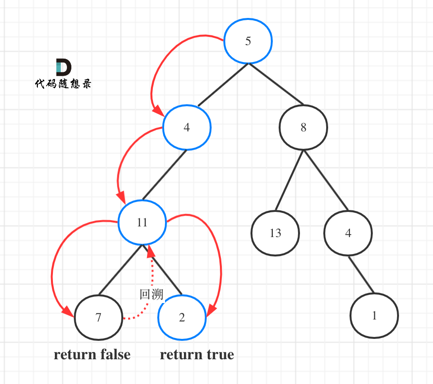

## 题目地址 

## 思路 

相信大家看到千篇一律的写法：
```
class Solution {
public:
    bool hasPathSum(TreeNode* root, int sum) {
        if (root == NULL) return false;
        if (!root->left && !root->right && sum == root->val) {
            return true;
        }
        return hasPathSum(root->left, sum - root->val) || hasPathSum(root->right, sum - root->val);
    }
};
```
**这种写法简短是简短，但其实对于读者理解不是很友好，没有很好的体现出递归的顺序已经背后的回溯。**

**相信很多同学都疑惑递归的过程中究竟什么时候需要返回值，什么时候不需要返回值？**

**如果需要搜索整颗二叉树，那么递归函数就不要返回值，如果要搜索其中一条符合条件的路径，递归函数就需要返回值，因为遇到符合条件的路径了就要及时返回。**

而本题就要要搜索一条路径，使其上所有节点值相加等于目标和，所以递归需要返回值！ 

如图所示：

 </img></div>

图中可以看出，遍历的路线，并不要遍历整棵树，所以递归函数需要返回值，可以用bool类型表示。

那么使用深度优先遍历的方式（本题前中后序都可以，无所谓）来遍历二叉树，如下代码我尽量将每一步清晰的表现出来，C++代码如下：

```
class Solution {
private:
    bool traversal(TreeNode* cur, int count) {
        if (!cur->left && !cur->right && count == 0) return true; // 遇到叶子节点，并且计数为0
        
        if (!cur->left && !cur->right) return false; // 遇到叶子节点而没有找到合适的边，直接返回

        if (cur->left) { // 左 （空节点不遍历）
            // 遇到叶子节点返回true，则直接返回true
            if (traversal(cur->left, count - cur->left->val)) return true;
        }
        if (cur->right) { // 右 （空节点不遍历）
            // 遇到叶子节点返回true，则直接返回true
            if (traversal(cur->right, count - cur->right->val)) return true;
        }
        return false;
    }

public:
    bool hasPathSum(TreeNode* root, int sum) {
        if (root == NULL) return false;
        return traversal(root, sum - root->val);
    }
};
```


那么其实本题一定是有回溯的，没有回溯，如何后撤重新找另一条路径呢，但是貌似以上代码中，**大家貌似没有感受到回溯，那是因为回溯在代码里隐藏起来了。**

隐藏在`traversal(cur->left, count - cur->left->val)`这里， 因为把`count - cur->left->val` 直接作为参数传进去，函数结束，count自然恢复到原先的数值了。

为了把回溯的过程体现出来，将`if (traversal(cur->left, count - cur->left->val)) return true;` 改为如下代码：

```
if (cur->left) { // 左
    count -= cur->left->val; // 递归，处理节点;
    if (traversal(cur->left, count)) return true;
    count += cur->left->val; // 回溯，撤销处理结果
}
```

这样大家就能感受到回溯了，整体回溯代码如下：

```
class Solution {
private:
    bool traversal(TreeNode* cur, int count) {
        if (!cur->left && !cur->right && count == 0) return true; // 遇到叶子节点，并且计数为0
        if (!cur->left && !cur->right) return false; // 遇到叶子节点直接返回

        if (cur->left) { // 左
            count -= cur->left->val; // 递归，处理节点;
            if (traversal(cur->left, count)) return true;
            count += cur->left->val; // 回溯，撤销处理结果
        }
        if (cur->right) { // 右
            count -= cur->right->val; // 递归，处理节点;
            if (traversal(cur->right, count)) return true;
            count += cur->right->val; // 回溯，撤销处理结果
        }
        return false;
    }

public:
    bool hasPathSum(TreeNode* root, int sum) {
        if (root == NULL) return false;
        return traversal(root, sum - root->val);
    }
};
```

如果使用栈模拟递归的话，那么如果做回溯呢？ 

此时栈里一个元素不仅要记录该节点指针，还要记录从头结点到该节点的路径数值总和。 

C++就我们用pair结构来存放这个栈里的元素。

定义为：`pair<TreeNode*, int>` pair<节点指针，路径数值>

这个为栈里的一个元素。

如下代码是使用栈模拟的前序遍历，如下：（详细注释）

```
class Solution {

public:
    bool hasPathSum(TreeNode* root, int sum) {
        if (root == NULL) return false;
        // 此时栈里要放的是pair<节点指针，路径数值>
        stack<pair<TreeNode*, int>> st;
        st.push(pair<TreeNode*, int>(root, root->val));
        while (!st.empty()) {
            pair<TreeNode*, int> node = st.top();
            st.pop();
            // 如果该节点是叶子节点了，同时该节点的路径数值等于sum，那么就返回true
            if (!node.first->left && !node.first->right && sum == node.second) return true;

            // 右节点，压进去一个节点的时候，将该节点的路径数值也记录下来
            if (node.first->right) {
                st.push(pair<TreeNode*, int>(node.first->right, node.second + node.first->right->val));
            }

            // 左节点，压进去一个节点的时候，将该节点的路径数值也记录下来
            if (node.first->left) {
                st.push(pair<TreeNode*, int>(node.first->left, node.second + node.first->left->val));
            }
        }
        return false;
    }
};
```
