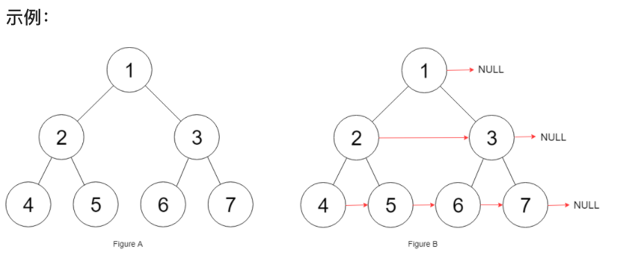

# 链接 
https://leetcode-cn.com/problems/populating-next-right-pointers-in-each-node/

## 思路 


注意题目提示内容，：
* 你只能使用常量级额外空间。
* 使用递归解题也符合要求，本题中递归程序占用的栈空间不算做额外的空间复杂度。

基本上就是要求使用递归了，迭代的方式一定会用到栈或者队列。

### 递归

一想用递归怎么做呢，虽然层序遍历是最直观的，但是递归的方式确实不好想。

如图，假如当前操作的节点是cur：

 </img></div>

最关键的点是可以通过上一层递归 搭出来的线，进行本次搭线。

图中cur节点为元素4，那么搭线的逻辑代码：（**注意注释中操作1和操作2和图中的对应关系**）

```
if (cur->left) cur->left->next = cur->right; // 操作1
if (cur->right) {
    if (cur->next) cur->right->next = cur->next->left; // 操作2 
    else cur->right->next = NULL;
}
```

理解到这里，使用前序遍历，那么不难写出如下代码：

如果对二叉树的前中后序不了解看这篇:[二叉树：一入递归深似海，从此offer是路人](https://mp.weixin.qq.com/s/PwVIfxDlT3kRgMASWAMGhA) 


```
class Solution {
private:
    void traversal(Node* cur) {
        if (cur == NULL) return;
                                // 中
        if (cur->left) cur->left->next = cur->right; // 操作1
        if (cur->right) {
            if (cur->next) cur->right->next = cur->next->left; // 操作2 
            else cur->right->next = NULL;
        }
        traversal(cur->left);   // 左
        traversal(cur->right);  // 右
    }
public:
    Node* connect(Node* root) {
        traversal(root);
        return root;
    }
};
```

### 迭代（层序遍历）

本题使用层序遍历是最为直观的，如果对层序遍历不了解，看这篇：[二叉树：层序遍历登场！](https://mp.weixin.qq.com/s/Gb3BjakIKGNpup2jYtTzog)。

层序遍历本来就是一层一层的去遍历，记录一层的头结点（nodePre），然后让nodePre指向当前遍历的节点就可以了。

代码如下：

```

class Solution {
public:
    Node* connect(Node* root) {
        queue<Node*> que;
        if (root != NULL) que.push(root);
        while (!que.empty()) {
            int size = que.size();
            vector<int> vec;
            Node* nodePre;
            Node* node;
            for (int i = 0; i < size; i++) { // 开始每一层的遍历
                if (i == 0) {
                    nodePre = que.front(); // 记录一层的头结点
                    que.pop();
                    node = nodePre;
                } else {
                    node = que.front();
                    que.pop();
                    nodePre->next = node; // 本层前一个节点next指向本节点
                    nodePre = nodePre->next;
                }
                if (node->left) que.push(node->left);
                if (node->right) que.push(node->right);
            }
            nodePre->next = NULL; // 本层最后一个节点指向NULL
        }
        return root;
    }
};
```
