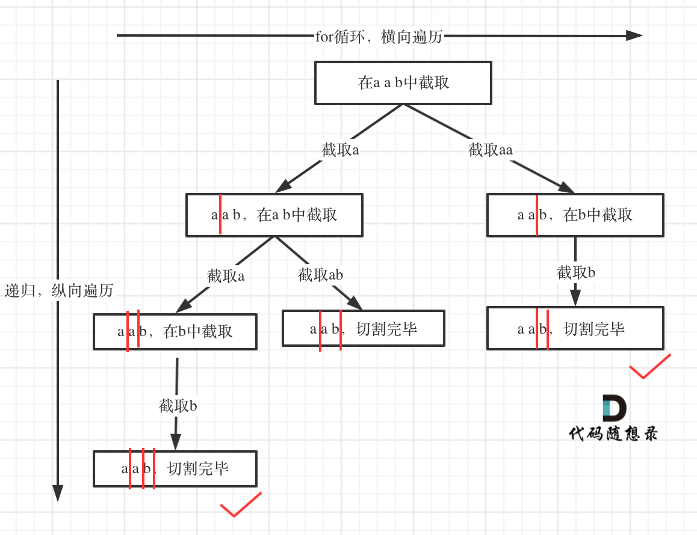

## 题目地址 
https://leetcode-cn.com/problems/palindrome-partitioning/

## 思路 

（分割 有这么多系列啊！！！！！）

本题这涉及到两个关键问题：

1. 切割问题，有不同的切割方式
2. 判断回文

相信这里不同的切割方式可以搞懵很多同学了。


这种题目，想用for循环暴力解法，可能都不那么容易写出来，所以要换一种暴力的方式，就是回溯

一些同学可能想不清楚 回溯究竟是如果切割子串 

我们来分析一下切割，其实切割，类似于组合问题。 

例如对于字符串abcdef，

组合问题：选取一个a之后，在bcdef中再去选取第二个，选取b之后在cdef中在选组第三个.....。
切割问题：切割一个a之后，在bcdef中再去切割第二段，切割b之后在cdef中在切割第三段.....。

感受出来了不？

所以切割问题，也可以抽象为一颗树形结构，如图：

 </img></div>

递归用来纵向遍历，for循环用来横向遍历，切割线（就是图中的红线）切割到字符串的结尾位置，说明找到了一个切割方法。

此时可以发现，切割问题的回溯搜索的过程和组合问题的回溯搜索的过程是差不多的。

回溯法模板：

```
backtracking() {
    if (终止条件) {
        存放结果;
    }

    for (选择：选择列表（可以想成树中节点孩子的数量）) {
        递归，处理节点;
        backtracking();
        回溯，撤销处理结果
    }
}

```

在来分析一下终止条件，要从上图中可以看出，切割线切到了字符串最后面，说明找到了一种切割方法，那么此时，就是本层递归的终止终止条件。

那么在代码里什么是切割线呢，在处理集合问题的时候，参数我们都要传入startIndex，表示下一轮递归遍历的起始位置，这个startIndex就是切割线。

代码如下：

```
void backtracking (const string& s, int startIndex) {
    // 如果起始位置已经大于s的大小，说明已经找到了一组分割方案了
    if (startIndex >= s.size()) {
        result.push_back(path);
        return;
    }
}
```

在来看看在递归循环，中如何截取子串呢


## C++代码
```
class Solution {
private:
    vector<vector<string>> result;
    vector<string> path; // 放已经回文的子串
    // startIndex: 搜索的起始位置
    void backtracking (const string& s, int startIndex) {
        // 如果起始位置已经大于s的大小，说明已经找到了一组分割方案了
        if (startIndex >= s.size()) {
            result.push_back(path);
            return;
        }
        for (int i = startIndex; i < s.size(); i++) {
            if (isPalindrome(s, startIndex, i)) { // 是回文子串
                // 获取[startIndex,i]在s中的子串
                string str = s.substr(startIndex, i - startIndex + 1);
                path.push_back(str);
            } else { // 如果不是则直接跳过
                continue;
            }
            backtracking(s, i + 1, path); // 寻找i+1为起始位置的子串
            path.pop_back(); // 回溯过程，弹出本次已经填在的子串
        }
    }
    bool isPalindrome(const string& s, int start, int end) {
        for (int i = start, j = end; i < j; i++, j--) {
            if (s[i] != s[j]) {
                return false;
            }
        }
        return true;
    }
public:
    vector<vector<string>> partition(string s) {
        result.clear();
        path.clear();
        backtracking(s, 0);
        return result;
    }
};
```
> 更多算法干货文章持续更新，可以微信搜索「代码随想录」第一时间围观，关注后，回复「Java」「C++」 「python」「简历模板」「数据结构与算法」等等，就可以获得我多年整理的学习资料。
