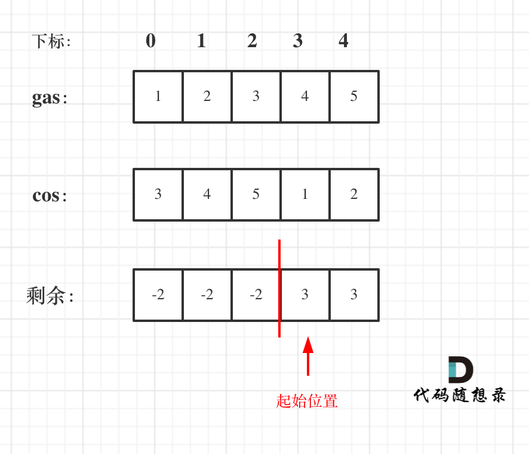

# 思路 

## 方法一 

来看一下贪心主要贪在哪里：

1. 如果gas的总和小于cost总和，那么无论从哪里出发，一定是跑不了一圈的 
2. remain[i] = gas[i]-cost[i]为一天剩下的油，remain[i]，i从0开始计算累加到最后一站，如果累加没有出现负数，说明从0出发，油就没有断过，那么0就是起点。

3. 如果累加的最小值是负数，就要从非0节点出发，从后向前，看哪个节点能这个负数填平。 

代码如下：

```
class Solution {
public:
    int canCompleteCircuit(vector<int>& gas, vector<int>& cost) {
        int curSum = 0;
        int min = INT_MAX; // 从起点出发，油箱里的油量
        for (int i = 0; i < gas.size(); i++) {
            int remain = gas[i] - cost[i];
            curSum += remain;
            if (curSum < min) {
                min = curSum;
            }
        }
        if (curSum < 0) return -1;  // 情况1
        if (min >= 0) return 0;     // 情况2
                                    // 情况3
        for (int i = gas.size() - 1; i >= 0; i--) {
            int remain = gas[i] - cost[i];
            min += remain; 
            if (min >= 0) {
                return i;
            }
        }
        return -1;
    }
};
```
其实这份代码还是比较复杂的。


## 方法二 

换一个思路，首先如果总油量减去总消耗大于零那么一定可以跑完一圈，说明 各个站点的加油站 剩油量remain[i]相加一定是大于零的。

每个加油站的剩余量remain[i]为gas[i] - cost[i]。

i从0开始累加remain[i]，和记为curSum，如果curSum小于零，说明 [0, i]区间都不能作为起始位置，起始位置从i+1算起。

如图：
 </img></div>

那么为什么[i，j] 区间和为负数，已经起始位置就可以是j+1呢，j+1后面就不会出现更大的负数？  

可以这么理解 j之前出现了多少负数，j后面就会出现多少正数，因为耗油总和是大于零的（前提我们已经确定了一定可以跑完全程）

代码如下：

```
class Solution {
public:
    int canCompleteCircuit(vector<int>& gas, vector<int>& cost) {
        int curSum = 0;
        int totalSum = 0;
        int start = 0;
        for (int i = 0; i < gas.size(); i++) {
            curSum += gas[i] - cost[i];
            totalSum += gas[i] - cost[i];
            if (curSum < 0) {
                start = i + 1;
                curSum = 0;
            }
        }
        if (totalSum < 0) return -1; // 说明怎么走都不可能跑一圈了
        return start;
    }
};
```


> **我是[程序员Carl](https://github.com/youngyangyang04)，[组队刷题](https://img-blog.csdnimg.cn/20201115103410182.png)可以找我，本文[leetcode刷题攻略](https://github.com/youngyangyang04/leetcode-master)已收录，更多[精彩算法文章](https://mp.weixin.qq.com/mp/appmsgalbum?__biz=MzUxNjY5NTYxNA==&action=getalbum&album_id=1485825793120387074&scene=173#wechat_redirect)尽在：[代码随想录](https://img-blog.csdnimg.cn/20200815195519696.png)，关注后就会发现和「代码随想录」相见恨晚！**

**如果感觉题解对你有帮助，不要吝啬给一个👍吧！**


