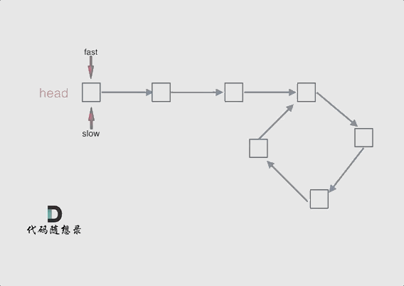

## 思路 

可以使用快慢指针法，  分别定义 fast 和 slow指针，从头结点出发，fast指针每次移动两个节点，slow指针每次移动一个节点，如果 fast 和 slow指针在途中相遇 ，说明这个链表有环。

为什么fast 走两个节点，slow走一个节点，有环的话，一定会在环内相遇呢，而不是永远的错开呢？

首先第一点： **fast指针一定先进入环中，如果fast 指针和slow指针相遇的话，一定是在环中相遇，这是毋庸置疑的。**

那么来看一下，**为什么fast指针和slow指针一定会相遇呢？**

可以画一个环，然后让 fast指针在任意一个节点开始追赶slow指针。 

会发现最终都是这种情况， 如下图：

 </img></div>

fast和slow各自再走一步， fast和slow就相遇了

这是因为fast是走两步，slow是走一步，**其实相对于slow来说，fast是一个节点一个节点的靠近slow的**，所以fast一定可以和slow重合。

动画如下：


 </img></div>


## C++代码如下 

```
class Solution {
public:
    bool hasCycle(ListNode *head) {
        ListNode* fast = head;
        ListNode* slow = head;
        while(fast != NULL && fast->next != NULL) {
            slow = slow->next;
            fast = fast->next->next;
            // 快慢指针相遇，说明有环
            if (slow == fast) return true;
        }
        return false;
    }
};
```
## 扩展 

做完这道题目，可以在做做142.环形链表II，不仅仅要找环，还要找环的入口。

142.环形链表II题解：[链表：环找到了，那入口呢？](https://mp.weixin.qq.com/s/_QVP3IkRZWx9zIpQRgajzA)
