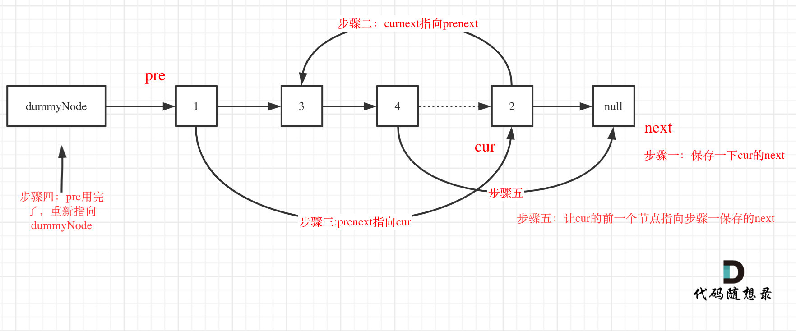

## 思路

这道题目还是很考察链表操作的。

如果不用虚拟头结点的话，这道题会很麻烦，对虚拟头结点不熟悉的同学，可以看这篇：[链表：听说用虚拟头节点会方便很多？](https://mp.weixin.qq.com/s/slM1CH5Ew9XzK93YOQYSjA)。

如果想整体掌握链表操作的话，看一下这篇[链表大总结](https://mp.weixin.qq.com/s/vK0JjSTHfpAbs8evz5hH8A)。

本题在模拟插入排序的过程中，一共要有三次改变节点指针的操作，如果不画一个图，很容易搞蒙了。

我举一个排序插入节点2的例子，并详细标注了每一个步骤，晚上一个插入操作有五步，如下：

 </img></div>

代码中注释的步骤和图中都是一一对应的，对着图看代码，就比较清晰了，C++代码如下：

```
class Solution {
public:
    ListNode* insertionSortList(ListNode* head) {
        if (head == nullptr) return head;

        ListNode* dummyHead = new ListNode(0); // 定一个虚拟头结点
        ListNode* cur = head;
        ListNode* pre = dummyHead;

        while (cur != nullptr) {
            while (pre->next != nullptr && pre->next->val < cur->val) {
                pre = pre->next;
            }
            // 在pre和prenext之间插入数据
            ListNode* next = cur->next; // 步骤一：保存curnext
            cur->next = pre->next;      // 步骤二
            pre->next = cur;            // 步骤三
            pre = dummyHead;            // 步骤四：pre重新指向虚拟头结点来找下一个插入位置
            cur = next;                 // 步骤五：cur的前一个节点的下一个节点指向保存的next
        }
        return dummyHead->next;
    }
};
```

> **我是[程序员Carl](https://github.com/youngyangyang04)，[组队刷题](https://img-blog.csdnimg.cn/20201115103410182.png)可以找我，本文[leetcode刷题攻略](https://github.com/youngyangyang04/leetcode-master)已收录，更多[精彩算法文章](https://mp.weixin.qq.com/mp/appmsgalbum?__biz=MzUxNjY5NTYxNA==&action=getalbum&album_id=1485825793120387074&scene=173#wechat_redirect)尽在：[代码随想录](https://img-blog.csdnimg.cn/20200815195519696.png)，关注后就会发现和「代码随想录」相见恨晚！**

**如果感觉题解对你有帮助，不要吝啬给一个👍吧！**

