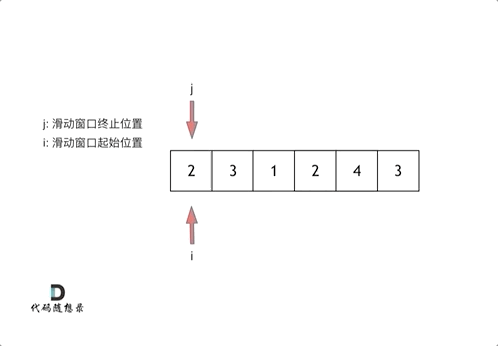

<p align='center'>

</p>
<p align="center">
  <a href="https://github.com/youngyangyang04/leetcode-master"></a>
  <a href="https://img-blog.csdnimg.cn/20201115103410182.png"></a>
  <a href="https://img-blog.csdnimg.cn/20201210231711160.png"></a>
  <a href="https://space.bilibili.com/525438321"></a>
  <a href="https://www.zhihu.com/people/sun-xiu-yang-64"></a>
  <a href="https://www.toutiao.com/c/user/60356270818/#mid=1633692776932365"></a>
</p>

> 滑动窗口拯救了你

# 题目209.长度最小的子数组

题目链接： https://leetcode-cn.com/problems/minimum-size-subarray-sum/

给定一个含有 n 个正整数的数组和一个正整数 s ，找出该数组中满足其和 ≥ s 的长度最小的 连续 子数组，并返回其长度。如果不存在符合条件的子数组，返回 0。

示例：

输入：s = 7, nums = [2,3,1,2,4,3]  
输出：2   
解释：子数组 [4,3] 是该条件下的长度最小的子数组。   


# 暴力解法

这道题目暴力解法当然是 两个for循环，然后不断的寻找符合条件的子序列，时间复杂度很明显是O(n^2) 。

代码如下：

```
class Solution {
public:
    int minSubArrayLen(int s, vector<int>& nums) {
        int result = INT32_MAX; // 最终的结果
        int sum = 0; // 子序列的数值之和
        int subLength = 0; // 子序列的长度
        for (int i = 0; i < nums.size(); i++) { // 设置子序列起点为i
            sum = 0;
            for (int j = i; j < nums.size(); j++) { // 设置子序列终止位置为j
                sum += nums[j];
                if (sum >= s) { // 一旦发现子序列和超过了s，更新result
                    subLength = j - i + 1; // 取子序列的长度
                    result = result < subLength ? result : subLength;
                    break; // 因为我们是找符合条件最短的子序列，所以一旦符合条件就break
                }
            }
        }
        // 如果result没有被赋值的话，就返回0，说明没有符合条件的子序列
        return result == INT32_MAX ? 0 : result;
    }
};
```
时间复杂度：O(n^2)  
空间复杂度：O(1)

# 滑动窗口

接下来就开始介绍数组操作中另一个重要的方法：**滑动窗口**。

所谓滑动窗口，**就是不断的调节子序列的起始位置和终止位置，从而得出我们要想的结果**。

这里还是以题目中的示例来举例，s=7， 数组是 2，3，1，2，4，3，来看一下查找的过程：

 </img></div>

最后找到 4，3 是最短距离。

其实从动画中可以发现滑动窗口也可以理解为双指针法的一种！只不过这种解法更像是一个窗口的移动，所以叫做滑动窗口更适合一些。

在本题中实现滑动窗口，主要确定如下三点：

* 窗口内是什么？ 
* 如何移动窗口的起始位置？
* 如何移动窗口的结束位置？ 

窗口就是 满足其和 ≥ s 的长度最小的 连续 子数组。

窗口的起始位置如何移动：如果当前窗口的值大于s了，窗口就要向前移动了（也就是该缩小了）。

窗口的结束位置如何移动：窗口的结束位置就是遍历数组的指针，窗口的起始位置设置为数组的起始位置就可以了。

解题的关键在于 窗口的起始位置如何移动，如图所示：

 </img></div>

可以发现**滑动窗口的精妙之处在于根据当前子序列和大小的情况，不断调节子序列的起始位置。从而将O(n^2)的暴力解法降为O(n)。**


# C++滑动窗口代码

```
class Solution {
public:
    int minSubArrayLen(int s, vector<int>& nums) {
        int result = INT32_MAX;
        int sum = 0; // 滑动窗口数值之和
        int i = 0; // 滑动窗口起始位置
        int subLength = 0; // 滑动窗口的长度
        for (int j = 0; j < nums.size(); j++) {
            sum += nums[j];
            // 注意这里使用while，每次更新 i（起始位置），并不断比较子序列是否符合条件
            while (sum >= s) {
                subLength = (j - i + 1); // 取子序列的长度
                result = result < subLength ? result : subLength;
                sum -= nums[i++]; // 这里体现出滑动窗口的精髓之处，不断变更i（子序列的起始位置）
            }
        }
        // 如果result没有被赋值的话，就返回0，说明没有符合条件的子序列
        return result == INT32_MAX ? 0 : result;
    }
};
```

时间复杂度：O(n)  
空间复杂度：O(1)


**循序渐进学算法，认准「代码随想录」，Carl手把手带你过关斩将！**

<p align='center'>

</p>
