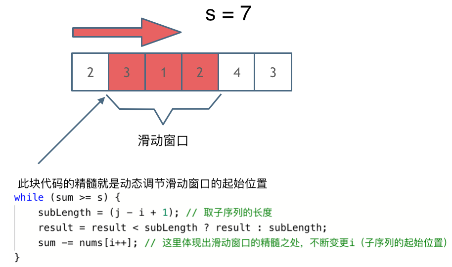

## 题目地址 
https://leetcode-cn.com/problems/minimum-size-subarray-sum/

## 思路 
这道题目暴力解法当然是 两个for循环，然后不断的寻找符合条件的子序列，时间复杂度很明显是O(n^2) 。

还可以使用滑动窗口的细想来做这道题。所谓滑动窗口，**就是不断的调节子序列的起始位置，从而得出我们要想的结果**

这里还是以题目中的示例来举例，s=7， 数组是 2，3，1，2，4，3，来看一下动画效果：

<video src='../video/209.长度最小的子数组.mp4' controls='controls' width='640' height='320' autoplay='autoplay'> Your browser does not support the video tag.</video></div>

代码如下：

## 暴力解法

```
class Solution {
public:
    int minSubArrayLen(int s, vector<int>& nums) {
        int result = INT32_MAX; // 最终的结果
        int sum = 0; // 子序列的数值之和
        int subLength = 0; // 子序列的长度
        for (int i = 0; i < nums.size(); i++) { // 设置子序列起点为i
            sum = 0;
            for (int j = i; j < nums.size(); j++) { // 设置子序列终止位置为j
                sum += nums[j];
                if (sum >= s) { // 一旦发现子序列和超过了s，更新result
                    subLength = j - i + 1; // 取子序列的长度
                    // result取 result和subLength最小的那个
                    result = result < subLength ? result : subLength;
                    break; // 因为我们是找符合条件最短的子序列，所以一旦符合条件就break
                }
            }
        }
        // 如果result没有被赋值的话，就返回0，说明没有符合条件的子序列
        return result == INT32_MAX ? 0 : result;
    }
};
```

## 滑动窗口 

 </img></div>
```
// 滑动窗口
class Solution {
public:
    int minSubArrayLen(int s, vector<int>& nums) {
        int result = INT32_MAX;
        int sum = 0; // 滑动窗口数值之和
        int i = 0; // 滑动窗口起始位置
        int subLength = 0; // 滑动窗口的长度
        for (int j = 0; j < nums.size(); j++) {
            sum += nums[j];
            // 注意这里使用while，每次更新 i（起始位置），并不断比较子序列是否符合条件
            while (sum >= s) {
                subLength = (j - i + 1); // 取子序列的长度
                // result取 result和subLength最小的那个
                result = result < subLength ? result : subLength;
                sum -= nums[i++]; // 这里体现出滑动窗口的精髓之处，不断变更i（子序列的起始位置）
            }
        }
        // 如果result没有被赋值的话，就返回0，说明没有符合条件的子序列
        return result == INT32_MAX ? 0 : result;
    }
};
```

> 更过算法干货文章持续更新，可以微信搜索「代码随想录」第一时间围观，关注后，回复「Java」「C++」 「python」「简历模板」「数据结构与算法」等等，就可以获得我多年整理的学习资料。

