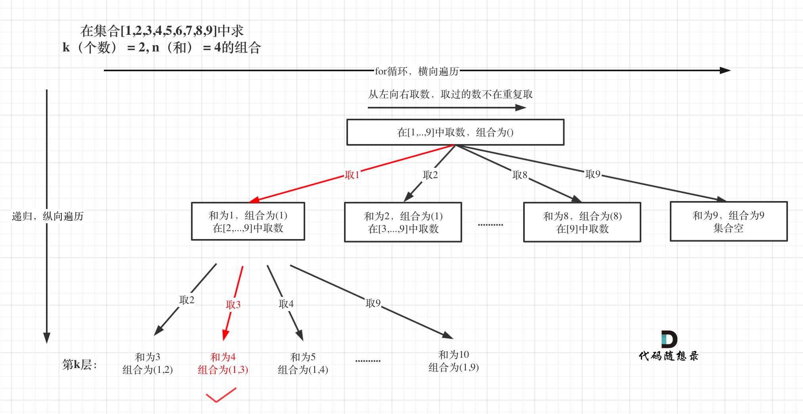

# 第216题. 组合总和 III
找出所有相加之和为 n 的 k 个数的组合。组合中只允许含有 1 - 9 的正整数，并且每种组合中不存在重复的数字。

说明：

所有数字都是正整数。
解集不能包含重复的组合。 

示例 1:

输入: k = 3, n = 7
输出: [[1,2,4]]
示例 2:

输入: k = 3, n = 9
输出: [[1,2,6], [1,3,5], [2,3,4]]


# 思路 

这道题目注意一下几点：

* 解集不能包含重复的组合。 说明不用去重了，难度就小一些。
* 求的是组合，那么集合没有顺序，for里面依然要从startIndex开始（如果是排列的话，就从0开始）

本题k相当于限制了树的深度，9就是树的宽度。

选取过程如图：

 </img></div>

那么这还是一道标准的模板题，模板：

```
backtracking() {
    if (终止条件) {
        存放结果;
    }

    for (选择：选择列表（可以想成树中节点孩子的数量）) {
        递归，处理节点;
        backtracking();
        回溯，撤销处理结果
    }
}
```


# C++代码

```
class Solution {
private:
    vector<vector<int>> result;
    vector<int> path;
    void backtracking(int target, int k, int num, int sum, int startIndex) {
        if (sum > target || num > k) {
            return;
        }
        if (num == k && sum == target) {
            result.push_back(path);
            return;
        }

        for (int i = startIndex; i <= 9; i++) {
            sum += i;
            path.push_back(i);
            num++;
            backtracking(target, k, num, sum, i + 1);
            num--;
            sum -= i;
            path.pop_back();
        }
    }

public:
    vector<vector<int>> combinationSum3(int k, int n) {
        backtracking(n, k, 0, 0, 1);
        return result;

    }
};
```
