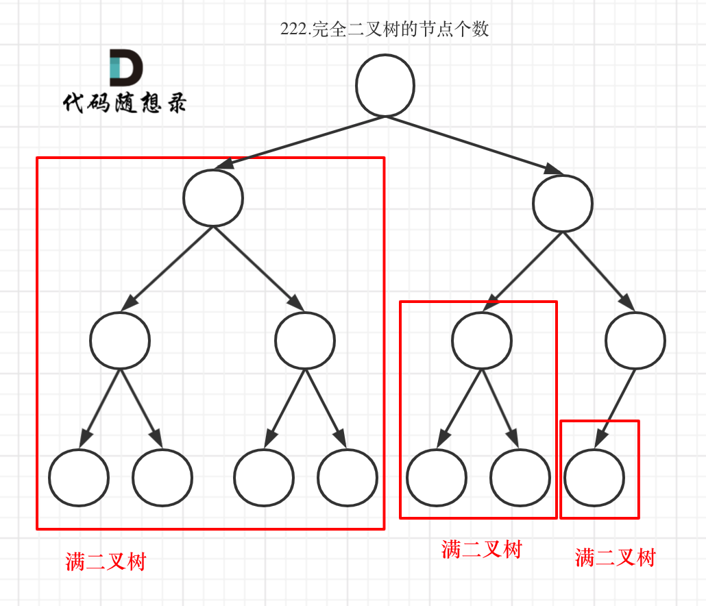

## 题目地址 
https://leetcode-cn.com/problems/count-complete-tree-nodes/

> 今天是中秋&&国庆，所以来一道二叉树简单题吧

如果之前两篇[二叉树：看看这些树的最大深度](https://mp.weixin.qq.com/s/guKwV-gSNbA1CcbvkMtHBg)， [二叉树：看看这些树的最小深度](https://mp.weixin.qq.com/s/BH8-gPC3_QlqICDg7rGSGA)都认真看了的话，这道题目可以分分钟刷掉了哈哈。

# 222.完全二叉树的节点个数

给出一个完全二叉树，求出该树的节点个数。

示例:

 </img></div>

# 思路 

这道题目其实没有必要强调是完全二叉树，就是求二叉树节点的个数。


依然可以使用递归法和迭代法来解决。

这道题目的递归法和求二叉树的深度写法类似， 而迭代法：二叉树层序遍历模板稍稍修改一下，记录遍历的节点数量就可以了。

递归遍历的顺序依然是后序（左右中）。

## 递归 

如果对求二叉树深度还不熟悉的话，看这篇：[二叉树：看看这些树的最大深度](https://mp.weixin.qq.com/s/guKwV-gSNbA1CcbvkMtHBg)。

1. 确定递归函数的参数和返回值：参数就是传入树的根节点，返回就返回以该节点为根节点二叉树的节点数量，所以返回值为int类型。

代码如下：
```
int getNodesNum(TreeNode* cur) {
```

2. 确定终止条件：如果为空节点的话，就返回0，表示节点数为0。

代码如下： 

```
if (cur == NULL) return 0;
```

3. 确定单层递归的逻辑：先求它的左子树的节点数量，再求的右子树的节点数量，最后取总和再加一 （加1是因为算上当前中间节点）就是目前节点为根节点的节点数量。

代码如下：

```
        int leftNum = getNodesNum(cur->left);      // 左
        int rightNum = getNodesNum(cur->right);    // 右
        int treeNum = leftNum + rightNum + 1;      // 中
        return treeNum;
```

所以整体C++代码如下：

```
class Solution {
private:
    int getNodesNum(TreeNode* cur) {
        if (cur == 0) return 0;
        int leftNum = getNodesNum(cur->left);      // 左
        int rightNum = getNodesNum(cur->right);    // 右
        int treeNum = leftNum + rightNum + 1;      // 中
        return treeNum;
    }
public:
    int countNodes(TreeNode* root) {
        return getNodesNum(root);
    }
};
```

代码精简之后C++代码如下：
```
class Solution {
public:
    int countNodes(TreeNode* root) {
        if (root == NULL) return 0;
        return 1 + countNodes(root->left) + countNodes(root->right);
    }
};

```

## 迭代法 

如果对求二叉树层序遍历还不熟悉的话，看这篇：[二叉树：层序遍历登场！](https://mp.weixin.qq.com/s/Gb3BjakIKGNpup2jYtTzog)。

那么只要模板少做改动，加一个变量result，统计节点数量就可以了

```
class Solution {
public:
    int countNodes(TreeNode* root) {
        queue<TreeNode*> que;
        if (root != NULL) que.push(root);
        int result = 0;
        while (!que.empty()) {
            int size = que.size();
            for (int i = 0; i < size; i++) {
                TreeNode* node = que.front();
                que.pop();
                result++;   // 记录节点数量
                if (node->left) que.push(node->left);
                if (node->right) que.push(node->right);
            }
        }
        return result;
    }
};
```

# 总结 

这道题目的解法其实我们在[二叉树：看看这些树的最大深度](https://mp.weixin.qq.com/s/guKwV-gSNbA1CcbvkMtHBg)和 [二叉树：看看这些树的最小深度](https://mp.weixin.qq.com/s/BH8-gPC3_QlqICDg7rGSGA)都有提到过了。

一样的分析套路，代码也差不多，估计此时大家最这一类求二叉树节点数量以及求深度应该非常熟练了。

没有做过这道题目的同学可以愉快的刷了它了。

最后祝大家中秋&国庆节日愉快哈！

> 更多算法干货文章持续更新，可以微信搜索「代码随想录」第一时间围观，关注后，回复「Java」「C++」 「python」「简历模板」「数据结构与算法」等等，就可以获得我多年整理的学习资料。
