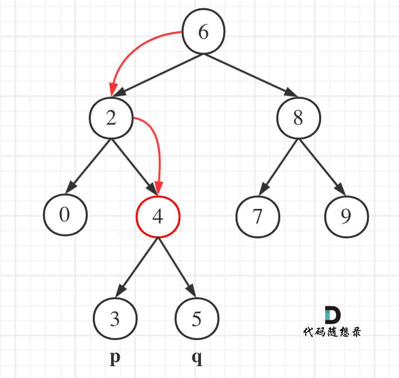

## 链接 
https://leetcode-cn.com/problems/lowest-common-ancestor-of-a-binary-search-tree/

## 思路 


遇到这个题目首先想的是要是能自底向上查找就好了，这样就可以找到公共祖先了，可惜二叉树只能自上向低。

那么自上相下查找的话，如何记录祖先呢？

做过[236. 二叉树的最近公共祖先](https://leetcode-cn.com/problems/lowest-common-ancestor-of-a-binary-tree/)题目的同学，应该知道，只要判断一个节点的左子树里有p，右子树里有q，那么当前节点就是最近公共祖先。

那么本题是二叉搜索树，二叉搜索树是有序的，那得好好利用一下这个特点。

在有序树里，如果判断一个节点的左子树里有p，右子树里有q呢？

其实只要从上到下遍历的时候，如果 (p->val <= cur->val && cur->val <= q->val)则说明该节点cur就是最近公共祖先了。

理解这一点，本题就很好解了。

如图所示

 </img></div>

在遍历二叉搜索树的时候就是寻找区间[p->val, q->val]（注意这里是左闭又闭）

那么如果 cur->val 大于 p->val，同时 cur->val 大于q->val，那么就应该向左遍历。（因为我们此时不知道p和q谁大，所以两个都要判断）

代码如下：

```
        if (cur->val > p->val && cur->val > q->val) {
            return traversal(cur->left, p, q);
        }
```

如果 cur->val 小于 p->val，同时 cur->val 小于 q->val，那么就应该向右遍历。

```
        } else if (cur->val < p->val && cur->val < q->val) {
            return traversal(cur->right, p, q);
        }
```

剩下的情况，我们就找到了区间使（p->val <=  cur->val && cur->val <= q->val）或者是 （q->val <=  cur->val && cur->val <= p->val）

代码如下：
```
        else {
            return cur;
        }

```

那么整体递归代码如下:

## C++递归代码

（我这里特意把递归的过程抽出一个函数traversal，这样代码更清晰，有助于读者理解。）

```
class Solution {
private:
    TreeNode* traversal(TreeNode* cur, TreeNode* p, TreeNode* q) {
        if (cur->val > p->val && cur->val > q->val) {
            return traversal(cur->left, p, q);
        } else if (cur->val < p->val && cur->val < q->val) {
            return traversal(cur->right, p, q);
        } else return cur;
    }
public:
    TreeNode* lowestCommonAncestor(TreeNode* root, TreeNode* p, TreeNode* q) {

        return traversal(root, p, q);
    }
};
```


## C++迭代法代码

同时给出一个迭代的版本，思想是一样的，代码如下：

```
class Solution {
public:
    TreeNode* lowestCommonAncestor(TreeNode* root, TreeNode* p, TreeNode* q) {
        while(root) {
            if (root->val > p->val && root->val > q->val) {
                root = root->left;
            } else if (root->val < p->val && root->val < q->val) {
                root = root->right;
            } else return root;
        }
        return NULL;
    }
};
```
