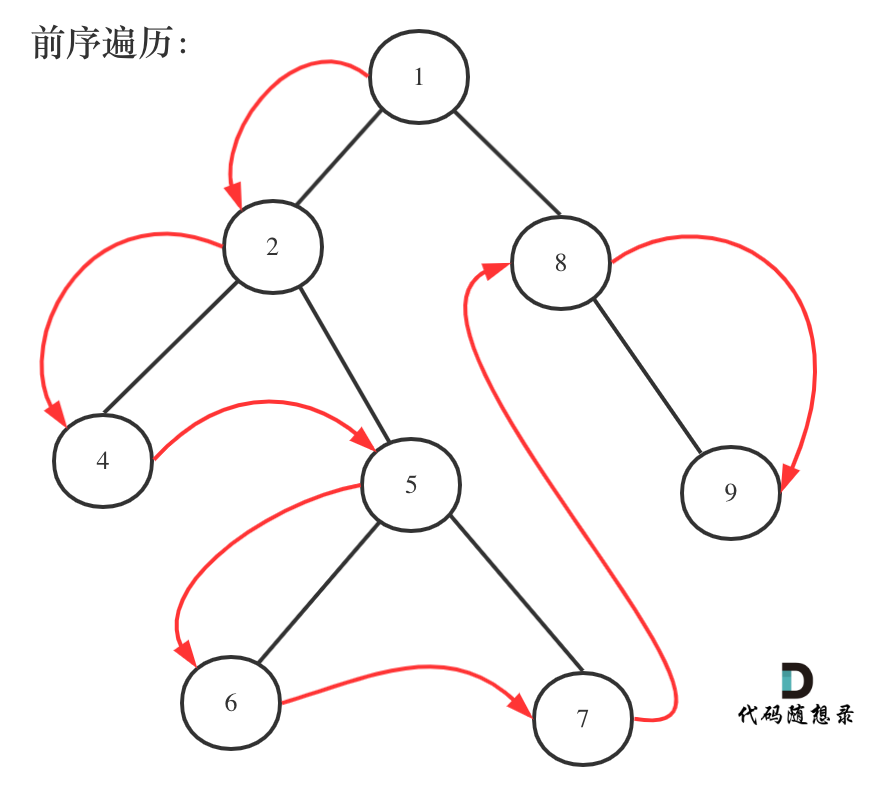

## 题目地址 
https://leetcode-cn.com/problems/binary-tree-paths/


## 思路

首先要知道遍历二叉树有两种遍历方式：二叉树深度优先遍历和二叉树广度优先遍历，那么每种遍历方式下还有不同的顺序。如下所示：
* 二叉树深度优先遍历
    * 前序遍历： [0144.二叉树的前序遍历](https://github.com/youngyangyang04/leetcode/blob/master/problems/0144.二叉树的前序遍历.md)
    * 后序遍历： [0145.二叉树的后序遍历](https://github.com/youngyangyang04/leetcode/blob/master/problems/0145.二叉树的后序遍历.md)
    * 中序遍历： [0094.二叉树的中序遍历](https://github.com/youngyangyang04/leetcode/blob/master/problems/0094.二叉树的中序遍历.md)
* 二叉树广度优先遍历 
    * 层序遍历：[0102.二叉树的层序遍历](https://github.com/youngyangyang04/leetcode/blob/master/problems/0102.二叉树的层序遍历.md)

这道题目要打印出根节点到叶子节点的所有路径，很明显广度优先遍历不合适，那么深度优先遍历中，应该选哪一种循序来遍历呢？

**要打印路径，就要选前序遍历**，因为中序和后序遍历都不能打印出路径来。

一些同学可能代码都写出来，而且都提交通过了，却不知道自己用了哪一种遍历，以及那种顺序来遍历的。

前序遍历如题：

 </img></div>

确定了是前序遍历，那么就是中左右的顺序。前序遍历 框架如下：
```
void traversal(TreeNode* cur, vector<int>& vec) {
    if (cur == NULL) return;
    vec.push_back(cur->val);    // 中 ，同时也是处理节点逻辑的地方
    traversal(cur->left, vec);  // 左
    traversal(cur->right, vec); // 右
}
```

我们先使用递归的方式，来做前序遍历。那么要知道递归和回溯就是一家的，本题也需要回溯。

1. 递归函数函数参数以及返回值 

要传入跟节点，记录每一条路径的path，和存放结果集的result，这里递归不需要返回值，代码如下：

```
void traversal(TreeNode* cur, vector<int>& path, vector<string>& result) 
```

2. 确定递归终止条件 

在写递归的时候都习惯了这么写：

```
if (cur == NULL) {
    终止处理逻辑
}
```

但是本题的终止条件这样写会很麻烦，因为本题要找到叶子节点，就开始结束的处理逻辑了（把路径放进result里）。

**那么什么时候算是找到了叶子节点？** 是当 cur不为空，其左右孩子都为空的时候，就找到叶子节点。

所以本题的终止条件是：
```
if (cur->left == NULL && cur->right == NULL) {
    终止处理逻辑
}
```

为什么没有判断cur是否为空呢，下文在讲解单层递归逻辑的时候会提到。

再来看一下终止处理的逻辑。

这里使用vector<int> 结构来记录路径，所以要把路径转为string格式，在把这个string 放进 result里。

**那么为什么使用了vector<int> 结构来记录路径呢？**  因为在下面处理单层递归逻辑的时候，要做回溯，使用vector方便来做回溯。 

那么有的同学问了，我看有些人的代码也没有回溯啊。

其实是有的，只不过隐藏在 函数调用时的参数赋值里，下文我还会提到。

这里我们先使用vector<int> 结构来记录路径，那么终止处理逻辑如下：

```
if (cur->left == NULL && cur->right == NULL) {
    string sPath;
    for (int i = 0; i < path.size() - 1; i++) {
        sPath += to_string(path[i]);
        sPath += "->";
    }
    sPath += to_string(path[path.size() - 1]);
    result.push_back(sPath);
    return;
}
```

3. 确定单层递归逻辑

因为是前序遍历，需要先处理中间节点，中间节点就是我们要记录路径上的节点，先放进path中。

`path.push_back(cur->val);` 

然后是递归和回溯的过程，上面说过没有判断cur是否为空，那么在这里递归的时候，如果为空就不进行下一层递归了。

所以递归前要加上判断语句，下面要递归的节点是否为空，如下

```
if (cur->left) {
    traversal(cur->left, path, result);
}
if (cur->right) {
    traversal(cur->right, path, result);
}
```

此时还没完，递归完，要做回溯啊，因为path 不能一直加入节点，它还要删节点，然后才能加入新的节点。

那么回溯要怎么回溯呢，一些同学会这么写，如下：

```
if (cur->left) {
    traversal(cur->left, path, result);
}
if (cur->right) {
    traversal(cur->right, path, result);
}
path.pop_back();
```

这个回溯就要很大的问题，我们知道，**回溯和递归是一一对应的，有一个递归，就要有一个回溯**，这么写的话相当于把递归和回溯拆开了， 一个在花括号里，一个在花括号外。

**所以回溯要和递归永远在一起，世界上最遥远的距离是你在花括号里，而我在花括号外！** 

那么代码应该这么写：

```
if (cur->left) {
    traversal(cur->left, path, result);
    path.pop_back(); // 回溯
}
if (cur->right) {
    traversal(cur->right, path, result);
    path.pop_back(); // 回溯
}
```

那么本题整体代码如下：

## C++代码第一种写法

```
class Solution {
private:

    void traversal(TreeNode* cur, vector<int>& path, vector<string>& result) {
        path.push_back(cur->val);
        // 这才到了叶子节点
        if (cur->left == NULL && cur->right == NULL) {
            string sPath;
            for (int i = 0; i < path.size() - 1; i++) {
                sPath += to_string(path[i]);
                sPath += "->";
            }
            sPath += to_string(path[path.size() - 1]);
            result.push_back(sPath);
            return;
        }
        if (cur->left) {
            traversal(cur->left, path, result);
            path.pop_back(); // 回溯
        }
        if (cur->right) {
            traversal(cur->right, path, result);
            path.pop_back(); // 回溯
        }
    }

public:
    vector<string> binaryTreePaths(TreeNode* root) {
        vector<string> result;
        vector<int> path;
        if (root == NULL) return result;
        traversal(root, path, result);
        return result;
    }
};
```

## C++代码第二种写法
接下来我介绍另一种写法，如下写法就是一个标准的前序遍历的过程。

```
class Solution {
private:

    void traversal(TreeNode* cur, string path, vector<string>& result) {
        path += to_string(cur->val);
        if (cur->left == NULL && cur->right == NULL) {
            result.push_back(path);
            return;
        }
        if (cur->left) traversal(cur->left, path + "->", result);
        if (cur->right) traversal(cur->right, path + "->", result);
    }

public:
    vector<string> binaryTreePaths(TreeNode* root) {
        vector<string> result;
        string path;
        if (root == NULL) return result;
        traversal(root, path, result);
        return result;

    }
};
```

注意在函数定义的时候`void traversal(TreeNode* cur, string path, vector<string>& result)` ，定义的是`string path`，说明每次都是复制赋值。

那么在如上代码中，**貌似没有看到回溯的逻辑，其实不然，回溯就隐藏在`traversal(cur->left, path + "->", result);`中的 `path + "->"`。**  每次函数调用完，path依然是没有+ 上"->" 的，这就是回溯了。

**综合以上，第二种写法更简洁，但是把很多重要的点隐藏在了代码细节里，第一种写法虽然代码多一些，但是每一个处理逻辑都完整的展现了出来。** 

至于还有非递归的方式，我在这篇题解[彻底吃透前中后序递归法（递归三部曲）和迭代法（不统一写法与统一写法）](https://leetcode-cn.com/problems/binary-tree-preorder-traversal/solution/dai-ma-sui-xiang-lu-chi-tou-qian-zhong-hou-xu-de-d/) 已经彻底介绍过了，感兴趣的同学可以去看一看。


> 更多算法干货文章持续更新，可以微信搜索「代码随想录」第一时间围观，关注后，回复「Java」「C++」 「python」「简历模板」「数据结构与算法」等等，就可以获得我多年整理的学习资料。
