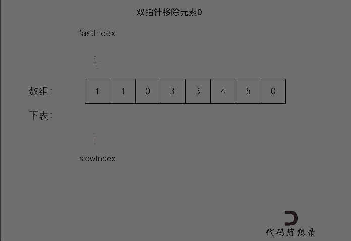

# 思路 

做这道题目之前，大家可以做一做[27.移除元素](https://leetcode-cn.com/problems/remove-element/)，我在讲解数组系列的时候针对移除元素写了这篇题解：[数组：就移除个元素很难么？](https://mp.weixin.qq.com/s/wj0T-Xs88_FHJFwayElQlA)

这道题目，使用暴力的解法，可以两层for循环，模拟数组删除元素（也就是向前覆盖）的过程。

好了，我们说一说双指针法，大家如果对双指针还不熟悉，可以看我的这篇总结[双指针法：总结篇！](https://mp.weixin.qq.com/s/_p7grwjISfMh0U65uOyCjA)。

双指针法在数组移除元素中，可以达到O(n)的时间复杂度，在[数组：就移除个元素很难么？](https://mp.weixin.qq.com/s/wj0T-Xs88_FHJFwayElQlA)里已经详细讲解了，那么本题和移除元素其实是一个套路。

**相当于对整个数组移除元素0，然后slowIndex之后都是移除元素0的冗余元素，把这些元素都赋值为0就可以了**。

如动画所示：

 </img></div>

C++代码如下：

```
class Solution {
public:
    void moveZeroes(vector<int>& nums) {
        int slowIndex = 0;
        for (int fastIndex = 0; fastIndex < nums.size(); fastIndex++) {
            if (nums[fastIndex] != 0) {
                nums[slowIndex++] = nums[fastIndex];
            }
        }
        // 将slowIndex之后的冗余元素赋值为0
        for (int i = slowIndex; i < nums.size(); i++) {
            nums[i] = 0;
        }
    }
};
```
> **我是[程序员Carl](https://github.com/youngyangyang04)，[组队刷题](https://img-blog.csdnimg.cn/20201115103410182.png)可以找我，本文[leetcode刷题攻略](https://github.com/youngyangyang04/leetcode-master)已收录，更多[精彩算法文章](https://mp.weixin.qq.com/mp/appmsgalbum?__biz=MzUxNjY5NTYxNA==&action=getalbum&album_id=1485825793120387074&scene=173#wechat_redirect)尽在：[代码随想录](https://img-blog.csdnimg.cn/20200815195519696.png)，关注后就会发现和「代码随想录」相见恨晚！**

**如果感觉题解对你有帮助，不要吝啬给一个👍吧！**

