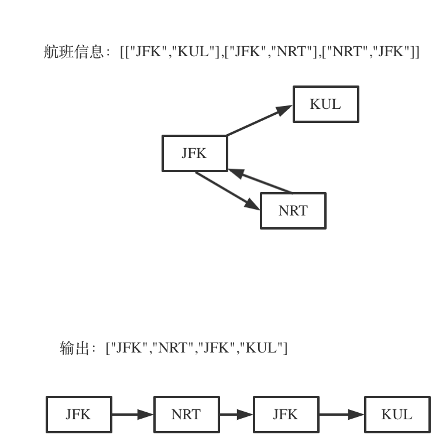

## 题目地址 


# 第242题.有效的字母异位词

# 思路

举一个有重复机场的例子：

 </img></div>

为什么要举这个例子呢，就是告诉大家，出发机场和到达机场也会重复的，**如果在解题的过程中没有对集合元素处理好，就会死循环。**

这道题目有几个难点： 

1. 有多种解法，字母序靠前排在前面，让很多同学望而退步，如何该记录映射关系呢 ？
2. 这是一个图不是一棵树，使用深搜/回溯 终止条件是什么呢？
3. 回溯的过程中，如何遍历一个城市所对应的所有城市。

首先这道题目是使用回溯法（也可以说深搜），那么按照我总结的回溯模板来。

```
backtracking() {
    if (终止条件) {
        存放结果;
    }

    for (枚举同一个位置的所有可能性，可以想成节点孩子的数量) {
        递归，处理节点;
        backtracking();
        回溯，撤销处理结果
    }
}
```

## 1. 有多种解法，字母序靠前排在前面，让很多同学望而退步，如何该记录映射关系呢 ？

一个城市映射多个城市，城市之间要靠字母序排列，一个城市映射多个城市，可以使用std::unordered_map，如果让多个城市之间再有顺序的话，就是用std::map 或者 或者std::multimap 或者 std::multiset。 

如果对map 和 set 的实现机制不太了解，也不清楚为什么 map、multimap就是有序的同学，可以看这篇文章[关于哈希表，你该了解这些！](https://mp.weixin.qq.com/s/g8N6WmoQmsCUw3_BaWxHZA)。 

这样存放映射关系可以定义为 `unordered_map<string, multiset<string>> targets` 或者  `unordered_map<string, map<string, int>> targets`。 

含义如下：

`unordered_map<string, multiset<string>> targets`：`unordered_map<出发城市, 到达城市的集合> targets`
`unordered_map<string, map<string, int>> targets`：`unordered_map<出发城市, map<到达城市, 航班次数>> targets`

这两个结构，我们选择了后者，因为如果使用`unordered_map<string, multiset<string>> targets` 遍历multiset的时候，不能删除元素，一旦删除元素，迭代器就失效了。而本地在回溯的过程中就是要不断的增删 multiset里的元素，所以 我们使用`unordered_map<string, map<string, int>> targets`。 

在遍历 `unordered_map<出发城市, map<到达城市, 航班次数>> targets`的过程中，可以使用航班次数这个字段的数字 --或者++，来标记到达城市是否使用过了，而不用对集合做删除元素或者增加元素的操作。

## 2. 这是一个图不是一棵树，使用深搜/回溯 终止条件是什么呢？

你看有多少个航班，那题目中的示例为例，输入: [["MUC", "LHR"], ["JFK", "MUC"], ["SFO", "SJC"], ["LHR", "SFO"]] ，这是有4个航班，那么只要找出一种行程，行程里的机场个数是5就可以了。 

所以终止条件 我们回溯遍历的过程中，遇到的机场个数，如果达到了（航班数量+1），那么我们就找到了一个行程，把所有航班串在一起了。 

## 3. 回溯的过程中，如何遍历一个城市所对应的所有城市。 

这里刚刚说过，在选择映射函数的时候，不能选择`unordered_map<string, multiset<string>> targets`， 因为一旦有元素增删multiset的迭代器就会失效，有一些题解使用了 例如list的迭代器，使用splice来保证 迭代器不失效。

可以说既要找到一个对数据经行排序的容器，而且这个容易增删元素，迭代器还不能失效。

**再说一下为什么一定要增删元素呢，正如开篇我给出的图中所示，出发机场和到达机场是会重复的，搜索的过程没及时删除元素就会死循环。**

所以我选择了`unordered_map<string, map<string, int>> targets` 来基于映射条件。

遍历过程如下：

```
    for (pair<const string, int>& target : targets[result[result.size() - 1]]) {
        if (target.second > 0 ) {
            result.push_back(target.first);
            target.second--;
            if (backtracking(ticketNum, index + 1, result)) return true;
            result.pop_back();
            target.second++;
        }
    }
```

可以看出 通过`unordered_map<string, map<string, int>> targets`里的int字段来判断 这个集合使用使用完了，这样避免了 增删元素。

此时完整代码如下：

# C++代码

```

class Solution {
private:
// unordered_map<出发城市, map<到达城市, 航班次数>> targets
unordered_map<string, map<string, int>> targets;
bool backtracking(int ticketNum, vector<string>& result) {
    if (result.size() == ticketNum + 1) {
        return true;
    }
    for (pair<const string, int>& target : targets[result[result.size() - 1]]) {
        if (target.second > 0 ) { // 使用int字段来记录到达城市是否使用过了
            result.push_back(target.first);
            target.second--;
            if (backtracking(ticketNum, result)) return true;
            result.pop_back();
            target.second++;
        }
    }
    return false;
}
public:
    vector<string> findItinerary(vector<vector<string>>& tickets) {
        vector<string> result;
        for (const vector<string>& vec : tickets) {
            targets[vec[0]][vec[1]]++; // 记录映射关系
        }
        result.push_back("JFK");
        backtracking(tickets.size(), result);
        return result;
    }
};

```

