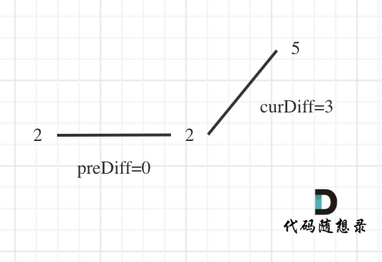

题目链接： https://leetcode-cn.com/problems/wiggle-subsequence/

## 思路 

本题要求通过从原始序列中删除一些（也可以不删除）元素来获得子序列，剩下的元素保持其原始顺序。

相信这么一说吓退不少同学，这又可以修改数组，这得如何修改呢？ 

我们来分析一下，要求删除元素使其达到最大摆动序列，应该删除什么元素呢？ 

用示例二来举例，如图所示：

 </img></div>

图中可以看出，为了让摆动序列最长，只需要把单一坡度（递增或者递减）上的节点删掉就可以了。

**这就是贪心所贪的地方，让峰值尽可能的保持峰值，然后删除单一坡度上的节点**。

**实际操作上，其实练删除的操作都不用做，因为题目要求的是摆动序列的长度，所以只需要统计数组的峰值数量就可以了（相当于是删除单一坡度上的节点，然后统计长度）**

代码实现中，还有一些技巧，例如统计峰值的时候，数组最左面和最右面是最不好统计的。

例如数组[2,5]，它的峰值数量是2，如果靠统计差值来计算峰值就需要考虑数组最左面和最右面的特殊情况。

所以可以针对数组[2,5]，假设为[2,2,5]，这样它就有坡度了，如图：

 </img></div>

这样result初始为1，curDiff > 0 && preDiff <= 0，result++，最后得到的result就是2了。

C++代码如下：

```
class Solution {
public:
    int wiggleMaxLength(vector<int>& nums) {
        if (nums.size() <= 1) return nums.size();
        int curDiff = 0; // 当前一对差值
        int preDiff = 0; // 前一对差值
        int result = 1;  // 记录峰值，起始位置峰值为1
        for (int i = 1; i < nums.size(); i++) {
            curDiff = nums[i] - nums[i - 1];
            // 出现峰值
            if ((curDiff > 0 && preDiff <= 0) || (preDiff >= 0 && curDiff < 0)) {
                result++;
                preDiff = curDiff;
            }
        }
        return result;
    }
};
```

> 我是[程序员Carl](https://github.com/youngyangyang04)，组队刷题可以找我，本文[leetcode刷题攻略](https://github.com/youngyangyang04/leetcode-master)已收录，更多[精彩算法文章](https://mp.weixin.qq.com/mp/appmsgalbum?__biz=MzUxNjY5NTYxNA==&action=getalbum&album_id=1485825793120387074&scene=173#wechat_redirect)尽在：[代码随想录](https://img-blog.csdnimg.cn/20200815195519696.png)，期待你的关注！

