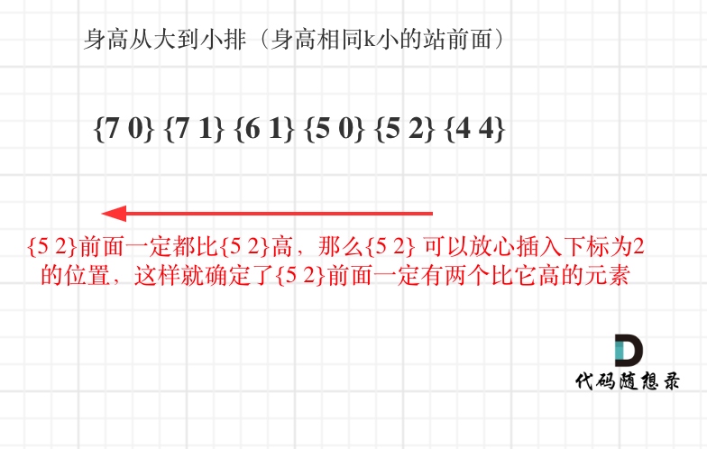

## 思路

本题有两个维度，h和k，看到这种题目一定要想如何确定一个维度，然后在按照另一个维度重新排列。

**如果两个维度一起考虑一定会顾此失彼**。

相信大家困惑的点是先确实k还是先确定h呢，也就是 究竟先按h排序呢，还先按照k排序呢？

如果按照k来从小到大排序，排完之后，会发现k的排列并不符合条件，身高也不符合条件，两个维度哪一个都没确定下来。

那么按照身高h来排序呢，身高一定是从大到小排（身高相同k小的站前面），让高个子在前面。

**此时我们可以确定一个维度了，就是身高，前面的节点一定都比本节点高！**

此时只需要按照k为下表重新插入队列，就可以了呢，为什么呢？ 

以图中{5,2} 为例：

 </img></div>

**都说用贪心算法，是贪心究竟贪在哪里呢？** 

贪心在优先按照身高高的people的k来插入，后序插入节点也不会影响前面已经插入的节点，最终按照k的规则完成了队列。

整个插入过程如下：

排序完：
[[7,0], [7,1], [6,1], [5,0], [5,2]，[4,4]]
插入的过程：
插入[7,0]：[[7,0]]
插入[7,1]：[[7,0],[7,1]]
插入[6,1]：[[7,0],[6,1],[7,1]]
插入[5,0]：[[5,0],[7,0],[6,1],[7,1]]
插入[5,2]：[[5,0],[7,0],[5,2],[6,1],[7,1]]
插入[4,4]：[[5,0],[7,0],[5,2],[6,1],[4,4],[7,1]]


C++代码如下：
```
class Solution {
public:
    // 身高从大到小排（身高相同k小的站前面）
    static bool cmp(const vector<int> a, const vector<int> b) {
        if (a[0] == b[0]) return a[1] < b[1];
        return a[0] > b[0];
    }
    vector<vector<int>> reconstructQueue(vector<vector<int>>& people) {
        sort (people.begin(), people.end(), cmp);
        list<vector<int>> que; // 使用list底层是链表实现，插入效率比vector高的多
        for (int i = 0; i < people.size(); i++) {
            int position = people[i][1]; // 插入到下标为position的位置
            std::list<vector<int>>::iterator it = que.begin();
            while (position--) { 
                it++;
            }
            que.insert(it, people[i]);
        }
        return vector<vector<int>>(que.begin(), que.end());
    }
};
```
