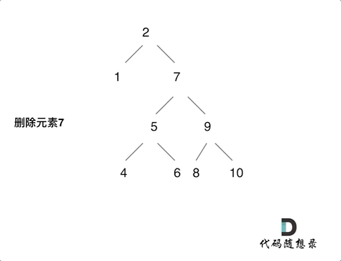

<p align="center">
  <a href="https://mp.weixin.qq.com/s/QVF6upVMSbgvZy8lHZS3CQ"></a>
  <a href="https://mp.weixin.qq.com/s/b66DFkOp8OOxdZC_xLZxfw"></a>
  <a href="https://img-blog.csdnimg.cn/20201210231711160.png"></a>
  <a href="https://space.bilibili.com/525438321"></a>
</p>


> 二叉搜索树删除节点就涉及到结构调整了

## 450.删除二叉搜索树中的节点

题目链接： https://leetcode-cn.com/problems/delete-node-in-a-bst/

给定一个二叉搜索树的根节点 root 和一个值 key，删除二叉搜索树中的 key 对应的节点，并保证二叉搜索树的性质不变。返回二叉搜索树（有可能被更新）的根节点的引用。

一般来说，删除节点可分为两个步骤：

首先找到需要删除的节点；
如果找到了，删除它。
说明： 要求算法时间复杂度为 O(h)，h 为树的高度。

示例:


## 思路

搜索树的节点删除要比节点增加复杂的多，有很多情况需要考虑，做好心里准备。

## 递归

递归三部曲：

* 确定递归函数参数以及返回值

说道递归函数的返回值，在[二叉树：搜索树中的插入操作](https://mp.weixin.qq.com/s/lwKkLQcfbCNX2W-5SOeZEA)中通过递归返回值来加入新节点， 这里也可以通过递归返回值删除节点。

代码如下：

```
TreeNode* deleteNode(TreeNode* root, int key)
```

* 确定终止条件

遇到空返回，其实这也说明没找到删除的节点，遍历到空节点直接返回了

```
if (root == nullptr) return root;
```

* 确定单层递归的逻辑

这里就把平衡二叉树中删除节点遇到的情况都搞清楚。

有以下五种情况：

* 第一种情况：没找到删除的节点，遍历到空节点直接返回了
* 找到删除的节点
    * 第二种情况：左右孩子都为空（叶子节点），直接删除节点， 返回NULL为根节点
    * 第三种情况：删除节点的左孩子为空，右孩子不为空，删除节点，右孩子补位，返回右孩子为根节点
    * 第四种情况：删除节点的右孩子为空，左孩子不为空，删除节点，左孩子补位，返回左孩子为根节点
    * 第五种情况：左右孩子节点都不为空，则将删除节点的左子树头结点（左孩子）放到删除节点的右子树的最左面节点的左孩子上，返回删除节点右孩子为新的根节点。

第五种情况有点难以理解，看下面动画：


 </img></div>

动画中颗二叉搜索树中，删除元素7， 那么删除节点（元素7）的左孩子就是5，删除节点（元素7）的右子树的最左面节点是元素8。

将删除节点（元素7）的左孩子放到删除节点（元素7）的右子树的最左面节点（元素8）的左孩子上，就是把5为根节点的子树移到了8的左孩子的位置。

要删除的节点（元素7）的右孩子（元素9）为新的根节点。.

这样就完成删除元素7的逻辑，最好动手画一个图，尝试删除一个节点试试。

代码如下：

```C++
if (root->val == key) {
    // 第二种情况：左右孩子都为空（叶子节点），直接删除节点， 返回NULL为根节点
    // 第三种情况：其左孩子为空，右孩子不为空，删除节点，右孩子补位 ，返回右孩子为根节点
    if (root->left == nullptr) return root->right;
    // 第四种情况：其右孩子为空，左孩子不为空，删除节点，左孩子补位，返回左孩子为根节点
    else if (root->right == nullptr) return root->left;
    // 第五种情况：左右孩子节点都不为空，则将删除节点的左子树放到删除节点的右子树的最左面节点的左孩子的位置
    // 并返回删除节点右孩子为新的根节点。
    else {
        TreeNode* cur = root->right; // 找右子树最左面的节点
        while(cur->left != nullptr) {
            cur = cur->left;
        }
        cur->left = root->left; // 把要删除的节点（root）左子树放在cur的左孩子的位置
        TreeNode* tmp = root;   // 把root节点保存一下，下面来删除
        root = root->right;     // 返回旧root的右孩子作为新root
        delete tmp;             // 释放节点内存（这里不写也可以，但C++最好手动释放一下吧）
        return root;
    }
}
```

这里相当于把新的节点返回给上一层，上一层就要用 root->left 或者 root->right接住，代码如下：

```
if (root->val > key) root->left = deleteNode(root->left, key);
if (root->val < key) root->right = deleteNode(root->right, key);
return root;
```

**整体代码如下：（注释中：情况1，2，3，4，5和上面分析严格对应）**

```C++
class Solution {
public:
    TreeNode* deleteNode(TreeNode* root, int key) {
        if (root == nullptr) return root; // 第一种情况：没找到删除的节点，遍历到空节点直接返回了
        if (root->val == key) {
            // 第二种情况：左右孩子都为空（叶子节点），直接删除节点， 返回NULL为根节点
            // 第三种情况：其左孩子为空，右孩子不为空，删除节点，右孩子补位 ，返回右孩子为根节点
            if (root->left == nullptr) return root->right;
            // 第四种情况：其右孩子为空，左孩子不为空，删除节点，左孩子补位，返回左孩子为根节点
            else if (root->right == nullptr) return root->left;
            // 第五种情况：左右孩子节点都不为空，则将删除节点的左子树放到删除节点的右子树的最左面节点的左孩子的位置
            // 并返回删除节点右孩子为新的根节点。
            else {
                TreeNode* cur = root->right; // 找右子树最左面的节点
                while(cur->left != nullptr) {
                    cur = cur->left;
                }
                cur->left = root->left; // 把要删除的节点（root）左子树放在cur的左孩子的位置
                TreeNode* tmp = root;   // 把root节点保存一下，下面来删除
                root = root->right;     // 返回旧root的右孩子作为新root
                delete tmp;             // 释放节点内存（这里不写也可以，但C++最好手动释放一下吧）
                return root;
            }
        }
        if (root->val > key) root->left = deleteNode(root->left, key);
        if (root->val < key) root->right = deleteNode(root->right, key);
        return root;
    }
};
```

## 普通二叉树的删除方式

这里我在介绍一种通用的删除，普通二叉树的删除方式（没有使用搜索树的特性，遍历整棵树），用交换值的操作来删除目标节点。

代码中目标节点（要删除的节点）被操作了两次：

* 第一次是和目标节点的右子树最左面节点交换。
* 第二次直接被NULL覆盖了。

思路有点绕，感兴趣的同学可以画图自己理解一下。

代码如下：（关键部分已经注释）

```C++
class Solution {
public:
    TreeNode* deleteNode(TreeNode* root, int key) {
        if (root == nullptr) return root;
        if (root->val == key) {
            if (root->right == nullptr) { // 这里第二次操作目标值：最终删除的作用
                return root->left;
            }
            TreeNode *cur = root->right;
            while (cur->left) {
                cur = cur->left;
            }
            swap(root->val, cur->val); // 这里第一次操作目标值：交换目标值其右子树最左面节点。
        }
        root->left = deleteNode(root->left, key);
        root->right = deleteNode(root->right, key);
        return root;
    }
};
```

这个代码是简短一些，思路也巧妙，但是不太好想，实操性不强，推荐第一种写法！

## 迭代法

删除节点的迭代法还是复杂一些的，但其本质我在递归法里都介绍了，最关键就是删除节点的操作（动画模拟的过程）

代码如下：

```C++
class Solution {
private:
    // 将目标节点（删除节点）的左子树放到 目标节点的右子树的最左面节点的左孩子位置上
    // 并返回目标节点右孩子为新的根节点
    // 是动画里模拟的过程
    TreeNode* deleteOneNode(TreeNode* target) {
        if (target == nullptr) return target;
        if (target->right == nullptr) return target->left;
        TreeNode* cur = target->right;
        while (cur->left) {
            cur = cur->left;
        }
        cur->left = target->left;
        return target->right;
    }
public:
    TreeNode* deleteNode(TreeNode* root, int key) {
        if (root == nullptr) return root;
        TreeNode* cur = root;
        TreeNode* pre = nullptr; // 记录cur的父节点，用来删除cur
        while (cur) {
            if (cur->val == key) break;
            pre = cur;
            if (cur->val > key) cur = cur->left;
            else cur = cur->right;
        }
        if (pre == nullptr) { // 如果搜索树只有头结点
            return deleteOneNode(cur);
        }
        // pre 要知道是删左孩子还是右孩子
        if (pre->left && pre->left->val == key) {
            pre->left = deleteOneNode(cur);
        }
        if (pre->right && pre->right->val == key) {
            pre->right = deleteOneNode(cur);
        }
        return root;
    }
};
```

## 总结

读完本篇，大家会发现二叉搜索树删除节点比增加节点复杂的多。

**因为二叉搜索树添加节点只需要在叶子上添加就可以的，不涉及到结构的调整，而删除节点操作涉及到结构的调整**。

这里我们依然使用递归函数的返回值来完成把节点从二叉树中移除的操作。

**这里最关键的逻辑就是第五种情况（删除一个左右孩子都不为空的节点），这种情况一定要想清楚**。

而且就算想清楚了，对应的代码也未必可以写出来，所以**这道题目即考察思维逻辑，也考察代码能力**。

递归中我给出了两种写法，推荐大家学会第一种（利用搜索树的特性）就可以了，第二种递归写法其实是比较绕的。

最后我也给出了相应的迭代法，就是模拟递归法中的逻辑来删除节点，但需要一个pre记录cur的父节点，方便做删除操作。

迭代法其实不太容易写出来，所以如果是初学者的话，彻底掌握第一种递归写法就够了。

