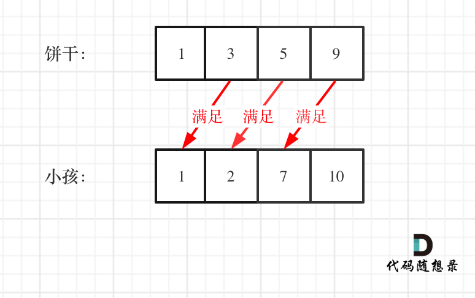

## 链接 

https://leetcode-cn.com/problems/assign-cookies/ 

## 思路 

这道题目呢，其实可以用较大大的饼干优先满足可以满足的胃口大的小孩。

注意我这里用的是 可以满足的胃口大的小孩。这样就不会造成大饼干的浪费。

所以使用贪心策略，讲饼干数组和小孩数组排序。

然后从后向前遍历小孩数组，用大饼干优先满足胃口大的，并统计满足小孩数量的大小就可以了。

如图：

 </img></div>


C++代码整体如下：

```
class Solution {
public:
    int findContentChildren(vector<int>& g, vector<int>& s) {
        sort(g.begin(), g.end());
        sort(s.begin(), s.end());
        int index = s.size() - 1; // 饼干数组的下表
        int result = 0;
        for (int i = g.size() - 1; i >= 0; i--) {
            if (index >= 0 && s[index] >= g[i]) {
                result++;
                index--;
            }
        }
        return result;
    }
};
```
> 我是[程序员Carl](https://github.com/youngyangyang04)，组队刷题可以找我，本文[leetcode刷题攻略](https://github.com/youngyangyang04/leetcode-master)已收录，更多[精彩算法文章](https://mp.weixin.qq.com/mp/appmsgalbum?__biz=MzUxNjY5NTYxNA==&action=getalbum&album_id=1485825793120387074&scene=173#wechat_redirect)尽在：[代码随想录](https://img-blog.csdnimg.cn/20200815195519696.png)，期待你的关注！

