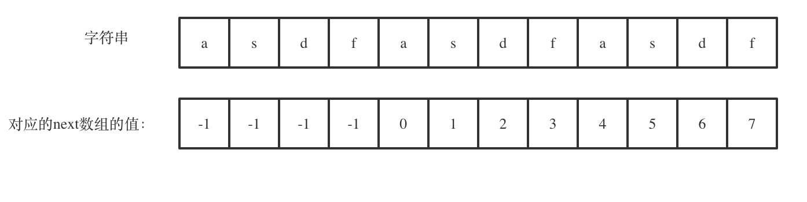

## 题目地址 
https://leetcode-cn.com/problems/repeated-substring-pattern/

## 思路 

这是一道标准的KMP的题目。

使用KMP算法，next 数组记录的就是最长公共前后缀， 最后如果 next[len - 1] != -1，说明此时有最长公共前后缀（就是字符串里的前缀子串和后缀子串相同的最长长度），同时如果len % (len - (next[len - 1] + 1)) == 0 ，则说明 (数组长度-最长公共前后缀的长度) 正好可以被 数组的长度整除，说明有重复的子字符串。

**强烈建议大家把next数组打印出来，看看next数组里的规律，有助于理解KMP算法**

如图：

 </img></div>

此时next[len - 1] = 7，next[len - 1] + 1 = 8，8就是此时 字符串asdfasdfasdf的最长公共前后缀的长度。


(len - (next[len - 1] + 1)) 也就是： 12(字符串的长度) - 8(最长公共前后缀的长度)   = 4， 4正好可以被 12(字符串的长度) 整除，所以说明有重复的子字符串。

代码如下：

## C++代码

```
class Solution {
public:
    void preKmp(int* next, const string& s){
        next[0] = -1;
        int j = -1;
        for(int i = 1;i < s.size(); i++){
            while(j >= 0 && s[i] !=s [j+1])
                j = next[j];
            if(s[i] == s[j+1])
                j++;
            next[i] = j;
        }
    }
    bool repeatedSubstringPattern(string s) {
        if (s.size() == 0) {
            return false;
        }
        int next[s.size()];
        preKmp(next, s);
        int len = s.size();
        if (next[len - 1] != -1 && len % (len - (next[len - 1] + 1)) == 0) {
            return true;
        }
        return false;

    }
};
```

> 更过算法干货文章持续更新，可以微信搜索「代码随想录」第一时间围观，关注后，回复「Java」「C++」 「python」「简历模板」「数据结构与算法」等等，就可以获得我多年整理的学习资料。

