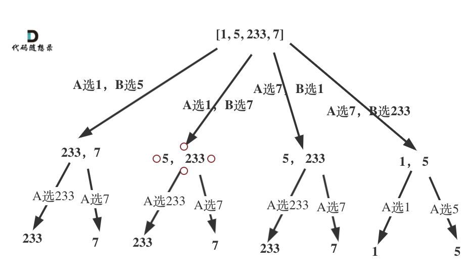
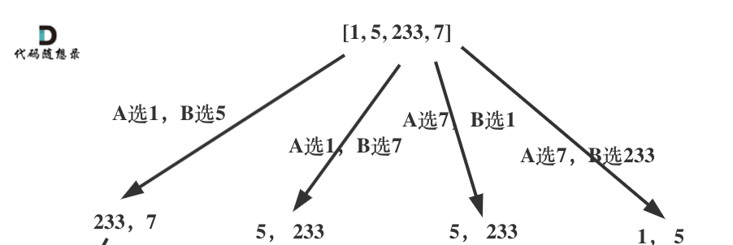
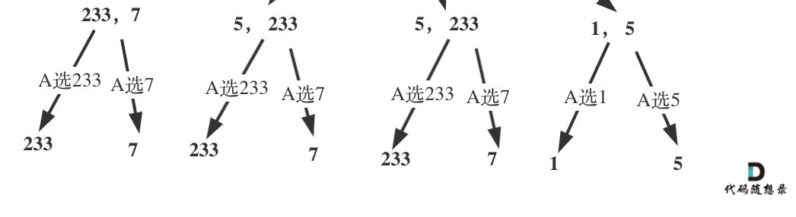
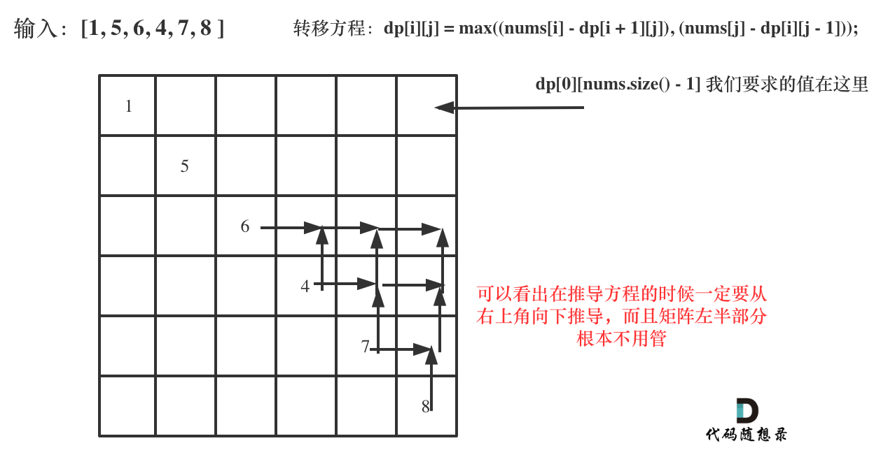

## 题目地址 

## 思路 

在做这道题目的时候，最直接的想法，就是计算出player1可能得到的最大分数，然后用数组总和减去player1的得分就是player2的得分，然后两者比较一下就可以了。

那么问题是如何计算player1可能得到的最大分数呢。

## 单独计算玩家得分

以player1选数字的过程，画图如下：

 </img></div>

可以发现是一个递归的过程。

按照递归三部曲来：

1. 确定递归函数的含义，参数以及返回值。

定义函数getScore，就是用来获取玩家1的最大得分。 参数为start 和 end 代表获取[start, end]这个区间的最大值，当然还需要传入nums。

返回值就是玩家1的最大得分。

代码如下：

```
int getScore(vector<int>& nums, int start, int end) {
```


2. 确定终止条件 

当start == end的时候，玩家A的得分就是nums[start]，代码如下：
```
    if (start == end) {
        return nums[start];
    }
```

3. 确定单层递归逻辑

玩家1的得分，等于集合左元素的数值+ 玩家2选择后集合的最小值（因为玩家2也是最聪明的）


而且剩余集合中的元素数量为2，或者大于2，的处理逻辑是不一样的！

如图：当集合中的元素数量大于2，那么玩家1先选，玩家2依然有选择的权利。
 </img></div>
所以代码如下：
```
    if ((end - start) >= 2) {
        selectLeft = nums[start] + min(getScore(nums, start + 2, end), getScore(nums, start + 1, end - 1));
        selectRight = nums[end] + min(getScore(nums, start + 1, end - 1), getScore(nums, start, end - 2));
    }
```


如图：当集合中的元素数量等于2，那么玩家1先选，玩家2没得选。
 </img></div>

所以代码如下：
```
    if ((end - start) == 1) {
        selectLeft = nums[start];
        selectRight = nums[end];
    }
```

单层递归逻辑代码如下：

```
    int selectLeft, selectRight;
    if ((end - start) >= 2) {
        selectLeft = nums[start] + min(getScore(nums, start + 2, end), getScore(nums, start + 1, end - 1));
        selectRight = nums[end] + min(getScore(nums, start + 1, end - 1), getScore(nums, start, end - 2));
    }
    if ((end - start) == 1) {
        selectLeft = nums[start];
        selectRight = nums[end];
    }

    return max(selectLeft, selectRight);
```

这些可以写出这道题目整体代码如下：

```
class Solution {
private:
int getScore(vector<int>& nums, int start, int end) {
    if (start == end) {
        return nums[start];
    }
    int selectLeft, selectRight;
    if ((end - start) >= 2) {
        selectLeft = nums[start] + min(getScore(nums, start + 2, end), getScore(nums, start + 1, end - 1));
        selectRight = nums[end] + min(getScore(nums, start + 1, end - 1), getScore(nums, start, end - 2));
    }
    if ((end - start) == 1) {
        selectLeft = nums[start];
        selectRight = nums[end];
    }

    return max(selectLeft, selectRight);
}
public:
    bool PredictTheWinner(vector<int>& nums) {
        int sum = 0;
        for (int i : nums) {
            sum += i;
        }
        int player1 = getScore(nums, 0, nums.size() - 1);
        int player2 = sum - player1;
        return player1 >= player2;
    }
};
```

可以有一个优化，就是把重复计算的数值提取出来，如下：
```
class Solution {
private:
int getScore(vector<int>& nums, int start, int end) {
    int selectLeft, selectRight;
    int gap = end - start;
    if (gap == 0) {
        return nums[start];
    } else if (gap == 1) { // 此时直接取左右的值就可以
        selectLeft = nums[start];
        selectRight = nums[end];
    } else if (gap >= 2) { // 如果gap大于2，递归计算selectLeft和selectRight
        // 计算的过程为什么用min，因为要按照对手也是最聪明的来计算。
        int num = getScore(nums, start + 1, end - 1);
        selectLeft = nums[start] +
                min(getScore(nums, start + 2, end), num);
        selectRight = nums[end] +
                min(num, getScore(nums, start, end - 2));
    }
    return max(selectLeft, selectRight);
}
public:
    bool PredictTheWinner(vector<int>& nums) {
        int sum = 0;
        for (int i : nums) {
            sum += i;
        }
        int player1 = getScore(nums, 0, nums.size() - 1);
        int player2 = sum - player1;
        // 如果最终两个玩家的分数相等，那么玩家 1 仍为赢家，所以是大于等于。
        return player1 >= player2;
    }
};
```

## 计算两个玩家的差值

以上是单独计算出两个选手的得分，逻辑上直观，但是代码确实比较冗余。

因为就我们要求的结果其实就是两个选手的胜负，那么不用两个选手的得分，而是把问题转换为两个选手所拿元素的差值。 

代码如下：

```
class Solution {
private:
int getScore(vector<int>& nums, int start, int end) {
    if (end == start) {
        return nums[start];
    }
    int selectLeft = nums[start] - getScore(nums, start + 1, end);
    int selectRight = nums[end] - getScore(nums, start, end - 1);
    return max(selectLeft, selectRight);
}
public:
    bool PredictTheWinner(vector<int>& nums) {
        return getScore(nums, 0, nums.size() - 1) >=0 ;
    }
};
```

计算的过程有一些是冗余的，在递归的过程中，可以使用一个memory数组记录一下中间结果，代码如下：

```
class Solution {
private:
int getScore(vector<int>& nums, int start, int end, int memory[21][21]) {
    if (end == start) {
        return nums[start];
    }
    if (memory[start][end]) return memory[start][end];
    int selectLeft = nums[start] - getScore(nums, start + 1, end, memory);
    int selectRight = nums[end] - getScore(nums, start, end - 1, memory);
    memory[start][end] = max(selectLeft, selectRight);
    return memory[start][end];
}
public:
    bool PredictTheWinner(vector<int>& nums) {
        int memory[21][21] = {0}; // 记录递归中中间结果
        return getScore(nums, 0, nums.size() - 1, memory) >= 0 ;
    }
};
```

此时效率已经比较高了
 </img></div>

那么在看一下动态规划的思路。 


## 动态规划


定义一个二维数组，先明确是用来干什么的，dp[i][j] 表示两个玩家在数组 i 到 j 区间内游戏能赢对方的差值（i <= j）。

假如玩家1先取左端 nums[i]，那么玩家2能赢对方的差值是dp[i+1][j] ，如果玩家1先取取右端 nums[j]，玩家2能赢对方的差值就是dp[i][j-1]，

那么 不难理解如下公式：

`dp[i][j] = max((nums[i] - dp[i + 1][j]), (nums[j] - dp[i][j - 1])); ` 


确定了状态转移公式之后，就要想想如何遍历。

一些同学确定的方程，却不知道该如何遍历这个遍历推算出方程的结果，我们来看一下。

首先要给dp[i][j]进行初始化，首先当i == j的时候，nums[i]就是dp[i][j]的值。

代码如下：

```
// 当i == j的时候，nums[i]就是dp[i][j]
for (int i = 0; i < nums.size(); i++) {
    dp[i][i] = nums[i];
}
```

接下来就要推导公式了，首先要知道最终求是dp[0][nums.size() - 1]是否大于等于0，也就是求dp[0][nums.size() - 1] 至关重要。

从下图中，可以看出在推导方程的时候一定要从右上角向下推导，而且矩阵左半部分根本不用管！ 

 </img></div>

按照上图中的规则，不难列出推导公式的循环方式如下：

```
for(int i = nums.size() - 2; i >= 0; i--) {
    for (int j = i + 1; j < nums.size(); j++) {
        dp[i][j] = max((nums[i] - dp[i + 1][j]), (nums[j] - dp[i][j - 1]));
    }
}

```

最后整体动态规划的代码：

##

```
class Solution {
public:
    bool PredictTheWinner(vector<int>& nums) {
        // dp[i][j] 表示两个玩家在数组 i 到 j 区间内游戏能赢对方的差值（i <= j）
        int dp[22][22] = {0};
        // 当i == j的时候，nums[i]就是dp[i][j]
        for (int i = 0; i < nums.size(); i++) {
            dp[i][i] = nums[i];
        }
        for(int i = nums.size() - 2; i >= 0; i--) {
            for (int j = i + 1; j < nums.size(); j++) {
                dp[i][j] = max((nums[i] - dp[i + 1][j]), (nums[j] - dp[i][j - 1]));
            }
        }
        return dp[0][nums.size() - 1] >= 0;
    }
};
```


