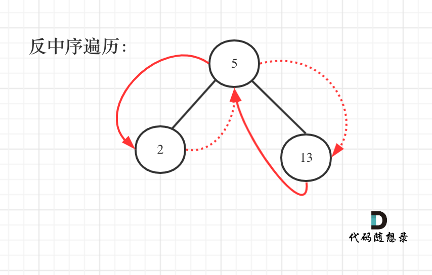

## 题目地址 

https://leetcode-cn.com/problems/convert-bst-to-greater-tree/

## 思路 

一看到累加树，相信很多小伙伴一脸懵逼，如何累加，遇到一个节点，然后在遍历其他节点累加？怎么一想这么麻烦呢。

然后发现这是一颗二叉搜索树，二叉搜索树啊，这是有序的啊。

那么有序的元素如果求累加呢？

**其实这就是一棵树，大家可能看起来有点别扭，换一个角度来看，这就是一个有序数组[2, 5, 13]，求从后到前的累加数组，也就是[20, 18, 13]，大家是不是感觉这就是送分题了。**

为什么变成数组就是送分题了呢，因为数组大家都知道怎么遍历啊，从后向前，挨个累加就完事了，这换成了二叉搜索树，看起来就别扭了一些是不是。

那么知道如何遍历这个二叉树，也就迎刃而解了，从树中可以看出累加的顺讯是 右中左，所以我们需要中序遍历反过来遍历这个二叉树，然后顺序累加就可以了。

遍历顺序如图所示：

 </img></div>


以下我给出一种递归的写法，两种迭代法的写法，别问我为什么写出了这么多写法，把我写的这个题解[彻底吃透二叉树的前中后序递归法和迭代法！！](https://leetcode-cn.com/problems/binary-tree-inorder-traversal/solution/che-di-chi-tou-er-cha-shu-de-qian-zhong-hou-xu-d-2/)看了，你也能分分钟写出来三种写法！[机智]

## C++递归代码

```
class Solution {
private:
    int pre; // 记录前一个节点的数值
    void traversal(TreeNode* cur) { // 右中左遍历
        if (cur == NULL) return;
        traversal(cur->right);
        cur->val += pre;
        pre = cur->val;
        traversal(cur->left);
    }
public:
    TreeNode* convertBST(TreeNode* root) {
        pre = 0;
        traversal(root);
        return root;
    }
};
```

## C++迭代法（一）代码

```
class Solution {
private:
    int pre; // 记录前一个节点的数值
    void traversal(TreeNode* root) {
        stack<TreeNode*> st;
        TreeNode* cur = root;
        while (cur != NULL || !st.empty()) {
            if (cur != NULL) {
                st.push(cur);
                cur = cur->right;   // 右
            } else {
                cur = st.top();     // 中
                st.pop();
                cur->val += pre;
                pre = cur->val;
                cur = cur->left;    // 左
            }
        }
    }
public:
    TreeNode* convertBST(TreeNode* root) {
        pre = 0;
        traversal(root);
        return root;
    }
};
```

## C++迭代法（二）代码 

```
class Solution {
private:
    int pre; // 记录前一个节点的数值
    void traversal(TreeNode* root) {
        stack<TreeNode*> st;
        if (root != NULL) st.push(root);
        while (!st.empty()) {
            TreeNode* node = st.top();
            if (node != NULL) {
                st.pop();
                if (node->left) st.push(node->left);    // 左

                st.push(node);                          // 中
                st.push(NULL);

                if (node->right) st.push(node->right);  // 右
            } else {
                st.pop();
                node = st.top();
                st.pop();
                node->val += pre;                       // 处理中间节点
                pre = node->val;
            }
        }
    }

public:
    TreeNode* convertBST(TreeNode* root) {
        pre = 0;
        traversal(root);
        return root;
    }
};
```
