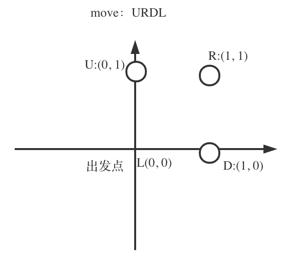

## 题目地址 
https://leetcode-cn.com/problems/robot-return-to-origin/

## 思路 

这道题目还是挺简单的，大家不要想复杂了，一波哈希法又一波图论算法啥的，哈哈。 

其实就是，x，y坐标，初始为0，然后：
* if (moves[i] == 'U') y++;
* if (moves[i] == 'D') y--;
* if (moves[i] == 'L') x--;
* if (moves[i] == 'R') x++;

最后判断一下x，y是否回到了(0, 0)位置就可以了。

如图所示：
 </img></div>

## C++代码

```
class Solution {
public:
    bool judgeCircle(string moves) {
        int x = 0, y = 0;
        for (int i = 0; i < moves.size(); i++) {
            if (moves[i] == 'U') y++;
            if (moves[i] == 'D') y--;
            if (moves[i] == 'L') x--;
            if (moves[i] == 'R') x++;
        }
        if (x == 0 && y == 0) return true;
        return false;
    }
};
```

> 更多算法干货文章持续更新，可以微信搜索「代码随想录」第一时间围观，关注后，回复「Java」「C++」 「python」「简历模板」「数据结构与算法」等等，就可以获得我多年整理的学习资料。
