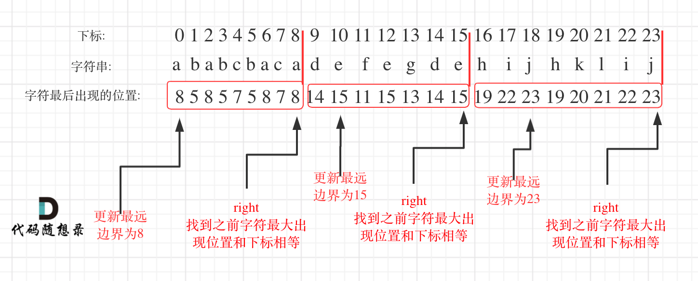

## 题目链接 
https://leetcode-cn.com/problems/partition-labels/

## 思路 

一想到分割字符串就想到了回溯，但本题其实不用那么复杂。

可以分为如下两步：

* 统计每一个字符最后出现的位置 
* 从头遍历字符，如果找到之前字符最大出现位置下标和当前下标相等，则找到了分割点

如图：

 </img></div>

明白原理之后，代码并不复杂，如下：

```
class Solution {
public:
    vector<int> partitionLabels(string S) {
        int hash[27] = {0}; // i为字符，hash[i]为字符出现的最后位置
        for (int i = 0; i < S.size(); i++) { // 统计每一个字符最后出现的位置
            hash[S[i] - 'a'] = i;
        }
        vector<int> result;
        int left = 0;
        int right = 0;
        for (int i = 0; i < S.size(); i++) {
            right = max(right, hash[S[i] - 'a']); // 找到字符出现的最远边界
            if (i == right) {
                result.push_back(right - left + 1);
                left = i + 1;
            }
        }
        return result;
    }
};
```
> 更多算法干货文章持续更新，可以微信搜索「代码随想录」第一时间围观，关注后，回复「Java」「C++」 「python」「简历模板」「数据结构与算法」等等，就可以获得我多年整理的学习资料。
