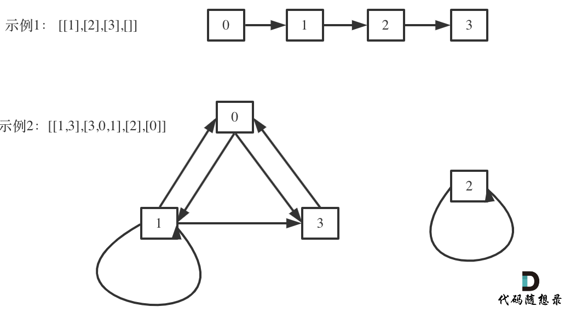

# 题目地址 
https://leetcode-cn.com/problems/keys-and-rooms/

## 思路 

其实这道题的本质就是判断各个房间所连成的有向图，说明不用访问所有的房间。

如图所示：

 </img></div>

示例1就可以访问所有的房间，因为通过房间里的key将房间连在了一起。

示例2中，就不能访问所有房间，从图中就可以看出，房间2是一个孤岛，我们从0出发，无论怎么遍历，都访问不到房间2。

认清本质问题之后，**使用 广度优先搜索(BFS) 还是 深度优先搜索(DFS) 都是可以的。**

代码如下：

## BFS C++代码 

```
class Solution {
bool bfs(const vector<vector<int>>& rooms) {
    vector<int> visited(rooms.size(), 0); // 标记房间是否被访问过
    visited[0] = 1; //  0 号房间开始
    queue<int> que;
    que.push(0); //  0 号房间开始

    // 广度优先搜索的过程
    while (!que.empty()) {
        int key = que.front(); que.pop();
         vector<int> keys = rooms[key];
         for (int key : keys) {
             if (!visited[key]) {
                 que.push(key);
                 visited[key] = 1;
             }
         }
    }
    // 检查房间是不是都遍历过了
    for (int i : visited) {
        if (i == 0) return false;
    }
    return true;

}
public:
    bool canVisitAllRooms(vector<vector<int>>& rooms) {
        return bfs(rooms);
    }
};
```

## DFS C++代码 

```
class Solution {
private:
    void dfs(int key, const vector<vector<int>>& rooms, vector<int>& visited) {
        if (visited[key]) {
            return;
        }
        visited[key] = 1;
        vector<int> keys = rooms[key];
        for (int key : keys) {
            // 深度优先搜索遍历
            dfs(key, rooms, visited);
        }
    }
public:
    bool canVisitAllRooms(vector<vector<int>>& rooms) {
        vector<int> visited(rooms.size(), 0);
        dfs(0, rooms, visited);
        //检查是否都访问到了
        for (int i : visited) {
            if (i == 0) return false;
        }
        return true;
    }
};
```
