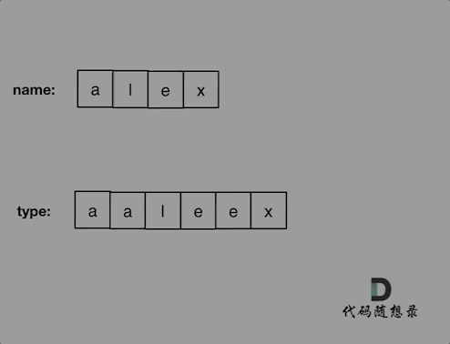

## 思路 

这道题目一看以为是哈希，仔细一看不行，要有顺序。 

所以模拟同时遍历两个数组，进行对比就可以了。 

对比的时候需要一下几点： 

* name[i] 和 typed[j]相同，则i++，j++ （继续向后对比）
* name[i] 和 typed[j]不相同 
    * 看是不是第一位就不相同了，也就是j如果等于0，那么直接返回false 
    * 不是第一位不相同，就让j跨越重复项，移动到重复项之后的位置，再次比较name[i] 和typed[j] 
        * 如果 name[i] 和 typed[j]相同，则i++，j++ （继续向后对比）
        * 不相同，返回false
* 对比完之后有两种情况
    * name没有匹配完，例如name:"pyplrzzzzdsfa" type:"ppyypllr" 
    * type没有匹配完，例如name:"alex" type:"alexxrrrrssda" 

动画如下：

 </img></div>

上面的逻辑想清楚了，不难写出如下C++代码：

```
class Solution {
public:
    bool isLongPressedName(string name, string typed) {
        int i = 0, j = 0;
        while (i < name.size() && j < typed.size()) {
            if (name[i] == typed[j]) { // 相同则同时向后匹配
                j++; i++;
            } else { // 不相同
                if (j == 0) return false; // 如果是第一位就不相同直接返回false
                // j跨越重复项，向后移动，同时防止j越界
                while(j < typed.size() && typed[j] == typed[j - 1]) j++;
                if (name[i] == typed[j]) { // j跨越重复项之后再次和name[i]匹配
                    j++; i++; // 相同则同时向后匹配
                }
                else return false;
            }
        }
        // 说明name没有匹配完，例如 name:"pyplrzzzzdsfa" type:"ppyypllr"
        if (i < name.size()) return false;

        // 说明type没有匹配完，例如 name:"alex" type:"alexxrrrrssda"
        while (j < typed.size()) {
            if (typed[j] == typed[j - 1]) j++;
            else return false;
        }
        return true;
    }
};

```

时间复杂度：O(n)
空间复杂度：O(1)

> 更多算法干货文章持续更新，可以微信搜索「代码随想录」第一时间围观，关注后，回复「Java」「C++」 「python」「简历模板」「数据结构与算法」等等，就可以获得我多年整理的学习资料。
