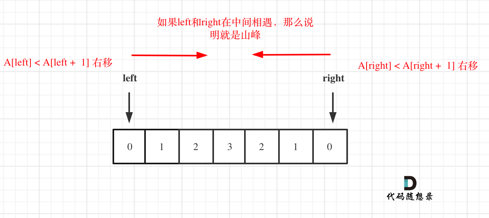

## 题目链接

https://leetcode-cn.com/problems/valid-mountain-array/

## 思路

判断是山峰，主要就是要严格的保存左边到中间，和右边到中间是递增的。

这样可以使用两个指针，left和right，让其按照如下规则移动，如图：

 </img></div>

**注意这里还是有一些细节，例如如下两点：**

* 因为left和right是数组下表，移动的过程中注意不要数组越界
* 如果left或者right没有移动，说明是一个单调递增或者递减的数组，依然不是山峰

C++代码如下：

```
class Solution {
public:
    bool validMountainArray(vector<int>& A) {
        if (A.size() < 3) return false;
        int left = 0;
        int right = A.size() - 1;

        // 注意防止越界
        while (left < A.size() - 1 && A[left] < A[left + 1]) left++;

        // 注意防止越界
        while (right > 0 && A[right] < A[right - 1]) right--;

        // 如果left或者right都在起始位置，说明不是山峰
        if (left == right && left != 0 && right != A.size() - 1) return true;
        return false;
    }
};
```
如果想系统学一学双指针的话， 可以看一下这篇[双指针法：总结篇！](https://mp.weixin.qq.com/s/_p7grwjISfMh0U65uOyCjA)


> 我是[程序员Carl](https://github.com/youngyangyang04)，组队刷题可以找我，本文[leetcode刷题攻略](https://github.com/youngyangyang04/leetcode-master)已收录，更多[精彩算法文章](https://mp.weixin.qq.com/mp/appmsgalbum?__biz=MzUxNjY5NTYxNA==&action=getalbum&album_id=1485825793120387074&scene=173#wechat_redirect)尽在：[代码随想录](https://img-blog.csdnimg.cn/20200815195519696.png)，期待你的关注！

