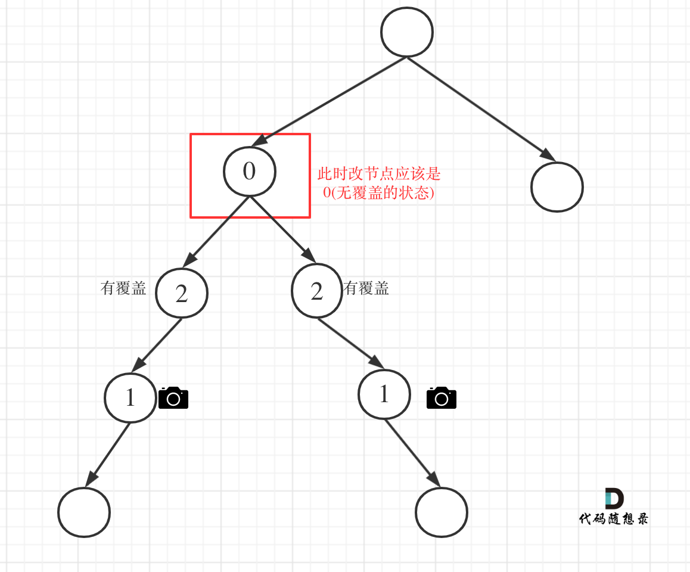
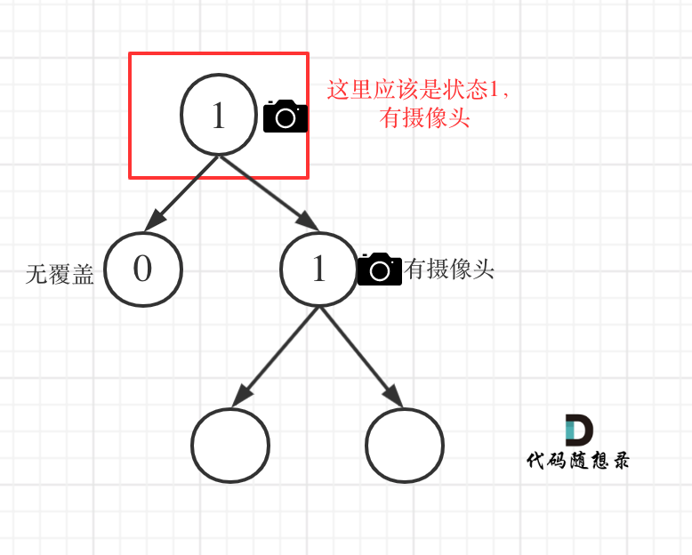

# 题目地址 
https://leetcode-cn.com/problems/binary-tree-cameras/

## 思路 

这道题目其实不是那么好理解的，题目举的示例不是很典型，会误以为摄像头必须要放在中间，其实放哪里都可以只要覆盖了就行。

这道题目难在两点：

1. 需要确定遍历方式 
2. 需要状态转移的方程 

我们之前做动态规划的时候，只要最难的地方在于确定状态转移方程，至于遍历方式无非就是在数组或者二维数组上。

**本题并不是动态规划，其本质是贪心，但我们要确定状态转移方式，而且要在树上进行推导，所以难度就上来了，一些同学知道这道题目难，但其实说不上难点究竟在哪。** 

1. 需要确定遍历方式

首先先确定遍历方式，才能确定转移方程，那么该如何遍历呢？

在安排选择摄像头的位置的时候，**我们要从底向上进行推导，因为尽量让叶子节点的父节点安装摄像头，这样摄像头的数量才是最少的**，这也是本道贪心的原理所在！

如何从低向上推导呢？ 

就是后序遍历也就是左右中的顺序，这样就可以从下到上进行推导了。

后序遍历代码如下：

```
    int traversal(TreeNode* cur) {

        // 空节点，该节点有覆盖
        if (终止条件) return ;

        int left = traversal(cur->left);    // 左
        int right = traversal(cur->right);  // 右

        逻辑处理                            // 中

        return ;
    }
```

**注意在以上代码中我们取了左孩子的返回值，右孩子的返回值，即left 和 right， 以后推导中间节点的状态**

2. 需要状态转移的方程 

确定了遍历顺序，再看看这个状态应该如何转移，先来看看每个节点可能有几种状态：

可以说有如下三种：

* 该节点无覆盖 
* 本节点有摄像头
* 本节点有覆盖

我们分别有三个数字来表示：

* 0：该节点无覆盖 
* 1：本节点有摄像头
* 2：本节点有覆盖

大家应该找不出第四个节点的状态了。 

**一些同学可能会想有没有第四种状态：本节点无摄像头，其实无摄像头就是 无覆盖 或者 有覆盖的状态，所以一共还是三个状态。**

**那么问题来了，空节点究竟是哪一种状态呢？ 空节点表示无覆盖？ 表示有摄像头？还是有覆盖呢？ **

回归本质，为了让摄像头数量最少，我们要尽量让叶子节点的父节点安装摄像头，这样才能摄像头的数量最少。

那么空节点不能是无覆盖的状态，这样叶子节点就可以放摄像头了，空节点也不能是有摄像头的状态，这样叶子节点的父节点就没有必要放摄像头了，而是可以把摄像头放在叶子节点的爷爷节点上。

**所以空节点的状态只能是有覆盖，这样就可以在叶子节点的父节点放摄像头了** 

接下来就是递推关系。

那么递归的终止条件应该是遇到了空节点，此时应该返回2（有覆盖），原因上面已经解释过了。

代码如下：

```
        // 空节点，该节点有覆盖
        if (cur == NULL) return 2;
```

递归的函数，以及终止条件已经确定了，再来看单层逻辑处理。

主要有如下四类情况：

1. 情况1：左右节点都有覆盖

左孩子有覆盖，右孩子有覆盖，那么此时中间节点应该就是无覆盖的状态了。

如图：

 </img></div>

代码如下：

```
        // 左右节点都有覆盖
        if (left == 2 && right == 2) return 0;
```

2. 情况2：左右节点至少有一个无覆盖的情况

如果是以下情况，则中间节点（父节点）应该放摄像头：

left == 0 && right == 0 左右节点无覆盖
left == 1 && right == 0 左节点有摄像头，右节点无覆盖
left == 0 && right == 1 左节点有无覆盖，右节点摄像头
left == 0 && right == 2 左节点无覆盖，右节点覆盖
left == 2 && right == 0 左节点覆盖，右节点无覆盖

这个不难理解，毕竟有一个孩子没有覆盖，父节点就应该放摄像头。

此时摄像头的数量要加一，并且return 1，代表中间节点放摄像头。

代码如下：
```
        if (left == 0 || right == 0) {
            result++;
            return 1;
        }
```

3. 情况3：左右节点至少有一个有摄像头

如果是以下情况，其实就是 左右孩子节点有一个有摄像头了，那么其父节点就应该是2（覆盖的状态）

left == 1 && right == 2 左节点有摄像头，右节点有覆盖
left == 2 && right == 1 左节点有覆盖，右节点有摄像头
left == 1 && right == 1 左右节点都有摄像头

代码如下：

```
        if (left == 1 || right == 1) return 2;
```

**从这个代码中，可以看出，如果left == 1, right == 0 怎么办？其实这种条件在情况2中已经判断过了**，如图：

 </img></div>

这种情况也是大多数同学容易迷惑的情况。

4. 情况4：头结点没有覆盖

以上都处理完了，递归结束之后，可能头结点 还有一个无覆盖的情况，如图：

 </img></div>

所以递归结束之后，还要判断根节点，如果没有覆盖，result++，代码如下：

```
    int minCameraCover(TreeNode* root) {
        result = 0;
        if (traversal(root) == 0) { // root 无覆盖
            result++;
        }
        return result;
    }
```

以上四种情况我们分析完了，代码也差不多了，整体代码如下：

（**以下我的代码是可以精简的，但是我是为了把情况说清楚，特别把每种情况列出来，因为精简之后的代码读者不好理解。**）

## C++代码 

```
class Solution {
private:
    int result;
    int traversal(TreeNode* cur) {

        // 空节点，该节点有覆盖
        if (cur == NULL) return 2;

        int left = traversal(cur->left);    // 左
        int right = traversal(cur->right);  // 右

        // 情况1
        // 左右节点都有覆盖
        if (left == 2 && right == 2) return 0;

        // 情况2
        // left == 0 && right == 0 左右节点无覆盖
        // left == 1 && right == 0 左节点有摄像头，右节点无覆盖
        // left == 0 && right == 1 左节点有无覆盖，右节点摄像头
        // left == 0 && right == 2 左节点无覆盖，右节点覆盖
        // left == 2 && right == 0 左节点覆盖，右节点无覆盖
        if (left == 0 || right == 0) {
            result++;
            return 1;
        }

        // 情况3
        // left == 1 && right == 2 左节点有摄像头，右节点有覆盖
        // left == 2 && right == 1 左节点有覆盖，右节点有摄像头
        // left == 1 && right == 1 左右节点都有摄像头
        // 其他情况前段代码均已覆盖
        if (left == 1 || right == 1) return 2;

        // 以上代码我没有使用else，主要是为了把各个分支条件展现出来，这样代码有助于读者理解
        // 这个 return -1 逻辑不会走到这里。
        return -1;
    }

public:
    int minCameraCover(TreeNode* root) {
        result = 0;
        // 情况4
        if (traversal(root) == 0) { // root 无覆盖
            result++;
        }
        return result;
    }
};
```
