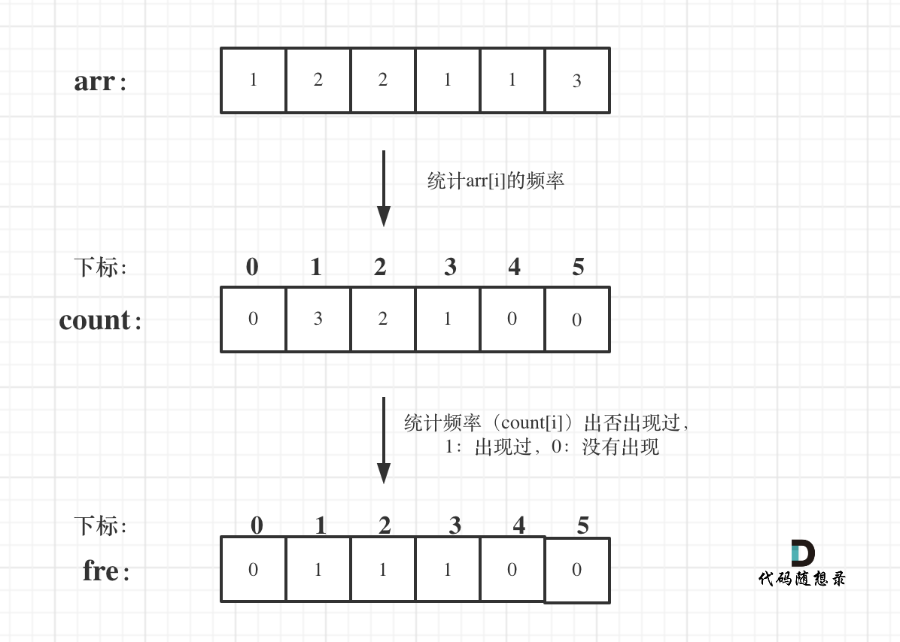

## 链接
https://leetcode-cn.com/problems/unique-number-of-occurrences/

## 思路

这道题目数组在是哈希法中的经典应用，如果对数组在哈希法中的使用还不熟悉的同学可以看这两篇：[数组在哈希法中的应用](https://mp.weixin.qq.com/s/vM6OszkM6L1Mx2Ralm9Dig)和[哈希法：383. 赎金信](https://mp.weixin.qq.com/s/sYZIR4dFBrw_lr3eJJnteQ)

进而可以学习一下[set在哈希法中的应用](https://mp.weixin.qq.com/s/N9iqAchXreSVW7zXUS4BVA)，以及[map在哈希法中的应用](https://mp.weixin.qq.com/s/uVAtjOHSeqymV8FeQbliJQ)

回归本题，**本题强调了-1000 <= arr[i] <= 1000**，那么就可以用数组来做哈希，arr[i]作为哈希表（数组）的下标，那么arr[i]可以是负数，怎么办？负数不能做数组下标。


**此时可以定义一个2000大小的数组，例如int count[2002];**，统计的时候，将arr[i]统一加1000，这样就可以统计arr[i]的出现频率了。

题目中要求的是是否有相同的频率出现，那么需要再定义一个哈希表（数组）用来记录频率是否重复出现过，bool fre[1002]; 定义布尔类型的就可以了，**因为题目中强调1 <= arr.length <= 1000，所以哈希表大小为1000就可以了**。

如图所示：


 </img></div>

C++代码如下：

```
class Solution {
public:
    bool uniqueOccurrences(vector<int>& arr) {
        int count[2002] = {0}; // 统计数字出现的频率
        for (int i = 0; i < arr.size(); i++) {
            count[arr[i] + 1000]++;
        }
        bool fre[1002] = {false}; // 看相同频率是否重复出现 
        for (int i = 0; i <= 2000; i++) {
            if (count[i]) {
                if (fre[count[i]] == false) fre[count[i]] = true;
                else return false;
            }
        }
        return true;
    }
};
```
> **我是[程序员Carl](https://github.com/youngyangyang04)，更多[精彩算法文章](https://mp.weixin.qq.com/mp/appmsgalbum?__biz=MzUxNjY5NTYxNA==&action=getalbum&album_id=1485825793120387074&scene=173#wechat_redirect)尽在：[代码随想录](https://img-blog.csdnimg.cn/20200815195519696.png)，你值得关注！**

**如果感觉题解对你有帮助，不要吝啬给一个👍吧！**
