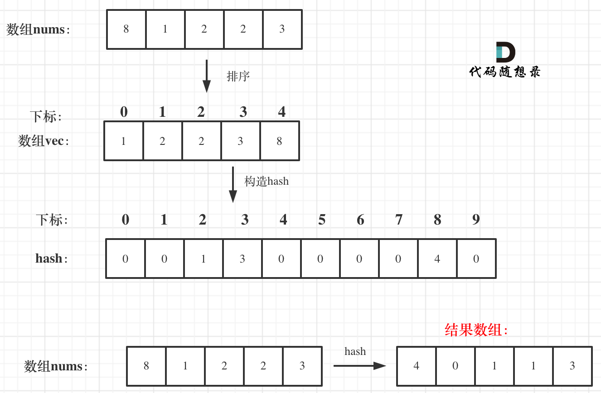

两层for循环暴力查找，时间复杂度明显为O(n^2)。 

那么我们来看一下如何优化。

首先要找小于当前数字的数字，那么从小到大排序之后，该数字之前的数字就都是比它小的了。

所以可以定义一个新数组，将数组排个序。

**排序之后，其实每一个数值的下标就代表这前面有几个比它小的了**。

代码如下：

```
vector<int> vec = nums;
sort(vec.begin(), vec.end()); // 从小到大排序之后，元素下标就是小于当前数字的数字
```

此时用一个哈希表hash（本题可以就用一个数组）来做数值和下标的映射。这样就可以通过数值快速知道下标（也就是前面有几个比它小的）。

此时有一个情况，就是数值相同怎么办？

例如，数组：1 2 3 4 4 4 ，第一个数值4的下标是3，第二个数值4的下标是4了。

这里就需要一个技巧了，**在构造数组hash的时候，从后向前遍历，这样hash里存放的就是相同元素最左面的数值和下标了**。
代码如下：

```
int hash[101];
for (int i = vec.size() - 1; i >= 0; i--) { // 从后向前，记录 vec[i] 对应的下标
    hash[vec[i]] = i;
}
```

最后在遍历原数组nums，用hash快速找到每一个数值 对应的 小于这个数值的个数。存放在将结果存放在另一个数组中。

代码如下：

```
// 此时hash里保存的每一个元素数值 对应的 小于这个数值的个数
for (int i = 0; i < nums.size(); i++) {
    vec[i] = hash[nums[i]];
}
```

流程如图：


 </img></div>

关键地方讲完了，整体C++代码如下：
```
class Solution {
public:
    vector<int> smallerNumbersThanCurrent(vector<int>& nums) {
        vector<int> vec = nums;
        sort(vec.begin(), vec.end()); // 从小到大排序之后，元素下标就是小于当前数字的数字
        int hash[101];
        for (int i = vec.size() - 1; i >= 0; i--) { // 从后向前，记录 vec[i] 对应的下标
            hash[vec[i]] = i;
        }
        // 此时hash里保存的每一个元素数值 对应的 小于这个数值的个数
        for (int i = 0; i < nums.size(); i++) {
            vec[i] = hash[nums[i]];
        }
        return vec;
    }
};
```
可以排序之后加哈希，时间复杂度为O(nlogn)


今天上午有事情，题解写的匆忙，下午我会继续完善题解。


