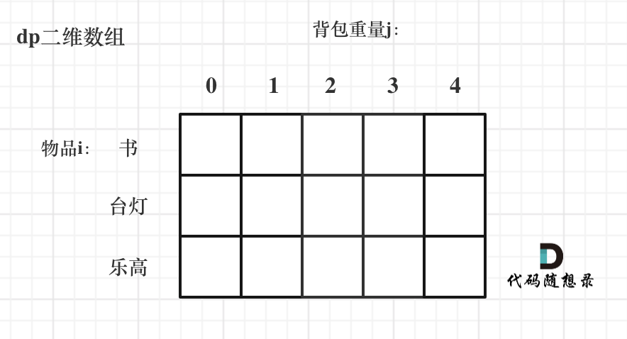
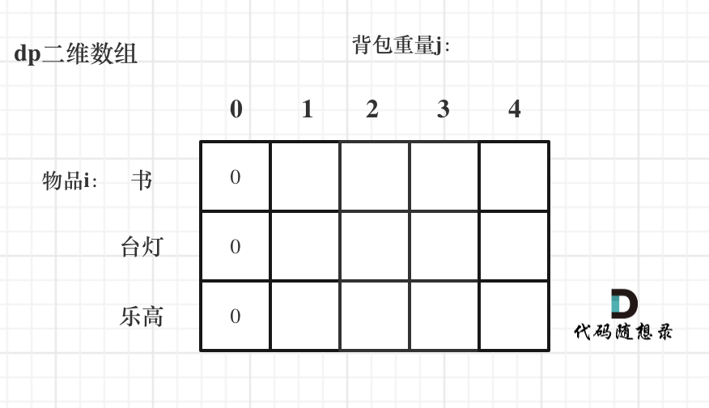
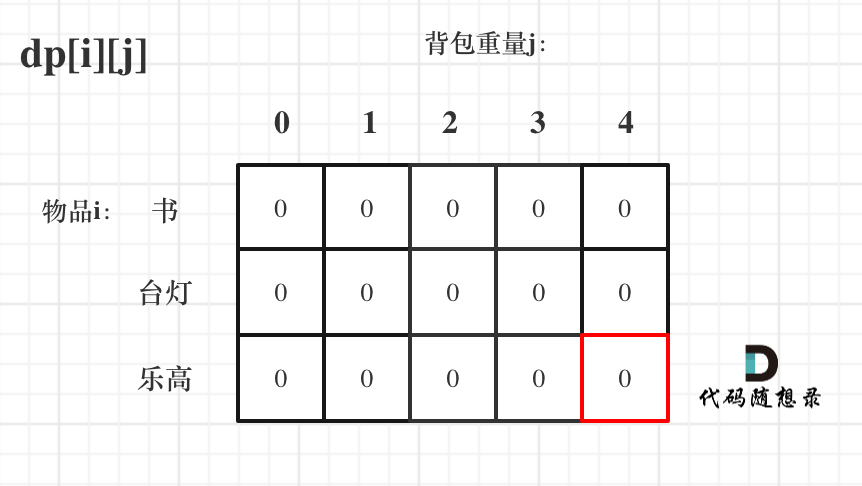
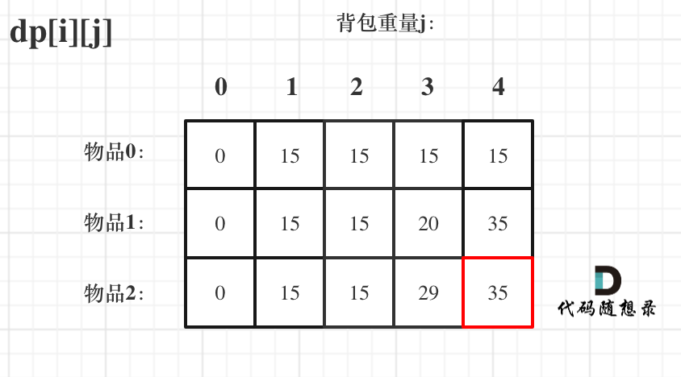

动态规划，英文：Dynamic Programming，简称DP，如果某一问题有很多重叠子问题，使用动态规划是最有效的。

所以动态规划中每一个状态一定是由上一个状态推导出来的，**这一点就区分于贪心**

题目的时候，很多同学会陷入一个误区，就是以为把状态转移公式背下来，照葫芦画瓢改改，就开始写代码，甚至把题目AC之后，都不太清楚dp[i]表示的是什么。

这就是一种朦胧的状态，然后就把题给过了，遇到稍稍难一点的，可能直接就不会了，然后看题解，然后继续照葫芦画瓢陷入这种恶性循环中。 

关于状态转移公式，

对于动态规划问题，我将拆解为如下四步曲，这四步都搞清楚了，才能说把动态规划真的掌握了！

* 确定dp数组以及下标的含义
* dp数组如何初始化
* 确定递推公式
* 确定遍历顺序

后面的讲解中我都是围绕着这四个点来经行讲解。

可能刷过动态规划题目的同学可能都知道递推公式的重要性，感觉确定了递推公式这道题目就解出来了。

其实 确定递推公式 仅仅是解题里的一步而且， dp数组的初始化 以及确定遍历顺序，都非常重要，

**很多同学搞不清楚dp数组应该如何初始化，或者遍历的顺序，以至于记下来公式，但写的程序怎么改都通过不了**。

# 动态规划如何debug 

平时我自己写的时候也经常出问题，**找问题的最好方式就是把dp数组打印出来，看看究竟是不是按照自己思路推导的！** 


# 背包三讲

背包九讲其实看起来还是有点费劲的，而且都是伪代码理解起来吃力
 </img></div>


## 01 背包

有N件物品和一个最多能被重量为W 的背包。第i件物品的重量是weight[i]，得到的价值是value[i] 。**每件物品只能用一次**，求解将哪些物品装入背包里物品价值总和最大。

这是标准的背包问题，以至于很多同学看了这个自然就会想到背包，甚至都不知道暴力的解法应该怎么解。

这样其实就是没有从底向上去思考，而是习惯性的只知道背包了，那么暴力的解法应该是怎么样的呢？

每一件物品其实只有两个状态，取或者不取，所以可以使用回溯法搜索出所有的情况，那么时间复杂度就是O(2^n)，这里的n表示物品数量。

所以暴力的解法是指数级别的时间复杂度。进而才需要动态规划的解法来进行优化！

目前leetcode上没有发现有纯01背包的题目，leetcode上相关01背包问题都是需要某种条件转化为01背包问题，所以 我举一个纯01背包的例子来给大家讲解。

把01背包理论和代码理解透彻了，我们再刷leetcode上的题目。

下面的讲解中，我举一个例子：

背包最大重量为4。

物品为：

|      | 重量 | 价值 |
| ---  | ---  | ---  |
| 书   | 1    | 15   |
| 台灯 | 3    | 20   |
| 乐高 | 4    | 30   |

以下讲解和图示中出现的数字都是以这个例子为例。

* 确定dp数组以及下标的含义 

对于背包问题，有一种写法， 是使用二维数组，即**dp[i][j] 表示从下标为[0-i]的物品里任意取，放进容量为j的背包，价值总和最大是多少**。

只看这个二维数组的定义，大家一定会有点懵，看下面这个图：

 </img></div>

要时刻记着这个dp数组的含义，下面的一些步骤都围绕这dp数组的含义进行的。

* dp数组如何初始化 

**关于初始化，一定要和dp数组的定义吻合，否则到递推公式的时候就会越来越乱**。

首先从dp[i][j]的定义触发，如果背包容量j为0的话，无论是选取哪些物品，背包价值总和一定为0。如图：

 </img></div>


那么其他下标应该初始化多少呢？

dp[i][j]在推导的时候一定是取价值最大的数，如果题目给的价值都是正整数那么非0下标都初始化为0就可以了，因为0就是最小的了，不会影响去最大价值的结果。

如果题目给的价值有负数，那么非0下标就要初始化为负无穷了。例如：一个物品的价值是-2，但对应的位置依然初始化为0，那么去最大值的时候，就会取0而不是-2了，所以要初始化为负无穷。

这样才能让dp数组在递归公式的过程中取的最大的价值，而不是被初始值覆盖了。

而本题价值都是正整数，所以初始化为0就可以了。

如图：

 </img></div>

**很明显，红框的位置就是我们要求的结果**

* 确定递推公式

再回顾一下dp[i][j]的含义：从下标为[0-i]的物品里任意取，放进容量为j的背包，价值总和最大是多少。

那么可以有两个方向推出来dp[i][j]，

* 又dp[i - 1][j]推出，即不放背包里不放物品i的最大价值，此时dp[i][j]就是dp[i - 1][j] 
* 又dp[i - 1][j - weight[i]]推出，dp[i - 1][j - weight[i]] 为背包容量为j - weight[i]的时候不放物品i的最大价值，那么dp[i - 1][j - weight[i]] + value[i] （物品i的价值），就是背包放物品i得到的最大价值

那么 dp[i][j] = max(dp[i - 1][j], dp[i - 1][j - weight[i]] + value[i]); 

* 确定遍历顺序 

确定递归公式之后，还要确定遍历顺序。

在如下图中，可以看出，有两个遍历的维度：物品与背包重量
 </img></div>

那么问题来了，先遍历 物品还是先遍历背包重量呢？ 

**其实都可以！！ 但是先遍历物品更方便一些**。下面讲到具体原因的时候来在分析原因。 

那么首先遍历物品，然后遍历背包重量。 


************************ 首先我们来看dp数组的推导过程：


注意 状态转移方程 dp[i][j] = max(dp[i - 1][j], dp[i - 1][j - weight[i]] + value[i]); 中有两个下表为负数的情况，即：i - 1 和 j - weight[i]。

所以代码如下：

```
for(int i = 1; i < weight.size(); i++) { // 遍历物品
    for(int j = 0; j <= bagWeight; j++) { // 遍历背包重量
        if (j < weight[i]) dp[i][j] = dp[i - 1][j]; 
        else dp[i][j] = max(dp[i - 1][j], dp[i - 1][j - weight[i]] + value[i]);

    }
}
```

来看一下对应的dp数组的数值，如图：

 </img></div>

建议大家此时自己在纸上推导一遍，看看dp数组里每一个数值是不是这样的。

**做动态规划的题目，最好的过程就是自己在纸上举一个例子把对应的dp数组的数值推导一下，然后在动手写代码！** 

很多同学做dp题目，遇到各种问题，然后凭感觉东改改西改改，怎么改都不对，或者稀里糊涂就改过了。 

主要就是自己没有动手推导一下dp数组的演变过程，如果推导明白了，代码写出来就算有问题，只要把dp数组打印出来，对比一下和自己推导的有什么差异，很快就可以发现问题了。


因为 dp 每次用上一行的值进行计算的，没有重复利用本行的数值，所以不会重复使用同一个物品
```
for (int j = bagWeight; j >= weight[0]; j--) {
    dp[0][j] = dp[0][j - weight[0]] + value[0];
}

// weight数组的大小 就是物品个数
for(int i = 1; i < weight.size(); i++) { // 遍历物品
    for(int j = 0; j <= bagWeight; j++) { // 遍历背包重量
        if (j < weight[i]) dp[i][j] = dp[i - 1][j];
        else dp[i][j] = max(dp[i - 1][j], dp[i - 1][j - weight[i]] + value[i]);

    }
}
```

```
0 15 15 15 15
0 0  0  20 35
0 0  0  0  35
```


* 确定dp数组以及下标的含义

对于背包问题，有一种写法， 是使用二维数组，即dp[i][j] 表示从下标为0-i的物品里任意取，放进容量为j的背包，价值总和最大是多少。

对于这种写法，不仅空间多用了一个维度，而且思路比较绕。

我习惯直接使用一维数组（相对于二维数组，一维可以说是滚动数组）。在后面的讲解中，我也直接使用一维数组。

在一维dp数组中，dp[i]表示：容量为i的背包，所背的物品价值可以最大为dp[i]


```
0 15 15 15 15
0 15 15 20 35
0 15 15 20 35
```

* dp数组如何初始化 

**关于初始化，一定要和dp数组的定义吻合，否则到递推公式的时候就会越来越乱**。

dp[i]表示：容量为i的背包，所背的物品价值可以最大为dp[i]，那么dp[0]就应该是0，因为背包容量为0所背的物品的最大价值就是0。

那么dp数组除了下标0的位置，初始为0，其他下标应该初始化多少呢？

在回顾一下dp数组的含义：容量为i的背包，所背的物品价值可以最大为dp[i]。

那么dp数组在推导的时候一定是去价值最大的数，如果题目给的价值都是正整数那么非0下标都初始化为0就可以了，如果题目给的价值有负数，那么非0下标就要初始化为负无穷。

这样才能让dp数组在递归公式的过程中取的最大的价值，而不是被初始值覆盖了。

那么我假设物品价值都是大于0的，所以dp数组初始化的时候，都初始为0就可以了。

代码如下：

```
vector<int> dp(背包容量V, 0); 
```

* 确定递推公式

有N件物品和一个容量为V 的背包。放入第i件物品耗费的空间是space[i]，得到的价值是value[i] 。**每件物品只能用一次**，求解将哪些物品装入背包可使价值总和最大。

dp[j]为 容量为j的背包所背的最大价值，那么如何推导dp[j]呢？

dp[j]可以通过dp[j - space[i]]推导出来，dp[j - space[i]]表示容量为j - space[i]的背包所背的最大价值。

dp[j - space[i]] + value[i] 表示 容量为 j - 物品i体积 的背包 加上 物品i的价值。

那么最大的dp[j]可能就是 dp[j - space[i]] + value[i]。

那么此时dp[j]有两个选择，一个是取子集dp[j]，一个是取dp[j - space[i]] + value[i]，指定是取最大的，毕竟是求最大价值，

所以递归公式为：

```
dp[j] = max(dp[j], dp[j - space[i]] + value[i]);
```

* 确定遍历顺序 

这里需要两层for循环，第一层遍历物品数量，第二层遍历背包的各个容量，来寻找最大值

****************** 讲讲for循环的顺序问题 

代码如下： 

```
for(int i = 0; i < 物品数量N; i++) { // 遍历物品
    for(int j = 背包容量V; j >= space[i]; j--) { // 遍历背包容量 
        dp[j] = max(dp[j], dp[j - space[i]] + value[i]);
    }
}
```

此时大家会发现为什么，第二层for循环要从大到小遍历。


注意这里第二个for循环是从大到小的，这样才能保证每件物品只使用一次。


如果物品装不满背包，dp[V]也是返回最大价值。


如果是第一种问法，要求恰好装满背包，那么在初始化时除了F [0]为0，其 它F [1..V ]均设为−∞，这样就可以保证最终得到的F [V ]是一种恰好装满背包的 最优解。
如果并没有要求必须把背包装满，而是只希望价格尽量大，初始化时应该 将F [0..V ]全部设为0。

这是为什么呢?可以这样理解:初始化的F 数组事实上就是在没有任何物 品可以放入背包时的合法状态。如果要求背包恰好装满，那么此时只有容量 为0的背包可以在什么也不装且价值为0的情况下被“恰好装满”，其它容量的 背包均没有合法的解，属于未定义的状态，应该被赋值为-∞了。如果背包并非 必须被装满，那么任何容量的背包都有一个合法解“什么都不装”，这个解的 价值为0，所以初始时状态的值也就全部为0了。


# 完全背包 

有N 种物品和一个容量为V 的背包，每种物品都有无限件可用。放入第i种 物品的耗费的空间是Ci ，得到的价值是Wi 。求解:将哪些物品装入背包，可使 这些物品的耗费的空间总和不超过背包容量，且价值总和最大。

这个问题非常类似于01背包问题，所不同的是每种物品有无限件


首先想想为什么01背包中要按照v递减的次序来 循环。让v递减是为了保证第i次循环中的状态F [i, v]是由状态F [i − 1, v − Ci]递 推而来。换句话说，这正是为了保证每件物品只选一次，保证在考虑“选入 第i件物品”这件策略时，依据的是一个绝无已经选入第i件物品的子结果F [i − 1, v − Ci]。而现在完全背包的特点恰是每种物品可选无限件，所以在考虑“加 选一件第i种物品”这种策略时，却正需要一个可能已选入第i种物品的子结 果F [i, v − Ci]，所以就可以并且必须采用v递增的顺序循环。这就是这个简单的
程序为何成立的道理。


值得一提的是，上面的伪代码中两层for循环的次序可以颠倒。这个结论有可能会带来算法时间常数上的优化。(可能说的就是组合或者排列了)

# 多重背包 

有N种物品和一个容量为V 的背包。第i种物品最多有Mi件可用，每件耗费 的空间是Ci ，价值是Wi 。求解将哪些物品装入背包可使这些物品的耗费的空间 总和不超过背包容量，且价值总和最大。

这题目和完全背包问题很类似。基本的方程只需将完全背包问题的方程略 微一改即可。


# 总结 

后台回复：背包九讲 就可以获得pdf
