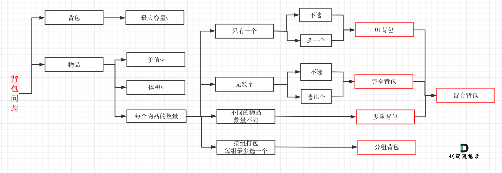

动态规划，英文：Dynamic Programming，简称DP，如果某一问题有很多重叠子问题，使用动态规划是最有效的。

所以动态规划中每一个状态一定是由上一个状态推导出来的，**这一点就区分于贪心**

题目的时候，很多同学会陷入一个误区，就是以为把状态转移公式背下来，照葫芦画瓢改改，就开始写代码，甚至把题目AC之后，都不太清楚dp[i]表示的是什么。

这就是一种朦胧的状态，然后就把题给过了，遇到稍稍难一点的，可能直接就不会了，然后看题解，然后继续照葫芦画瓢陷入这种恶性循环中。 

关于状态转移公式，

对于动态规划问题，我将拆解为如下四步曲，这四步都搞清楚了，才能说把动态规划真的掌握了！

* 确定dp数组以及下标的含义
* dp数组如何初始化
* 确定递推公式
* 确定遍历顺序

后面的讲解中我都是围绕着这四个点来经行讲解。

可能刷过动态规划题目的同学可能都知道递推公式的重要性，感觉确定了递推公式这道题目就解出来了。

其实 确定递推公式 仅仅是解题里的一步而且， dp数组的初始化 以及确定遍历顺序，都非常重要，

**很多同学搞不清楚dp数组应该如何初始化，或者遍历的顺序，以至于记下来公式，但写的程序怎么改都通过不了**。

# 动态规划如何debug 

平时我自己写的时候也经常出问题，**找问题的最好方式就是把dp数组打印出来，看看究竟是不是按照自己思路推导的！** 

# 背包三讲

背包九讲其实看起来还是有点费劲的，而且都是伪代码理解起来吃力
 </img>

# 完全背包 

有N 种物品和一个容量为V 的背包，每种物品都有无限件可用。放入第i种 物品的耗费的空间是Ci ，得到的价值是Wi 。求解:将哪些物品装入背包，可使 这些物品的耗费的空间总和不超过背包容量，且价值总和最大。

这个问题非常类似于01背包问题，所不同的是每种物品有无限件

首先想想为什么01背包中要按照v递减的次序来 循环。让v递减是为了保证第i次循环中的状态F [i, v]是由状态F [i − 1, v − Ci]递 推而来。换句话说，这正是为了保证每件物品只选一次，保证在考虑“选入 第i件物品”这件策略时，依据的是一个绝无已经选入第i件物品的子结果F [i − 1, v − Ci]。而现在完全背包的特点恰是每种物品可选无限件，所以在考虑“加 选一件第i种物品”这种策略时，却正需要一个可能已选入第i种物品的子结 果F [i, v − Ci]，所以就可以并且必须采用v递增的顺序循环。这就是这个简单的
程序为何成立的道理。

值得一提的是，上面的伪代码中两层for循环的次序可以颠倒。这个结论有可能会带来算法时间常数上的优化。(可能说的就是组合或者排列了)

# 多重背包 

有N种物品和一个容量为V 的背包。第i种物品最多有Mi件可用，每件耗费 的空间是Ci ，价值是Wi 。求解将哪些物品装入背包可使这些物品的耗费的空间 总和不超过背包容量，且价值总和最大。

这题目和完全背包问题很类似。基本的方程只需将完全背包问题的方程略 微一改即可。

# 总结 

后台回复：背包九讲 就可以获得pdf
